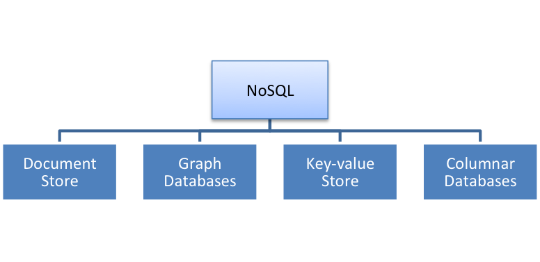
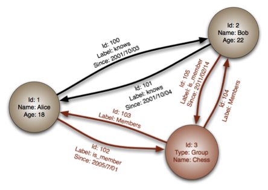

Recall that Brewer's CAP theorem proves that it is impossible to guarantee strict consistency and availability while being able to tolerate network partitions. This, in turn, led to various databases being designed with relaxed ACID guarantees, particularly in the case of consistency. An alternative to ACID is **BASE** (basically available, soft state, and eventual consistency).

- **Basically available** indicates that the system guarantees availability in terms of the CAP theorem. Small failures should not result in large disabilities of the system.
- **Soft state** indicates that the state of the system may change over time, even without input, because of the eventual consistency model.
- **Eventual consistency** means that given a sufficiently long period of time over which no changes are sent, all updates can be expected to propagate eventually through the system and the data will be consistent.

For example, assume a system with two transactions, A and B, running in parallel. Let A and B change the value of a variable, `x`, at the same time. Transaction A writes value _a_ and transaction B writes value _b_ to variable `x`. Under a **strict consistency model**, the database will impose a total ordering of all transactions and guarantee that every read of variable `x` will return its latest value. Under eventual consistency, the value of variable `x` may not propagate to each and every node before the next read. Even after transaction B executes, some nodes may still see that variable `x` has value _a_. Since the system is eventually consistent, there is a possibility of conflicts emerging with regard to operations on the data. Conflicts can be resolved through mechanisms such as vector clocks or client-specified timestamps.

To understand why BASE is a useful model, consider the scenario of an e-commerce vendor that deals with millions of visitors every day. A bulk of the visitors are shopping around and browsing products. One of the elements that are on the screen is the available stock of a product. Now the vendor can calculate the available stock using an expensive transactional query that guarantees the value that is provided to the user at any given instant. However, this requires getting a consistent snapshot of the inventory database. The snapshot could in turn lead to an expensive transaction, which is even more expensive if the vendor runs a distributed database. The vendor can only scale up so much until the performance of the query is poor. Instead, the vendor can use a lightweight query that returns a recent cached estimate of the number of available units of a particular product. Note here that the application can tolerate stale or inaccurate values. The e-commerce website only cares if the customer decides to buy a particular product, during which it must use a transactional query to confirm the available inventory and update it after a customer completes a purchase.

Soft state and eventual consistency are techniques that work well in the presence of partitions and thus promote availability. A new class of databases emerged that follow BASE characteristics and have been dubbed as NoSQL databases. Eventual consistency can be tolerated as long as the application can tolerate stale data. Applications such as instant messaging, for example, are usually tolerant of the eventual consistency limitations.

The typical characteristics of NoSQL databases include:

- No strict schema requirements.
- No strict adherence to ACID properties for transactions.
- Consistency traded in favor of availability.

The tradeoff with NoSQL databases is between ACID properties (most notably consistency) and performance and scalability.

## Types of NoSQL databases

A limited taxonomy of NoSQL databases is illustrated in the following figure.

_Figure 20: A taxonomy of NoSQL databases_

### Document stores

In contrast to RDBMSs, where data is stored as records with fixed-length fields, document stores store a document in some standard format or encoding. These DBs became popular because they can store a variety of data and their schema can change with time. The encoding may be in XML or JSON, as well as any arbitrary binary format such as PDFs or Office documents. These are typically called **binary large objects (BLOBs)**. A document is addressed using a key, which can be indexed for fast retrieval. Clearly, document stores can be used to store and index documents or individual media in a manner that can be indexed using metadata. This allows document stores to outperform traditional file systems in searching and indexing capabilities. Examples of document stores include MongoDB and CouchDB. 

### Graph databases

In graph databases, graph structures such as vertices and edges are used to represent and store data. Graph databases can be used to store data that has network-like properties between elements (e.g., a social network graph). Graph databases are a powerful tool for graph-like queries, for example, where you might want to find the shortest path between two elements. Figure 21 illustrates an example of a graph database, with a vertex representing a person or a club and the edges representing membership or familiarity. Alice and Bob are represented using vertices with an edge that signifies the "knows" relationship connecting them. From this, we can see that Alice and Bob know each other. The relationship is further quantified using the "since" tag, which specifies that Alice has known Bob since 2001/10/03 and Bob has known Alice since 2001/10/04. Likewise, a group entity called "Chess" is defined with relationships indicated by edges to both Alice and Bob, which signifies that they are both members of a chess group. 

_Figure 21: Example of a graph database_

Queries in graph databases typically consist of graph traversals. For example, graphs can be used to compute the degrees of separation between two or more people in a social graph. Graph databases thus are great at representing networked information, with the relationship between entities occupying a key aspect of the representation. Examples of graph database software include Neo4j and VertexDB. 

### Key-value stores

A key-value (KV) store is a database model that maps keys to (possibly) more complex values. This type of database has the most flexibility because keys can be mapped to arbitrary values or structures such as lists. The key-value pair constitutes an individual record in this model, and the keys are typically stored as a hash table. Hash lookups are fast and can be distributed easily, and for this reason, key-value stores can be scaled horizontally. Key-value stores typically support no more than the regular CRUD (create, read, update and delete) operations and may not natively support more advanced operations such as aggregations (e.g., averaging the values across key-value pairs) and joins (e.g., combining multiple-key value pairs into another key-value pair). Key-value stores are great for storing semi-structured information that is difficult to encapsulate within a rigid schema. The key-value relationship thus enables fast retrieval of data through an indexed key. An example of a key-value stores is Apache Cassandra.

### Columnar databases

Columnar databases are a hybrid of RDBMSs and KV stores. Like relational databases, they store values in groups of zero or more columns, and as in key-value stores, values are queried by matching keys. However, in columnar databases, data is physically transposed and stored in column order instead of in row order as in traditional RDBMSs. Operations such as modification of a subset of columns or aggregation of a column across all rows become more efficient, as entire rows do not have to be read to obtain the value of a single column. Furthermore, addition of columns to an existing table is inexpensive compared to traditional RDBMSs. Columnar databases have been developed with horizontal scalability as a primary design goal. As such, they are particularly suited to "big data" problems, living in clusters of tens, hundreds, or thousands of nodes. They also tend to have built-in support for features such as compression and versioning. Examples of columnar databases include Apache HBase and Vertica.

### Compare popular databases

The following table illustrates the differences between various popular databases that belong to each category.

| | MySQL | MongoDB | Neo4j | DynamoDB | HBase |
|--|--|--|--|--|--|
| **Type** | Relational database | NoSQL document store | NoSQL graph database | NoSQL key-value store | NoSQL columnar database |
| **Data storage** |Records in relational tables | Binary large objects (BLOBs) | Edges and vertices in a graph | Key-value pairs |Column-oriented records in a table|
| **Atomicity guarantees** | Guaranteed over entire table for all types of queries|Guaranteed for write operations that modify a single document; not guaranteed for write operations that are performed over multiple documents|Guaranteed for all write operations to the graph using transactions | Atomicity guaranteed for transactions involving individual key-value pairs | Atomicity is guaranteed for operations within a row in the HBase table|
| **Consistency guarantees** | Yes | Eventual consistency model when data is read from secondary nodes|Strong consistency guarantee | Eventual consistency model; stale data may be offered to applications | Strong consistency guarantees for individual row operations; operations that span rows (scans) do not have any consistency guarantees |
| **Isolation guarantees** | Yes | Only for writes to a single document | Manual locks can be acquired for vertices and edges during write operations; no read locks | No isolation guarantee | Isolation is guaranteed for a single row operation but not for operations that span rows |
| **Durability guarantees** | Yes | Single-server durability with write-ahead journaling | Yes, changes to the graph are durable and persist | Yes, transactions with key-value pairs are durable | Yes, writes that are reported as successful persist on the database |

Following are some of the advantages of NoSQL databases.

- **Data flexibility**: NoSQL databases are designed with non-relational models and hence typically do not enforce a rigid schema. Document stores allow arbitrary information to be stored in some form of encoding (XML/JSON, etc.) or even in binary. Graph databases do not have schemas but a set of properties that are used in different kinds of edges or nodes. In key-value stores, for example, the value associated to a key can be a single value or a larger, more complex data structure such as a hash or list. In columnar stores, it is fast and easy to alter a table to add more columns if required. 
- **Scalability**: Several NoSQL systems employ a distributed architecture from the ground up, unlike RDBMSs, whose fundamental designs have not changed in decades. This means that NoSQL systems are built for high scalability. For example, Yahoo has deployed an HBase cluster with 1,000+ nodes and 1 PB of data. Such large data stores are not uncommon with companies such as Google, Amazon, and Facebook.
- **Performance**: By relaxing some of the ACID guarantees, NoSQL systems can take advantage of parallel access to data and provide faster performance than their traditional SQL counterparts.

Disadvantages of NoSQL databases include the following.

- Application developers can no longer rely on ACID guarantees and have to design for lack of consistency guarantees. They must account for the possibility of stale data from the database during reads or writes that are not fully committed to disk before the operation.
- NoSQL has lock-in because of a lack of standards. Even if data formats may be standardized through XML or JSON, each NoSQL product may have its own query/response formats. By comparison, moving between RDBMSs is easier because the data formats and query languages are largely standardized.
