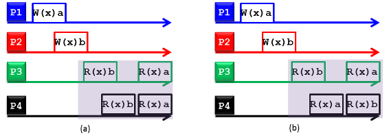
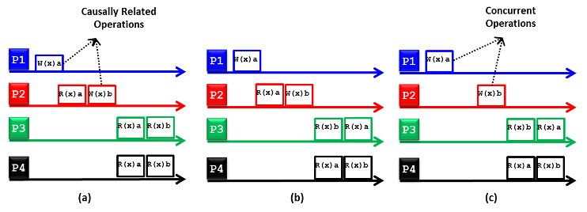

Without replication, consistency is not a concern. Replication entails maintaining multiple copies (or replicas) of the same data across multiple machines, whereas consistency provides a system-wide consistent view/state of replicas across multiple clients/processes. As pointed out earlier, data items are replicated for two primary reasons: performance and reliability. Regarding performance, replication is crucial when the system needs to scale in numbers (as is mainly the case with storages in private and public clouds) and in geographical areas (as is usually the case with storages in public clouds). For instance, when an increased number of processes must access data that is managed by a single storage server, performance can be improved by replicating the data across multiple servers (instead of having only one server) and subsequently dividing the work across the servers. This division allows requests to be served concurrently and thereby increases system speed. In contrast, replication across geographical areas (e.g., as applied by Azure) can be ensured by replicating copies of data in the proximity of the requesting processes to minimize data access times. Concerning reliability, replication makes it possible to provide better fault tolerance against corrupted and lost data, a key requirement on the cloud. In particular, if a replica is lost or corrupted, another valid replica (if maintained) can be alternatively accessed. 

Replication produces multiple replicas of data, and consistency ensures that those replicas remain uniform so that different processes can access (i.e., read and write) them. Specifically, replicas in a collection are considered to be consistent when they appear identical to concurrently accessing processes. The ability to handle concurrent operations on replicas while maintaining consistency is fundamental to distributed storage in general and cloud storage in particular. In this unit, consistency is discussed in the context of read and write operations performed on shared replicas in a distributed data store (see Figure 13). The distributed data store can be a DFS, a parallel file system, or a distributed database. Consistency can be achieved by employing a **consistency model**. We define a consistency model as a contract between processes and the distributed data store. This definition implies that if processes agree to obey certain rules, the distributed data store promises to enforce those rules. The following video covers a number of consistency models.
 

> [!VIDEO https://www.microsoft.com/videoplayer/embed/RE4q0qt]

We discuss three consistency models in detail in this unit: **sequential consistency**, **causal consistency**, and **eventual consistency**.

_Figure 13: A distributed data store that can be a distributed file system, a parallel file system, or a distributed database with replicas maintained across distributed storage disks_

### Sequential consistency

Also called **strong** or **strict consistency**, sequential consistency entails propagating updates to all replicas immediately. This typically requires applying updates on related replicas in a single atomic operation or transaction. In practice, implementing atomicity across widely dispersed replicas in a large-scale distributed data store is inherently difficult, especially if updates are to be completed quickly. The difficulty stems from the unpredictable access latencies imposed by the underlying storage network and the lack of a global clock that can be utilized to order operations rapidly and accurately. To address this problem, the requirement of executing updates as atomic operations can be relaxed. Relaxing consistency requirements means that replicas need not always be the same in all locations. Whether or not consistency relaxation is acceptable depends on the application that is running over the distributed data store. Specifically, relaxing consistency requirements depends on the read and write access patterns of the application and the purpose for which replicas are used. For instance, browsers and web proxies are often configured to store webpages in local caches (this is a type of replication because multiple copies are maintained for the same webpage) to reduce access times for future references. It is acceptable in some situations that users receive outdated webpages as long as, eventually and rapidly enough, the webpages will be upgraded to the most up-to-date versions available at the actual web server(s). Eventual consistency is an example of a model that suits such scenarios.

_Figure 14: (a) A sequentially consistent distributed data store, and (b) a nonsequentially consistent distributed data store_

A distributed data store is considered sequentially consistent if all processes see the same interleaving of read and write operations when accessing replicas concurrently. Figure 14 demonstrates two distributed data stores: a sequentially consistent data store (see Figure 14(a)) and a nonsequentially consistent data store (see Figure 14(b)). The symbols W(x)a and R(x)b denote a write value of _a_ to replica x and a read value of _b_ from replica x, respectively. The figure shows four processes operating on replicas corresponding to data item x. In Figure 14(a), process P1 writes _a_ to x, and later (in absolute time), process P2 writes _b_ to x. Subsequently, processes P3 and P4 first receive value _b_ and later value _a_ upon reading x. As such, the write operation carried by process P2 appears to have taken place before that of P1 and of both processes P3 and P4. Nonetheless, Figure 14(a) still represents a sequentially consistent distributed data store because processes P3 and P4 experience the same interleaving of operations (i.e., reading first _b_ and then _a_). In contrast, processes P3 and P4 in Figure 14(b) see different interleaving of operations, thus violating the condition of sequential consistency. 

### Causal consistency

The causal consistency model is a weaker variant of the sequential consistency model. First, causality implies that if operation _b_ is caused or influenced by an earlier operation _a_, then every process accessing the distributed data store should see first _a_ and then _b_. A causally consistent distributed data store enforces consistency across only the operations that are potentially causally related. The operations that are not potentially causally related can appear at processes in any interleaving and are denoted as concurrent operations. Figure 15 shows two causally consistent distributed data stores (Figures 15(a) and 15(c)) and one noncausally consistent distributed data store (Figure 15(b)). In Figure 15(a), W(x)b performed by process P2 is potentially dependent on W(x)a carried by process P1 because _b_ may be a result of computation involving _a_ read by process P2 (i.e., R(x)a) before writing _b_ (i.e., W(x)b). Thus, the results of the write operations W(x)a and W(x)b performed by P1 and P2, respectively, should appear in the same order at each reading process. Because processes P3 and P4 read first _a_ and then _b_, they are said to adhere to the causality condition, thus making the underlying distributed data store causally consistent. In contrast, process P3 in Figure 15(b) does not abide by the causality condition (i.e., it reads first _b_ and then _a_), thus rendering the underlying distributed data store noncausally consistent. Last, Figure 15(c) illustrates a causality consistent distributed data store because W(x)a and W(x)b are concurrent operations; hence, their results (i.e., R(x)a and R(x)b) can appear in any order in the reading processes, which is the case for processes P3 and P4.

_Figure 15: (a) A causally consistent distributed data store, (b) a noncausally consistent distributed data store, and (c) a causally consistent distributed data store_

### Eventual consistency

The eventual consistency model is considered a weaker form of sequential and causal consistency models. Eventual consistency implies that a write on a replica need not be propagated to all other replicas immediately and can be delayed (or sometimes never propagated) if acceptable by applications. Specifically, if a process P accesses a certain replica, R, $N$ times per a minute, and R is updated $M$ times per minute, then if an application exhibits a low read-to-write ratio (i.e., $N << M$), many updates to the replica will never be accessed by P, rendering all those updates and the required network communication pointless. In this case, it might be better to apply a weak consistency model whereby R is updated only when accessed by P. That is, it is more efficient to propagate an update in a lazy fashion, whereby a reading process will see an update only after some time has passed since the update took place (not immediately, as is the case with strict consistency). If conflicts resulting from two operations that attempt to write on the same data (i.e., write-write conflicts) seldom or never occur, it is often acceptable to delay the propagation of an update. Conflicts seldom occur with database systems, which typically employ eventual consistency. We discuss database systems in detail in the next section. Note that we presented only part of the story about consistency models. Another part covers how such models are implemented. In this unit, we are concerned only with what these models are and their applicability to cloud storage systems. Nonetheless, we briefly point out that sequential consistency is hard to implement in practice and that it scales poorly. Typically, sequential consistency requires using synchronization mechanisms such as transactions and locks. In contrast, implementing causal consistency involves building a dependency graph that captures causally related operations and enforces those operations across accessing processes. One way to implement such a model is to use [vector timestamps](http://en.wikipedia.org/wiki/Vector_clock). Eventual consistency can be implemented by grouping read and write operations into sessions and using vector timestamps.

## ACID properties in databases

Databases can offer **transactional** properties. A transaction comprises a unit of work performed within a database management system (or similar system) against a database. Transactions are treated in a coherent and reliable way independent of other transactions. Transactions in a database environment have two main purposes:

- To provide reliable units of work that allow correct recovery from failures and keep a database consistent, even in cases of system failures when execution stops (completely or partially) and many operations on a database remain uncompleted, with unclear status.
- To provide isolation between programs accessing a database concurrently. If this isolation is not provided, the program's outcomes are possibly erroneous.

To better understand the need for transactions in a database, consider the following financial transaction performed on two bank accounts, A and B. Suppose a user would like to transfer \$100 from account A to account B. This transfer can be represented in two steps:

1. Deduct \$100 from account A.
1. Credit \$100 to account B.

Suppose a database failure occurs between operations 1 and 2: \$100 would have been deducted from account A, but the credit to account B would have not taken place. The accounts, and the database itself, would be in an **inconsistent** state.

To solve this problem, the operations can be defined as a transaction, as follows:

1. Begin transaction.
1. Deduct \$100 from account A.
1. Credit \$100 to account B.
1. End transaction.

It now becomes the database's responsibility to ensure **atomicity** of this transaction—that the transaction is either successful in its entirety (committed) or not performed at all (rollback). The database should be **consistent** after the transaction is complete; that is, the database should be in a valid state after the transaction is committed, and any rules defined for records in the database should not be violated (e.g., a savings account may not have a negative balance). Any transactions that are happening concurrently to the accounts must not interfere with each other, thus providing **isolation**. Finally, the transaction must be **durable**, which means that the actions performed in the transaction should persist after the transaction is committed to the database. The properties of atomicity, consistency, isolation, and durability are collectively known as the **ACID** properties of transactions and are expected to be followed by most RDBMSs that are used for transaction processing. The following video provides an overview of ACID properties in databases:
 

> [!VIDEO https://www.microsoft.com/videoplayer/embed/RE4q0qx]

- **Atomic**: The transaction is indivisible—either all the statements in the transaction are applied to the database, or none are.
- **Consistent**: The database remains in a consistent state before and after transaction execution. 
- **Isolated**: Although multiple transactions can be executed by one or more users simultaneously, one transaction should not see the effects of other concurrent transactions.
- **Durable**: Once a transaction is saved to the database (an action referred to in database programming parlance as a **commit**), its changes are expected to persist.

## Why you can't have it all: The CAP theorem

In 1999, Brewer[1][^1] proposed a theorem describing the limitations of distributed data storage called the **CAP theorem**. The CAP theorem states that any distributed storage system with shared data can have at most two of three desirable properties:

- **Consistency**: Consistency is a state in which every node always sees the same data at any given instant (strict consistency).
- **Availability**: A guarantee that every request receives a response about whether it was successful or failed is an availability guarantee. 
- **Partition tolerance**: A network partition is a condition where the nodes of a distributed system cannot contact each other. Partition tolerance means that the system continues to operate normally despite arbitrary message loss or failure of part of the system.

The following video provides an overview of the CAP theorem:

> [!VIDEO https://www.microsoft.com/videoplayer/embed/RE4pSF5]

The easiest way to understand CAP is to think of two nodes of a distributed storage system on opposite sides of a network partition (Figure 16). Allowing at least one node to update state will cause the nodes to become inconsistent, thus forfeiting C. Likewise, if the choice is to preserve consistency, one side of the partition must act as if it is unavailable, thus forfeiting A. Only when nodes communicate is it possible to preserve both consistency and availability, thereby forfeiting P.

As an example, consider the case of a traditional single-node RDBMS. In this scenario, consistency and availability can be guaranteed, while the concept of partition tolerance does not exist because the database is on a single node.

When companies such as Microsoft were designing large-scale databases to serve millions of customers, 24/7 availability was key, as even a few minutes of downtime means lost revenue. When scaling distributed shared-data systems to hundreds or thousands of machines, the likelihood of a failure of one or more nodes (thereby creating a network partition) increases significantly. Therefore, by the CAP theorem, in order to have strong guarantees on availability and partition tolerance, one must sacrifice strict consistency in a large-scale, high-performance distributed database.

_Figure 16: CAP theorem illustrated_
 
***
### References

1. _Eric Brewer (2000). [Towards Robust Distributed Systems](https://www.researchgate.net/publication/221343719_Towards_robust_distributed_systems) Proceedings of the Annual ACM Symposium on Principles of Distributed Computing_

***

[^1]: <https://www.researchgate.net/publication/221343719_Towards_robust_distributed_systems> "Eric Brewer (2000). *Towards Robust Distributed Systems* Proceedings of the Annual ACM Symposium on Principles of Distributed Computing"
