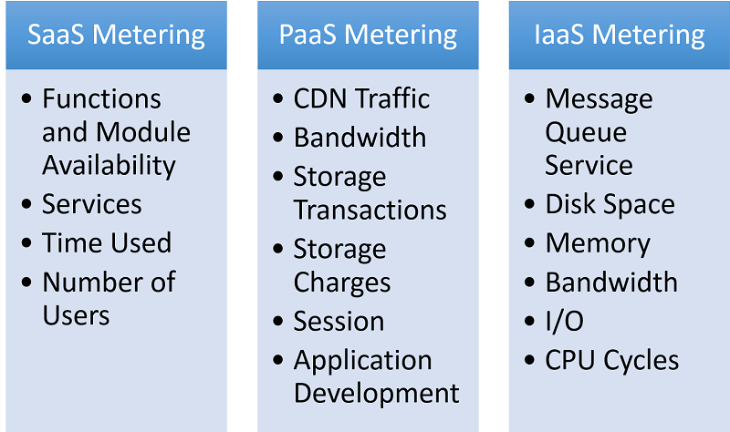
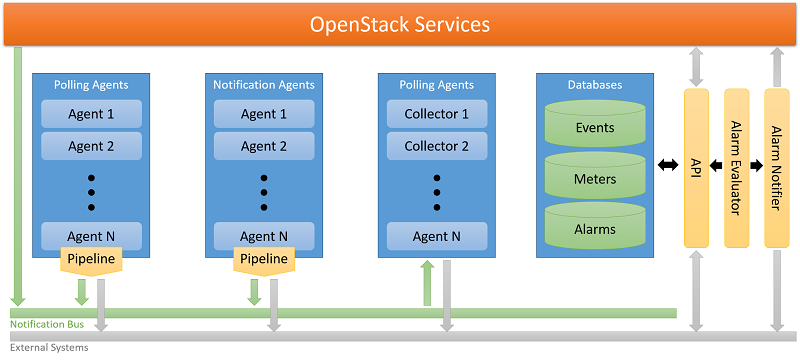

Cloud service providers (CSPs) charge their customers according to usage of their services. In order to do that, providers have to monitor the usage of their services carefully and have to include the cost of running these services in their infrastructure. This is mission critical for both CSPs and their customers. 

The revenue stream of a CSP depends on the correctness of metering and monitoring its resources. Losing resource usage data for a couple of hours can cost a cloud provider millions of dollars. On the other hand, overcharging customers for a couple of hours can highly affect the company's credibility.

From the customer's point of view, the cost of cloud resources forms an important part of their expenses. In order for cloud clients to make budget plans, they must receive consistent bills every month. This poses important challenges to cloud providers for metering and monitoring.

## Challenges for metering and monitoring

There are various costs included in cloud resources. Fixed costs such as facilities, staff, and servers are easy to calculate. Variable costs, however, require constant metering and monitoring. The advantage of using CSPs comes from paying only for the resources that are used. For example, provisioning an VM instance includes the cost of instance usage per hour, storage per GB-month for each storage type, and data transfer per GB-month. Even for this one resource, the cloud provider has to keep track of these metrics for every instance and attached volume. In Figure 3, a possible breakdown of various cost for services can be found. If we imagine doing this for more than 1 million cloud customers for tens of different types of services, this will require the metering and monitoring of gigabytes of logs every minute and charging customers accordingly. The most popular model that is used to define such metrics is called the chargeback model.

_Figure 3: Metering in different types of cloud services_

## Chargeback model

The chargeback model is the ability of an IT organization to measure the usage of resources and charge back its customers accordingly. Traditionally the chargeback model is easy to implement, since an IT department can easily divide its budget for the business units that it serves (software licenses, stand-alone servers, etc.). This is challenging in cloud computing because the CSP needs to consider the rate and time of consumption. 

## Validation for metering and monitoring

From the customer's point of view, verifiable metering is an important issue. There are some costs that are easy to measure, like VM usage (hourly usage * cost per hour), but it is hard for customers to measure other resources such as data transitions or I/O requests. In order to verify metering and monitoring, users can work with certified cloud providers. For instance, IBM's Resilient Cloud Validation program allows businesses that collaborate with IBM to perform a consistent program of benchmarking and validation of cloud services.

## Case study: Ceilometer

Although the underlying architecture of metering and measuring is hidden by corporate CSPs, Ceilometer is designed for OpenStack metering, billing, and rating. The high-level architecture of OpenStack Ceilometer can be summarized as follows (Figure 4): 

_Figure 4: Ceilometer architecture_

**Polling Agent**: A daemon that polls OpenStack services for metering. 

**Notification Agent**: A daemon that listens to notifications on the message queue and converts them into samples and events. 

**Collector**: A daemon designed to gather metering data created by the notification and polling agents. 

**API**: A service to query the data recorded by the collector. 

**Alarming**: Daemons to evaluate and trigger notifications based on predefined rules. 

Each of these services is designed to scale horizontally. Additional workers and nodes can be added according to the expected load.
