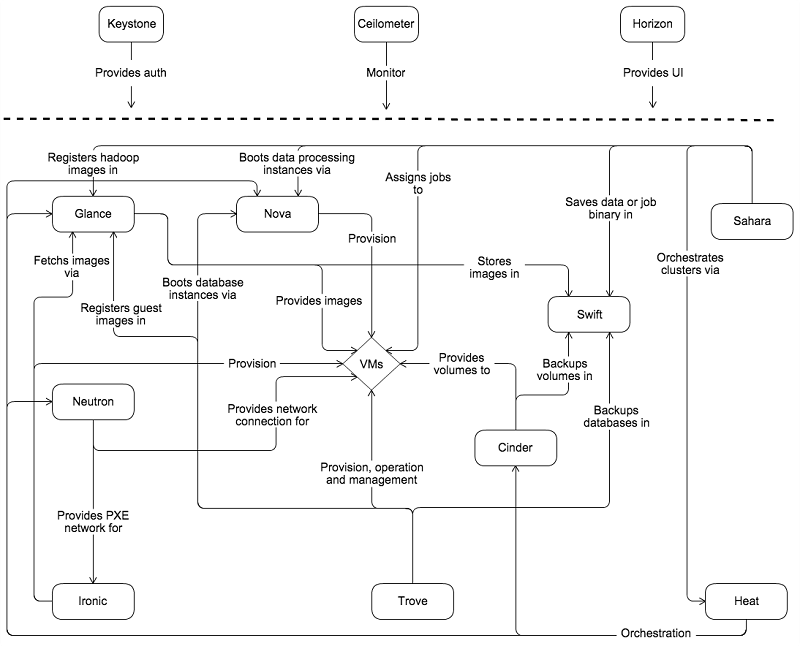

Earlier, we described OpenStack as a popular solution that allows developers to build both public and private clouds. At the time of writing, OpenStack has mature offerings that cover a large part of the cloud software stack spectrum. We take a very quick conceptual overview of the various pieces of the OpenStack architecture, as the complete description of the OpenStack architecture is beyond the scope of this course. The purpose is to give you an overview of the different components that make up a cloud software stack. 

OpenStack consists of multiple layers that can be used to configure, provision, manage, monitor, and deprovision various types of compute, storage, and networking resources. 

A high-level view of the various services involved in the OpenStack middleware suite is represented in the following figure:

_Figure 6: OpenStack service architecture_

## User authentication service (Keystone)

The primary authentication service in OpenStack is called Keystone. Keystone is an OpenStack project that provides **Identity**, **Token**, **Catalog**, and **Policy** services for use specifically by individual services in the OpenStack family.

The identity service provides authentication credential validation, as well as data about users and groups. The token service validates and manages session tokens used for authenticating requests once a user's credentials have already been verified. The catalog service provides an endpoint registry used for endpoint discovery. The policy service provides a rule-based authorization engine and the associated rule management interface, which can be used to dynamically grant or deny resource privileges to specific applications and services.

## Monitoring service (Ceilometer) 

The Ceilometer project aims to deliver a unique point of contact for billing systems to acquire all of the measurements needed to establish customer billing across all current OpenStack core components, with work underway to support future OpenStack components. Celiometer is designed to provide efficient collection of metering data, while ensuring that metering messages are digitally signed and non-repudiable. Ceilometer was introduced in "Metering and Monitoring Cloud Services." 

## Orchestration service (Heat) 

Heat is the primary orchestration system in OpenStack. Heat provides orchestration services for higher-level systems such as Sahara, OpenStack's cluster provisioning system that is similar to Azure HDInsight. Heat can orchestrate individual cloud middleware services such as the compute service (Nova), block storage service (Cinder), and networking service (Neutron). 

## Virtual machine image service (Glance)

Glance image services include discovering, registering, and retrieving virtual machine images. Glance has a RESTful API that allows querying of VM image metadata, as well as retrieval of actual virtual machine images. 

## Object storage service (Swift) 

Swift is a highly available, distributed, eventually consistent object store, similar to Amazon's S3. You create, modify, and get objects and metadata by using Swift's Object Storage API, which is implemented as a set of REST web services. We will take a closer look at OpenStack's Swift service in future modules.

## Block storage volume management service (Cinder)

Cinder is an OpenStack project to provide "block storage as a service," similar to block blob storage in Azure Blob Storage. Cinder allows users to define block storage devices and attach them as volumes to individual virtual machines. Cinder virtualizes pools of block storage devices and provides end users with a self-service API to request and consume those resources without requiring any knowledge of where their storage is actually deployed or on what type of device. Cinder is also used by the Glance service to instantiate volumes from virtual machine images. Cinder is designed to work with a growing number of storage systems and devices, including storage area network (SAN) appliances and distributed file systems. 

## Cluster provisioning and management service (Sahara)

The Sahara project aims to provide users with a simple means to provision data-processing frameworks (such as Hadoop, and Spark) on OpenStack, much like Azure HDInsight. Sahara can be used to specify cluster configuration parameters such as the framework version, cluster topology, and node hardware details. Sahara uses Nova to provision individual cluster nodes using framework-specific images supplied by Glance. Sahara then runs special scripts to complete the configuration of each of the individual cluster nodes so that they are ready to execute jobs. 

## Compute service (Nova)

Nova is an OpenStack project designed to provide massively scalable, on-demand, self-service access to compute resources. Nova is designed to provision and manage different virtual machines deployed using different virtualization platforms, including Xen, VMware, and Hyper-V. It can even deploy virtual machines onto AWS EC2, with an aim to support the notion of "cloud bursting." The Nova service is also used by other services such as Trove (to provision virtual machines that hold databases) and Sahara (to provision virtual machines for analytics clusters). 

## Database as a service (Trove)

Trove is a database as a service for OpenStack. It's designed to run entirely on OpenStack, with the goal of allowing users to quickly and easily utilize the features of a relational database without the burden of handling complex administrative tasks. Cloud users and database administrators can provision and manage multiple database instances as needed. The service focuses on providing resource isolation at high performance while automating complex administrative tasks, including deployment, configuration, patching, backups, restores, and monitoring. 

## User interface (Horizon)

Horizon is the canonical implementation of OpenStack's Dashboard, which provides a web-based user interface to OpenStack services, including Nova, Swift, and Keystone. Users can sign in to Horizon to get interactive dashboard views of the status of their resources, and issue service requests to individual OpenStack services.

## Physical hardware management (Ironic)

Ironic is a bare-metal provisioning system that can be used to control physical servers. Ironic has the ability to power on and power off individual servers using industry-standard protocols such as Intelligent Platform Management Interface (IPMI). Once machines are powered on, the system can coordinate the machine boot-up process through the Preboot eXecution Environment (PXE), using specific boot images stored in the image management service (Cinder). 

One may wonder why bare-metal provisioning makes sense in a cloud environment where virtualized resources are the norm. There are situations where bare-metal provisioning could be advantageous. For example, a client that has a higher SLO requirement for compute performance for a high-performance computing application may require dedicated hardware without the overhead of a hypervisor. In such a case, it would be advantageous to provision and dedicate an entire physical server without virtualization. 

As an example of one of the scenarios that Ironic can be used in, consider the case where there's a physical server capacity crunch due to a large number of virtual machines that have been provisioned. In this case, Ironic can power-on additional servers and configure them to boot with a specific hypervisor image. Once the additional capacity is made available, virtual machines can be provisioned on the new servers, or existing virtual machines can be migrated to the new servers. In case of the reverse (where the physical server capacity is not being fully utilized), virtual machines can be consolidated to a smaller number of physical servers, and the servers that have been freed up can be powered off to save on electricity costs.

