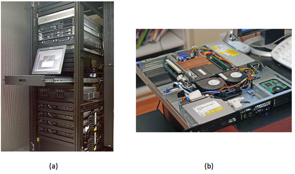
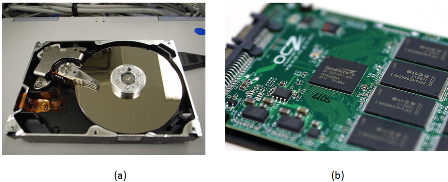
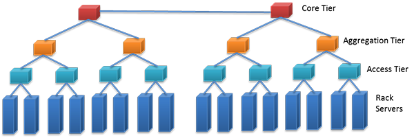
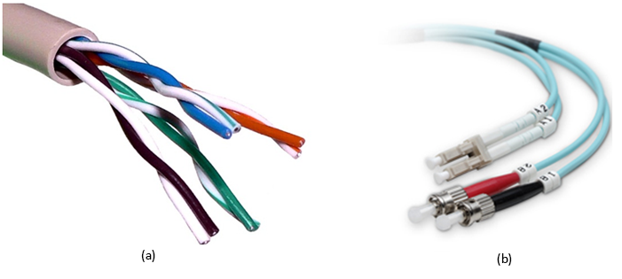
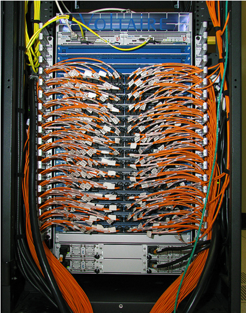

In this section, we define IT equipment as anything that is mounted in a rack (called **rack-mounted equipment**). This equipment typically includes servers, dedicated storage arrays, network switches and routers, power distribution, and remote management devices. We are specifically referring to a four-post rack inside a cabinet enclosure. Additional types of racks are described later in this module.

## Servers

A **rack-mounted server** is similar to a tower PC, except turned horizontally and made to fit into a thinner, deeper chassis (see Figure 1). The height is measured in multiples of rack units, where 1U = 1.75 inches (4.45 cm). A 1U server can be CPU and RAM dense but leaves little room for I/O expansion cards (usually two). A server that is 2U or 3U can have six to eight I/O card slots. Smaller chassis must also have smaller fans and therefore make considerable noise compared to your average desktop computer. (This is acceptable because most server rooms are not occupied by humans.) Systems that have 4U, 5U, or larger chassis usually have a specialized function. One example is an 80-core Intel server, which has CPU sockets and RAM on vertically mounted daughter cards. Another example is a quad-GPU accelerator server. A third example is a server chassis with a 24, 36, or 48 internal hard drives.

_Figure 1: (a) Servers mounted in standard 19-inch rack. (b) A look inside a 1U rack-mounted server._ ([Source](http://en.wikipedia.org/wiki/file:rack001.jpg))

Rack-mounted servers have their own fans, **power supply units (PSUs)**, network, and I/O, but **blade servers** share all of these across many nodes within the same blade **enclosure** (called a blade **chassis**). There is no common blade standard, so each vendor's blades work only with its enclosures. Blades are thin, vertical metal enclosures and slide into the front of a blade chassis and attach to a common **backplane**. Each blade has its own motherboard, CPU, RAM, and disk. The shared PSUs are typically more efficient than dedicated rack-mounted versions because they can power up or down incrementally, adjusting PSU capacity to load demand. For example, instead of 10 servers with 2 * 750-W redundant PSU, a blade enclosure can power the equivalent of 10 servers with 4 * 2,500-W PSU, with one being redundant. Blades are denser than their horizontally mounted counterparts, allow for easier maintenance, and require fewer cables. The disadvantage is higher upfront cost if you need only a few servers; plus, you are locked in to a specific vendor.

Last, there are a few servers that look similar to a standard rack-mounted server, except they have two motherboards horizontally per 1U, each mounted on its own tray. They also share a PSU but, unlike blades, have their own fans and I/O. There are variations on this theme, such as four nodes per 2U or two nodes with multiple GPUs.

> [!div class="alert is-tip"]
> ### Did you know?
>
> A 1-U rack-mounted server is sometimes called a "pizza box."

The following video describes various server form factors:
 

> [!VIDEO https://www.microsoft.com/en-us/videoplayer/embed/RE4pXFF]

An important feature found in most rack-mounted servers is hot-swap capability. Components such as PSU, fans, and hard drives can be removed and replaced while the server stays running. This feature increases uptime/reliability on small- and medium-scale deployments. Large-scale application deployments require more sophisticated resiliency to be built into software layers. These large-scale systems do not use hot-swap or redundant components for individual servers, but instead consider the entire server to be failed (and replaced) as a unit.

The electrical components (for example, capacitors, voltage regulators) of a server are typically more expensive and longer lasting than those parts used on desktop systems because the servers are designed to run 24/7 for many years on end. A workstation is similar to a server-class computer, with similar CPU, high RAM capacity, and added reliability. The difference is that a workstation sits at the user's desk, so it requires quieter fans. To add to the confusion, there are also rack-mounted workstations. These workstations are just like a server but have remote viewing capability, so the end user sits at a thin client.

Newer servers are now being designed to run reliably at higher ambient room temperatures (up to 95° F, or 35° C), which decreases cooling requirements and therefore lowers operational expense.

### On the motherboard or mainboard

**CPU and memory**: A typical server motherboard has more CPU sockets than a desktop system, and each of those sockets can control more DIMMs (dual inline memory modules). Other primary differences of server-class CPUs versus desktop class (Intel Xeon versus i3/i5/i7; AMD Opteron versus FX/A/Phenom) are more onboard cache, support for registered DIMMs, and support for error-correcting code (ECC) RAM.

Server-class CPUs also have dedicated circuitry that allows them to communicate with each other through dedicated channels in the motherboard. For Intel, this is known as QuickPath Interconnect (QPI), and for AMD, it is known as HyperTransport (HT). These follow a nonuniform memory access (NUMA) model, in which processes running on other CPUs (sockets) can access large amounts of RAM by going through QPI or HT to the RAM attached to another CPU. Combining high-density, [registered DIMMs](http://en.wikipedia.org/wiki/Registered_DIMM) (16 GB or 32 GB), more DIMM slots per server (9 or 16), and multiple sockets with onboard interconnect, a single server can have 512 GB or even 1 TB of RAM available to a single process. (You get higher performance when you have multiple processes with multiple threads each, but that is a topic for another course.)

**Onboard management**: Although many desktop motherboards now have onboard gigabit Ethernet (GigE) networking, this trend started with servers, and on modern servers, you will find two to four GigE ports. Other onboard devices that a server includes are a serial port for console redirection and an embedded management controller, which allows remote management even if the system is powered off (but still plugged in) or if the OS is not responding (such as kernel panic). Many server motherboards have onboard hard drive controllers, but these are also common in the form of an expansion card, which is discussed below.

### Expansion cards

**PCI Express**: Often, a server requires additional I/O devices, depending on the applications intended to run on it. PCs and mainframes have always had some notion of expandability, and expansion buses have evolved from ISA to PCI to PCI-X to what is the current standard—PCI Express (PCIe). The biggest difference between PCI and PCIe is that PCIe is based on point-to-point, high-speed serial links, rather than an actual bus, which has multiple devices attached. Each of these high-speed links constitutes a lane, and multiple lanes work in parallel. So a PCIe device that is x8 has eight of these high-speed lanes. Each generation of PCIe, from 1.0 to 3.0, effectively doubles the bandwidth of the previous generation.

|PCIe generation|x1 (MB/s)|x4 (GB/s)|x8 (GB/s)|x16 (GB/s)|
|--|--|--|--|--|
|1.0|250|1|2|4|
|2.0|500|2|4|8|
|3.0|985|3.94|7.88|15.75|

**RAID**: RAID (redundant array of inexpensive disks) adapters allow multiple hard drives to act as a single logical unit, with increased performance and redundancy or a mixture of both.

|RAID level|Name|Advantages|Disadvantages|
|--|--|--|--|
|0|Called block-level striping.|Improved performance.|No fault tolerance, and a single drive failure destroys the entire array.|
|1|Called **mirroring** because data is replicated entirely.|Can withstand drive failure. It has faster reads (sometimes), and this level maintains performance on failure.|One-half the capacity versus two independent drives. This level has slower writes.|
|10|Called RAID 1+0 or 10 **(mirroring+striping)**. It combines the speed of RAID 0 and redundancy of RAID 1.|Provides fault tolerance. It has improved performance. This level maintains performance on failure. |One-half the capacity versus two independent RAID 0 arrays.|
|5|Block-level striping with distributed parity.|This level can withstands single drive failure, and it has more capacity versus RAID 1, 10, and 6.|Slower writes than RAID 0, 1, and 10, degraded performance on failure, and slow rebuild process.|
|6|Block-level striping with double-distributed parity.|Withstands two drive failures and has more capacity versus RAID 1 and 10 (with more than four drives).|Slower writes than RAID 5, degraded performance on failure, and slow rebuild process.|

RAID controllers come with different number of ports (connected drives), support different interfaces (SATA, SAS), vary in amount of built-in cache (for example, 512 MB, 1 GB), and have varying performance levels (MB/s throughput, I/O per second). Each of those factors can change the price of the adapter (from a few hundred to over $1,000). 

A host bus adapter (HBA) is similar to a RAID controller, except that it connects to external storage (discussed in the next section) and does not typically include any RAID features on the card itself. The card will encapsulate all communication, so the remote disk device will look like a local disk to the OS and is bootable.

**Networking support**: Ethernet network adapters can include single or multiport cards, with speeds ranging from 100 Mbps (obsolete) to 1 Gbps (common, inexpensive), 10 Gbps (becoming more prevalent but still expensive), or 40 Gbps (available but not common yet).

A host channel adapter (HCA) refers to a high-speed, low-latency interconnect adapter, such as InfiniBand. These are typically used on high-performance computing (HPC) clusters.

Solid-state storage cards are now available, such as those from Fusion-io. They provide much faster performance than RAID controllers, especially on random I/O. They have a very high cost per gigabyte compared to hard disk drives (HDDs) or even solid-state drives (SSDs) (see the following "Storage" section).

**Accelerators**: Video cards, started in desktop computers, use GPUs for fast 3D rendering. These GPUs can also be used for scientific computation, so they made their way into HPC server markets. Now, NVIDIA Tesla series accelerators can be found in more than 50 of the top 500 supercomputers. Recently, Intel released an accelerator product, the Xeon Phi, which is based on Many Integrated Cores (MIC) architecture and is similar in performance to the Tesla product (>1 teraflop). These cost approximately $3,000 but can increase performance 2.5x to 10x (often) to 100x (atypical) for math-intensive applications. Note, however, that these will not fit into an average server case due to the large size of the card and additional PSU requirements.

## Storage

When most people hear the word "storage," it is likely that they will envision an HDD (see Figure 2a). Inside an HDD, the rotating platters and moving read/write head have been similar for decades. What have evolved are higher areal density, new recording techniques, faster interfaces, and overall lower power. The two most common form factors of HDDs are 3.5 inches and 2.5 inches. Rotational speeds can vary, but common RPM values are 5,400, 5,900, 7,200, 10,000, and 15,000. The higher the RPM, the lower the latency between random seeks.

_Figure 2: (a) Internal view of a hard disk showing the rotating platters and read/write head. (b) SSD with circuitry exposed._ ([Source](http://www.flickr.com/photos/auxo/6901630801/))

> [!div class="alert is-tip"]
> ### Did you know?
>
> The maximum physical capacity of a hard drive is governed by what is called the [superparamagnetic limit](http://en.wikipedia.org/wiki/superparamagnetism#effect_on_hard_drives).

**SSDs** (as shown in Figure 2b) are becoming more affordable, but still have a much higher cost per gigabyte than their mechanical counterparts. SSDs are completely electronic; there are no moving parts, which gives lower seek times, higher performance, and higher reliability. SSDs do have a limited number of writes, but one would have to continuously write to the drive 24 hours a day for several years to reach that limit. The terms _SLC_, _MLC_, and _TLC_ refer to how many voltage levels there are in each cell: S is for single (1), M is for multi (2), and T is for triple (3). The fewer the levels, the more reliable it is (SLC > MLC > TLC). The more levels, the higher the density (TLC > MLC > SLC). SLC is generally reserved for high-throughput transactional servers. MLC is the most common replacement for desktop and laptop drives, plus servers that need higher I/O performance than a fast (10,000 or 15,000 rpm) HDD can provide. TLC is emerging as a lower-cost alternative to MLC, but somewhat compromises performance and reliability to achieve a lower price.

The hard drives that are found in datacenters are nearly identical to those found in desktop PCs. The primary difference between an enterprise and a regular SATA drive is added antivibration protection, which claims to increase the lifespan of drives that are rack mounted with many other drives in the same chassis. They also come with longer warranties—5 years instead of 3.

**SATA (serial ATA)** and **SAS (serial attached SCSI)** are the two predominant interfaces for all modern HDDs and most SSDs. For servers, SAS provides the ability for a single drive to "talk" to two drive controllers (in case one controller fails). SAS also requires lower CPU usage and provides the ability to daisy chain a large number of drives via an SAS expander. Most RAID controllers that support SAS also support SATA, but the inverse is not true.

**Direct attached storage (DAS)** refers to a rack-mounted chassis that holds additional drives, along with PSUs and fans, but minimal control logic. All of the work is done by the controller (on the server) that these units attach to. A typical connection is made through external SAS cable (high-speed serial, multilane, copper).

A **storage area network (SAN)** is a collection of hard drives in a chassis that can be connected to many servers. A system administrator will carve the array into LUNs (storage [logical unit numbers](http://en.wikipedia.org/wiki/logical_unit_number)), where each LUN can be used for a different purpose. Many servers connect to the same SAN simultaneously, but only one server accesses a given LUN at a time (unless coordinated sharing software is installed, such as VMware). Servers connect to the SAN through a network, typically Fibre Channel or iSCSI over Ethernet (1 Gb or 10 Gb). Each LUN gets a unique World Wide Name (WWN), which can be used for zoning and masking, providing security so that servers can only read the LUNs that belong to them. Access can also be restricted by IP and subnet.

Most commercial SAN products span multiple rack units or even multiple racks, and have multiple redundant controllers and network paths to increase uptime. SANs have embedded RAID controllers, so disk failures are transparent to the attached servers. SAN products vary greatly and, depending on features, performance, and capacity, can range from $5,000 to several million dollars.

**Network attached storage (NAS)** is a device or server that shares a file system to multiple users over the network. Any Linux server can become a NAS, and many consumer dedicated NAS devices run Linux underneath. The two most common protocols used by a NAS are CIFS (Common Internet File System, also called Server Message Block or SMB) and NFS (Network File System). CIFS comes from Microsoft Windows heritage and is a per-user connection in which NFS is primarily used on UNIX/Linux and is a per-host connection.

Last, there are many [distributed parallel file systems](http://en.wikipedia.org/wiki/list_of_file_systems#distributed_file_systems) that are typically used in compute clusters and implement a many-to-many scheme. These provide a much higher combined throughput than any single SAN or NAS and can scale in both performance and capacity.

The choice of which type of storage to use is largely dependent on the application, and most organizations will use a combination of the above. For example, a large storage array uses a parallel distributed file system on its internal back-end network but presents SAN-style LUNs and provides NAS capability for other clients. A Windows file server will look like a NAS to a client mapping a network drive, but it is likely that the storage device in which files actually reside are in a SAN, which is outside of the Windows server itself. When we learn about resource sharing in a later module, some of those features (live migration, fault tolerance) require a SAN storage device.

## Networking

In addition to servers, a datacenter houses all of the network equipment that is used to connect those servers to each other and to the outside world.

One popular design is the **multitier** topology (as shown in Figure 3), in which servers connect directly to switches. Those switches link to aggregation switches, which, in turn, connect to the rest of the organization's network (such as core switches) and eventually to the upstream ISP.

_Figure 3: A stack of network switches mounted in a rack._ ([Source](http://www.flickr.com/photos/kenfagerdotcom/7536249106/in/photostream/))

A **fatter** (higher bandwidth) connection typically links the bottom-tier and aggregation switches. For example, with 48x 1-Gb ports connecting the rack servers and the access tier, the access to the aggregation tier might have 2 * 10-Gb uplinks.

**Top of rack (TOR)** refers to a configuration in which the lowest tier of network switches is found in each rack. This design can decrease cabling cost and complexity because the wires are shorter and can be copper, even at 10-Gb speeds. This is especially useful if most of the network traffic is to other servers in the same rack. Apache Hadoop, for example, can take advantage of this topology for choosing which nodes to store data (on rack and off rack) and which nodes to retrieve data (on rack) from. One disadvantage includes limited scalability. Ethernet switches are blocking, which means that if all the ports are busy at the same time, the backplane cannot handle all the traffic, so some requests are postponed. Also, the uplinks that are available are typically less than the full possible bandwidth of the Ethernet switch. (For example, you cannot have a 48-Gbps uplink on a 48x 1-Gb switch.) In most real-world scenarios, however, those uplinks are never saturated because not every server is using the full capacity simultaneously. Another disadvantage is port utilization. Switches come with a specific number of ports, typically 24 or 48. If you have a number of servers in between that, you will have some ports in each rack that are never used.

**End of row (EOR)** refers to a configuration in which you have a row of adjacent racks, or a row of back-to-back racks, sometimes called a bay. There is one additional rack dedicated for network switches, and all of the hosts in that row (or bay) are wired to that dedicated rack. Wiring is done either above the racks in a wiring tray or below the racks, underneath a raised floor (more on that in the next section). The switches in this dedicated rack can be a larger (10 U or higher) modular chassis, in which each module communicates to other modules through a fast backplane. The advantage is that all servers in the same row (or bay) can communicate with each other at the same speed (and lower latency), so there are fewer bottlenecks. The disadvantage is higher upfront cost and more complex cabling (harder to debug if there is a problem). Gigabit links can still be copper at this distance, but anything 10 Gbps or above should be fiber.

**Ethernet** is by far the most popular type of network in datacenters (and elsewhere in organizations). Although its rise in popularity started in the 1980s with 10 Mbps, both that and 100-Mbps products are obsolete because of the low price and ubiquity of 1-Gbps products. The primary driver for Ethernet popularity is the low cost and ease of installation of twisted-pair wiring. The most common type of Ethernet wiring is unshielded twisted pair (UTP) (see Figure 4a), which has four pairs of thin (28 AWG) copper wires and comes in different categories: Category 5 (Cat 5) is good for 10/100 Mbps, Cat 5e and Cat 6 are good for 1 Gbps, and Cat 7 can go up to 10 Gbps. Each generation has slight design changes over the previous one, which allow for greater bandwidth and/or longer runs. Alternatively, shielded twisted pair (STP) has an extra metal shielding on the outside for use in electrically noisy environments (such as a factory or near high-power lines). The shielding reduces interference but is generally not needed for most in-rack installations.

Ethernet can also travel over fiber-optic cable (as shown in Figure 4b). Fiber is unidirectional, so in a cable, you will see two strands, one send and one receive. The electrical signals are converted to photons, which stay inside the fiber due to the differences in indexes of refraction between the core (thin center) and cladding (thicker outside layer). The cladding is covered by a layer of fireproofing material. Fiber cables are thinner and lighter than copper cables, but care has to be taken in routing to maintain a minimum bend radius. Otherwise, some photons escape, causing loss. Multimode fiber is most commonly used inside datacenters because the cables and transceivers are much less expensive than single-mode fiber. Single-mode fiber is generally reserved for long-distance (100 m to 40 km) connections. Higher-speed Ethernet of 40 Gbps is actually 4x 10-Gbps links that work in unison (similar to PCIe lanes); similarly, 100 Gbps is 10x 10 Gbps (copper, fiber) or 4x 25 Gbps (fiber only).

_Figure 4: (a) Cutout of an unshielded twisted pair (UTP) cable, showing four pairs of cables. (b) Fiber-optic network cable. LC connectors on top and ST connectors on bottom._ ([Source](https://en.wikipedia.org/wiki/File:UTP_cable.jpg))

**Fibre Channel (FC)** is a protocol designed to support SANs and remote block-level storage devices. Even though it typically runs over fiber, it can also run over copper. It can also be encapsulated in Ethernet in the form of Fibre Channel over Ethernet (FCoE) but is not routable like iSCSI. Fibre Channel HCA and switch generations are named by their speed (in Gbps)—# GFC, in which # is 1, 2, 4, 8, 10, or 16. The most common now is 8 GFC, which supports 8-Gbps links (approximately 800 MB/s in each direction).

**iSCSI**, or **internet SCSI** (pronounced "scuzzy"), is a protocol that packetizes SCSI (Small Computer Systems Interface, an old hard drive standard) commands to be transported over LANs or WANs. Many SANs support iSCSI, and it is popular because you can use your existing Ethernet network instead of deploying a dedicated FC network.

**InfiniBand (IB)** has been popular in HPC clusters for almost a decade and is also gaining traction in other areas in the datacenter. The main advantage of InfiniBand is much lower end-to-end latency compared to Ethernet (1.7 microseconds versus 12.5 microseconds for 10 GigE, versus 30 to 100 microseconds for GigE). It also scales better with the number of nodes in a [cluster](http://www.hpcadvisorycouncil.com/pdf/ib_and_10gigE_in_hpc.pdf). The other key factor in IB performance is that the switches (shown in Figure 5) are fully nonblocking, which means the backplane supports are running every single port at full speed, in both directions. InfiniBand speeds are summarized in the chart below:

|SDR|DDR|QDR|FDR-10|FDR|EDR|
|--|--|--|--|--|--|
|8 Gbit/s|16 Gbit/s|32 Gbit/s|40 Gbit/s|54.54 Gbit/s|100 Gbit/s|

InfiniBand and 40-Gbit Ethernet are also being deployed as a **converged network**, or **virtual fabric**, which, along with virtualization of the OS, allows many virtual adapters (Ethernet, FC-HBAs) to run over fewer high-speed links. The connections can be configured dynamically through software and allow for fewer cables and easier maintenance and management.

_Figure 5: An InfiniBand switch._ ([Source](https://en.wikipedia.org/wiki/File:UTP_cable.jpg))

The choice of network technology and topology to deploy in a datacenter also depends on your applications but will typically include multiple tiers, with the connection between the tiers being high-speed fiber. Copper UTP cabling is prevalent within the rack and will continue to function well for low-speed management networks.

