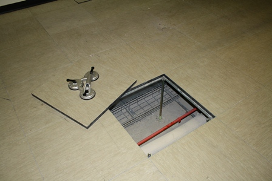
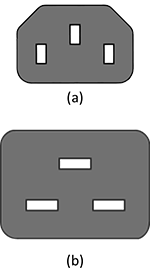
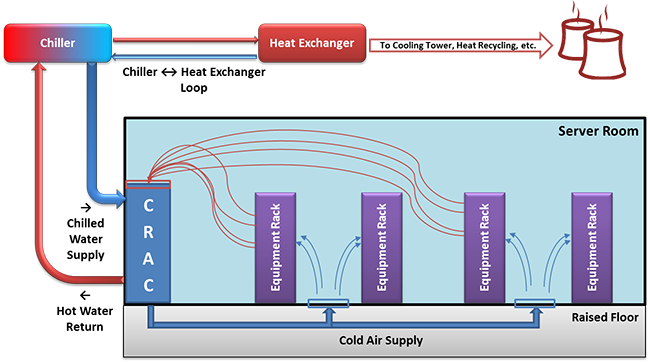

Let's look at the infrastructure configuration for a datacenter.

##  Datacenter facilities

A datacenter's functional units (servers, storage, networking) all rely on a facility's infrastructure, which includes physical space, power, cooling, and safety. In assembling each of the latter component systems, designers prioritize redundancy issues. Redundant power sources, for example, minimize the risk of service outages should the building lose main power. Redundant cooling avoids physical damage to IT equipment during an unplanned outage and enables planned outages for HVAC equipment maintenance. 

## Server room

A server room can vary in size from a single rack in a closet to several hundred square feet to a warehouse the size of a football field. Some authors use the terms "server room" and "datacenter" interchangeably. For the purpose of the course, we define a **server room** as the actual room that houses all of the racks full of IT equipment, and a **datacenter** as the server room plus all of the power and HVAC equipment that may be located outside of that room.

You were already introduced to the concept of a rack and a rack unit (U). Figure 6 shows a rack inside an open cabinet. Sometimes racks are also called cabinets. There are several variations of racks, but the most common are 19 inches wide (measured from the center of each hole on the same U). Some IBM equipment racks measure 24 inches post to post, inherited from older mainframes. Usually, network equipment is designed to mount on only two posts of the rack because wiring closets often have only two posts permanently mounted to the floor and/or wall. Servers, however, are designed to mount on four-post racks. The depth of the rear two posts is not standardized, and in most racks you can adjust the depth. Different rack-mount equipment has different depths, and each server or storage array will come with two mounting rails that connect to the front and rear posts on the left and right sides. There are two types of holes in vertical posts, square and round. Some mounting rails hook directly into square holes and have tool-less installation (fast). For round-hole racks, equipment is directly screwed in (this is more popular for telecom and A/V racks). If you need to mount round-hole style equipment or rails into a square-hole rack, you use cage nuts and bolts.

_Figure 6: 42-unit (42U) four-post rack cabinet with sides and doors removed_

The most common height rack is 42U, and that is simply to fit through a normal doorway. The overall height, width, and depth of racks by different manufacturers are not exactly the same; the only guarantee is the post widths. Some racks have extended depth, which is useful for larger servers and/or routing cables and mounting zero-U (vertical mount outside of the 42U space) equipment. "Wide" racks have extra space to the left and right of the posts, which is useful for end-of-row networking racks because of the added space to run many cables. Racks also have casters that allow them to be rolled into place or moved if needed. However, these wheels are not meant to permanently support the full weight of a filled rack, which is why you have to screw down the four stabilization feet at each corner. Regions that are prone to earthquakes also have safety regulations that require racks to be bolted into concrete through metal plates on the front and rear of the rack.

Many server rooms have a raised floor, although it is not a strict requirement. This provides a plenum for cold air to be distributed throughout the room (tiles in front of racks have vent holes). Raised floors also provide space to run electrical or network cable or chilled water pipes for in-row cooling. Last, they provide more flexibility for future layout/configuration changes. Figure 7 shows what a raised floor looks like. 

_Figure 7: Example of a raised floor_

The floor consists of an array of metal support pedestals that are mounted to the subfloor; metal stringers that are placed horizontally between pedestals; and strong floor tiles that rest atop the stringers at each corner at a pedestal. When a tile is removed, the holes are large enough for a human to fit through, and the tiles are strong enough to withstand the weight of a filled rack. Tiles do have a rollover rating, however, and for safety reasons, any tile that has been rolled over (moving a filled rack on top of it) more times than it is rated for should be replaced. Also for safety reasons, on a stringerless floor, no more than two or three consecutive tiles should ever be lifted from the floor simultaneously. If there is a problem with one of the pedestals, weight can shift laterally, cascading to a catastrophic floor failure.

Above the racks are cable trays that run horizontally between racks. There are options to hang these from the ceiling, or some racks have optional trays that mount on top. For electrical safety, these are required to be properly earth grounded, even if they are carrying only network cable. When there are a many wires to run between two racks, hook-and-loop (Velcro) fasteners are most often used to bundle the wires together.

Most datacenters implement strict physical security procedures—for good reason. If someone with bad intentions had physical access to a server, they could, for example, gain administrative privileges, steal data, eavesdrop on network connections, and install viruses/Trojans. Common practice includes keycard/PIN access and/or biometric scanner, full-time security guard, cameras, and break-in detectors. In shared datacenters with multiple tenants, one technique is to have a perimeter chain-link fence with a padlock around each customer's set of racks. Watch Google's security practices [here](http://youtu.be/cLory3qLoY8).

## Power

The following video discusses various power distribution methods in datacenters:
 

> [!VIDEO https://www.microsoft.com/en-us/videoplayer/embed/RE4pHZL]

Reliability/uptime is often the number-one design consideration for a datacenter. Unfortunately, the power feeding the datacenter is not 100% reliable because of events such as bad weather conditions and downed power lines. In some locations, it is possible to get feeds from multiple electrical utility suppliers, but often this is not available. To keep the IT equipment powered on during a power outage, a generator can be installed. Backup generators come in two varieties, powered by either diesel fuel or natural gas. They could power the datacenter indefinitely as long as fuel is available, but both fuel sources are significantly more expensive than electricity from the grid. Generators are typically mounted outdoors due to fumes, noise, weight, and vibration. An automatic or universal transfer switch is a device that can choose a working power source (utility 1, utility 2, or generator) and connect it to the main power input to the datacenter.

Generators have a 15- to 60-second start-up time, so this is where an uninterruptible power supply (UPS) can provide power to the IT equipment until the utility power is restored or the generator is running. A UPS has many lead-acid batteries (like in a car) strung in series. For example, a 480-volt UPS would have a string of forty 12-volt batteries. A UPS also acts as a line conditioner and will switch to a DC battery source if it detects poor AC conditions, such as surges, sags, overvoltage, undervoltage (brownout), and variations in wave shape or frequency.

Between the UPS and the IT equipment, there are power distribution units (PDUs). Think of PDUs as similar to power strips you use at home but designed for higher voltages and amps, with more outlets and built-in circuit breakers. They often include monitoring features, so you can remotely see the power draw per branch (group of outlets connected to a single breaker). Some also include per-outlet power sensing (POPS) as well as remote on/off switching for each outlet. The outlets for PDUs do not look like the electrical outlets in your house; instead, they are IEC 60320 C13 (said "C thirteen"). See Figure 8a for a diagram of the C13 connector with a 10 to 12-amp rating, and Figure 8b for the C19 connector with a 16 to 20-amp rating.

For AC, higher voltage (400 V and 480 V) is more efficient for distributing power throughout a datacenter than 240 V or 208 V but still has to be stepped down before going to the actual server. Most server power supplies are universal and will accept input AC voltages ranging from 110 V to 240 V. The benefits to running at 208 to 240 V versus running at 110 to 125 V are slightly higher efficiency (5% to 10%) as well as getting the full rated power output (as labeled on the PSU). Most server room/datacenter installations will run at 200+ VAC for the efficiency, as well as lower pricing for electrical wiring (smaller-gauge copper). In order to boost efficiency, some server PSUs also support 277 V directly. Instead of traditional wire, some server rooms employ bus bars that mount overhead (above the racks) and have circuit breaker whips that can attach at any horizontal location (these are like track lighting, only larger).

_Figure 8: (a) C13 power connector. (b) C19 power connector._ ([Source](https://en.wikipedia.org/wiki/IEC_60320))

Some vendors offer DC distribution, in which the AC-to-DC conversion is done per rack, per row, or per bay, rather than converting AC to DC within every server power supply. These systems have been measured to be more efficient than their AC counterparts, but only 2% to 4% for average loads. For details, see the white paper "[Quantitative analysis of power distribution configurations for data centers (WP#16)](https://www.thegreengrid.org/en/resources/library-and-tools/393-WP#16---Quantitative-Analysis-of-Power-Distribution-Configurations-for-Data-Centers-)."[1][^1]

Because DC power supplies are not a commodity, these are only suited for large-scale deployments with custom components.

## Cooling

Many of the advances in datacenter efficiency over the last 10 years have come from new designs and methods for cooling.

_Figure 9: Typical datacenter cooling with a CRAC and raised floor_

Commonly found in traditional server rooms are computer room air conditioners (CRAC or CAC). These continuously take in hot air and output cold air into the space under a raised floor or into ducts. The difference between a CRAC and a regular air conditioner is that CRACs also provide humidity control. Keeping a relative humidity around 40% is recommended. If the air is too wet, you get condensation (bad for electronics and anything metal). If it is too dry, you get a higher risk of ESD, or electrostatic discharge (also harmful to electronics). The unit fans have to be sized large enough to create positive pressure and airflow for the volume of the room and have sufficient cooling capacity to maintain the desired "cold aisle" air temperature. We'll learn more about hot and cold aisles in a later module. The CRACs remove heat through the use of a condenser (similar to what is in your refrigerator at home) or through a heat exchanger that uses chilled water supplied by chillers elsewhere on site.

Measurement of energy for electronics is usually in kW, but most HVAC equipment is measured in tons or BTU/h, so here are two conversions:

- 1 kW = 3412 Btu/h
- 1 ton = 12,000 Btu/h

> [!div class="alert is-tip"]
> ### Did you know?
>
> A BTU, or British thermal unit, is the amount of energy needed to heat 1 pound of water to 1°F, and a ton is the heat absorbed by melting 1 ton of ice in 24 hours.

Using vapor compression, chillers remove heat from water in a closed-loop, high-pressure system, usually outputting water that is approximately 42° F (5.5° C). Chillers themselves need to dissipate the heat they remove from the water, which can be through air cooling (fans) or water cooling (needs another water source and/or cooling tower). Chillers are sized based on water temperatures (entering and leaving) and flow rate (gallons per minute). The main sources of energy consumption in a chiller are the electric motors in the compressor and pump(s).

To reduce the load on these chillers, evaporative cooling techniques are now frequently deployed for large datacenter installations. When hot dry air passes over water, some of the water evaporates, absorbing energy and cooling the air. If you want to use evaporative cooling, it is a good idea to locate a new datacenter near an abundant water source.

The overall system can be made more efficient if it does not have to cool as much air. Air-side economization is a method of using or mixing outside air when it is cooler than the recirculated air. This method is cost effective in cold climates but not as useful in hot and humid regions.

When rack densities increase to 10 kW or higher, it is helpful to move the cooling equipment closer to the rack. A product category that allows this is in-row cooling. This way the cold air can flow directly into the front of the IT equipment, and the hot exhaust air from the rear of the rack goes directly into the adjacent air conditioner. This method puts a focus back on cooling the racks, instead of cooling the room. Similar to in-row cooling, there are top-of-rack cooling systems. These systems are bolted to the top of each rack and provide localized cooling on a per-rack basis. The advantage of top of rack is that you are not taking up floor space in the server room, while the disadvantage is higher difficulty for installation and maintenance. Smaller-capacity, in-row systems use a compressor, whereas higher-capacity models use chilled-water or external gas refrigerant. Top-of-rack systems typically use external refrigerant. The advantage of using a gas refrigerant is that there is no chance of water leaking near the IT equipment. The disadvantage is the added cost of additional equipment in the server room, which removes the heat from the refrigerant loop (using chilled water). Both in-row and top-of-aisle systems offer a modular cooling approach. As long as the facility's chilled-water plant has enough capacity, you can add coolers only when you add new IT equipment, thus staggering your capital expenditures.

Hot-aisle containment is a method of placing your racks into rows/bays such that adjacent rows face away from each other (such as cold-hot-cold) and then completely enclosing the hot aisle. This arrangement prevents hot and cold air mixing before it recirculates back through the air conditioner, which greatly improves efficiency. Some server room designs employ the opposite, cold-aisle containment, in which the room itself is hot but the separate cold air is fed into the contained fronts of racks.

Although it has been mainstream among overclocking enthusiasts for years, water-cooling products (or glycol or other liquid) are also becoming available from several vendors. There are two approaches: one is to have specialized rack doors that are in essence huge heatsinks, with cold water fed in and hot water returned; the second is to have cold-in and hot-out water hoses going to every server in the rack, and inside each server are specialized heatsinks for the CPU (and GPU) that the water circulates through. In both cases, the servers still require fans to cool the other components (for example, RAM, hard drives).

One vendor even offers an extreme liquid cooling technique. The (sealed) rack is turned sideways and filled with mineral oil (nonconductive dielectric), and the servers are fully submersed vertically. The fans are removed, and the hard drives have to be sealed (or use SSD). It is best to use servers with front-facing I/O ports.

Many modern buildings' HVAC systems are designed to reclaim heat that is produced in the server room and use it elsewhere, such as hot water or heating (in cold climates), thus reducing overall energy costs.

## Safety

In addition to the safety notes mentioned earlier, there are some features of a datacenter that are safety specific.

### Fire suppression

The preferred system for putting out fires in a server room is to use a **clean agent**. An agent like this is stored and transported under high pressure so that it is a liquid and takes up less space. When activated, it is a gas that comes out of misting nozzles in the ceiling. The "clean" term means these systems do not leave residue or require cleanup as do handheld fire extinguishers (dry chemical) or water sprinkler systems.

Halon was the most popular fire suppressant in this category, but it is a CFC (greenhouse gas), and manufacturing of halons was banned in 1994. The old systems still exist (must use recycled halon) but cannot be used in new installations.

A popular clean agent of today is DuPont's FM-200 (CF3CHFCF3), which is nontoxic, and with a properly designed system, the gas will fill the room and extinguish all fires within 10 seconds (hint: do not leave the doors open). It is safe for humans to breathe but can create fumes when it reacts with fire. Standard practice is to leave the room (sealed) for 10 minutes to ensure all fire is out.

Another method of fire suppression is the use of inert gases, such as CO2. These gases work by reducing the ratio of oxygen in the air. The problem with these systems is that they are dangerous to humans and also not as effective (depending on the type of fire).

Traditional sprinkler systems use a large amount of water to decrease combustibility of everything in the room. They are not as effective for electrical fires, damage electronics, and require extensive cleanup. Sometimes they are required to be in every room by the municipality, so you might still find sprinklers alongside an FM-200 system. With a wet-pipe system, water is already in the sprinkler pipes, and heat from the fire melts the caps and releases the water. A more appropriate dry-pipe system has normally empty pipes, and smoke detectors will electronically trigger a preaction valve to fill the pipes (but the caps still have to melt before water comes out). The main purpose of sprinklers is to protect the building from collapse, not to protect the electronics in the room.

No matter what system is in place, modern facilities have electronic sensors throughout for monitoring and alerting building engineers, security, the fire department, and other pertinent parties in an automated fashion.

### OSHA compliance

Occupational Safety and Health Administration (OSHA) is a governmental entity (under the US Department of Labor) that is tasked with providing regulations to maintain a safe workplace environment. Some of the rules you might find in a datacenter are not as common elsewhere.

Noise is becoming more of a problem, not just from fans on the IT equipment, but also from the HVAC systems. To maintain safe volumes, ear plugs or earmuffs are recommended for all personnel while inside the server room.

Procedures for removing floor tiles on raised floors should include cones or temporary barriers so that someone does not accidentally fall through an open hole. If the subfloor is deep or is superficial, workers should be harnessed, and the tiles should be tethered before removal.

Electrical safety is relevant because of the large amount of high-voltage circuits found in modern datacenters. Any electrical maintenance or installations should be done by certified electricians. Large UPS cabinets have a potential for lethal electrical arcs, so arc-flash ("bunny") suits must be worn during maintenance. All racks/cabinets, PDUs, and other electrical equipment must be properly grounded. An emergency power cutoff (referred to as the "big red button") should be installed, which when pressed will cut all power to the room (or module or bay) if someone is getting shocked.

For server rooms in older buildings, all locations of asbestos should be clearly marked, or technicians should be trained for awareness and use appropriate safety precautions (respiratory masks) when running network cable (typically to/from other areas of the building).

Servers can be heavy, even 75 lb (35 kg) for a 4U server. Even some large network switches cannot be lifted and must be delivered by forklift. To reduce back strain and risk of injury, you should use teamwork to mount servers. There are also server lifts that can align a server to the appropriate height for installation and removal.

There should be an adequate number of well-marked emergency exits. This seems obvious but is more difficult in large, containerized datacenters and in facilities that have multiple floors.
 
***

### References

1. _The Green Grid (2008). [Quantitative analysis of power distribution configurations for data centers (WP#16)](https://www.thegreengrid.org/en/resources/library-and-tools/393-WP#16---Quantitative-Analysis-of-Power-Distribution-Configurations-for-Data-Centers-)_

[^1]: <https://www.thegreengrid.org/en/resources/library-and-tools/393-WP#16---Quantitative-Analysis-of-Power-Distribution-Configurations-for-Data-Centers-> "The Green Grid (2008). *Quantitative analysis of power distribution configurations for data centers (WP#16)*"

***
