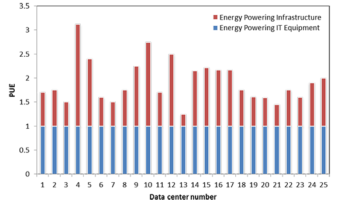
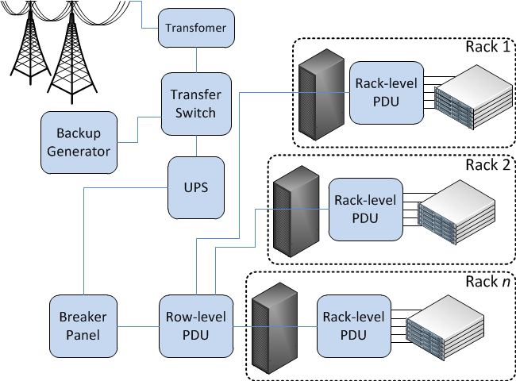

Multiple servers are virtualized and consolidated onto fewer physical hosts to increase utilization and decrease energy costs. This improvement is helpful, but the demand for IT-related services in organizations continues to grow. The number of web-based startup companies, which have a higher proportional demand for IT equipment, also continues to grow. 

> [!VIDEO https://www.microsoft.com/en-us/videoplayer/embed/RE4pXFK]

## Server utilization

To see why server utilization is important, let us discuss power consumption when a server is idle (the CPUs are not doing anything, but the HDDs are spinning, and RAM and I/O devices still consume power) versus when the server is at maximum load (when all CPUs are at 100% utilization).

Use the following formula to estimate the power consumption $ P $ at a specific utilization (**n** %):

$$ P_{n} = \left( P_{max} - P_{idle} \right) \times \frac{n}{100} + P_{idle} $$

Through empirical measurements, this approximation is accurate to within plus or minus 5% across utilization rates.

If an organization wants to decrease its overall monthly operating expenses, it has to do so both inside the rack and outside the rack. To minimize the latter, you must first understand power usage effectiveness (PUE).

## Power usage effectiveness

As you read earlier, a datacenter draws a significant amount of power, from kilowatts to several megawatts. The cost of power is a significant element of the operating expenses of a datacenter and hence contributes to the total cost of ownership (TCO). As companies are offering more web-based services, which are housed at a datacenter, the cost of power becomes an important element in the cost of offering services on the web. Furthermore, datacenter-related emissions are an ongoing concern. These economic and environmental factors have accelerated the interest in measuring and improving the energy efficiency of datacenters.

The power drawn by a datacenter is shared between the IT equipment and the support equipment, such as the power distribution and cooling facilities. Datacenter energy efficiency can be thought of as the ratio of the energy delivered to the IT equipment to the total energy delivered to the datacenter. Clear and standardized efficiency metrics are needed to help datacenters to understand their energy efficiency, identify areas for improvement, and perform comparisons over time.

The [Green Grid](http://www.thegreengrid.org/) consortium has developed the PUE and its inverse, the datacenter infrastructure efficiency (DCIE). The PUE is simply the ratio of the total power entering the datacenter divided by the power used by the IT equipment. PUE measures how efficiently the power is delivered to the IT equipment in the datacenter.

$$ PUE = \frac{total\ data\ center\ power\}{total\ IT\ equipment\ power\} $$

If a datacenter's PUE is 3.0, then the datacenter facilities (for example, power distribution and cooling) utilize 2 units of energy for every unit delivered to the IT equipment. The lower the PUE, the more efficient the datacenter facilities. An ideal PUE is 1.0, which would indicate 100% efficiency, meaning that all the power drawn by the datacenter was delivered to the IT equipment.

In 2007, the Lawrence Berkeley National Labs (LBNL) ran an energy study for 25 datacenters (see Figure 20). The best PUE, 1.14, resulted in about 87% of the site energy reaching the IT equipment. In the worst case (PUE 3.0), only 33% made it to the IT equipment.

_Figure 20: PUE of 25 datacenters studied by LBNL_ (Lawrence Berkeley National Labs, 2007)

The PUE allows companies to identify areas for improvement, address these areas, and monitor the progress in PUE over time.

PUE simply measures the efficient use of power. Understanding the energy contributors to PUE is important to improve datacenter design practices. However, PUE is not sufficient as the only measure because it does not account for the load on the IT equipment. If PUE is low, but the IT equipment is not doing useful work, then the datacenter is losing money. Some recent practices include utilizing a TCO metric that accounts for the cost of the server, which is the total cost of energy that it will consume while running a specific workload over its lifespan. Using this approach, datacenters will utilize application-specific optimizations, which will lead to more effective use of the datacenter equipment.

## PDU branches

In an earlier module, you were introduced to a PDU, or power distribution unit. You also learned about inefficiencies related to multiple conversions. This section shows you the advantages of using three-phase power and some common pitfalls to avoid when choosing the size and number of PDUs. This section is optional reading as it goes into specific details concerning electrical engineering.

There are several types of power distribution: rack level, row level, and room level. All of them have an input electrical feed and provide one or more branch circuits, with each branch protected by a circuit breaker (a safety device that will "trip" if there is an overload, stopping the flow of electricity). The difference with row-level PDUs is that they typically take a higher voltage and output to a lower voltage using a transformer. (Transformers generate heat, so you will also find cooling fans inside a row-level PDU.)

_Figure 22: Row-level and rack-level PDUs_

Three-phase power (often denoted with Greek letter phi [3Φ]) is how AC electricity is generated and transmitted. Each phase is a sine wave, and waves are 120 degrees apart. It is not common to have three-phase power in homes, but it is common in industrial buildings and a requirement in any modern datacenter. It is important to keep each phase as evenly loaded as possible. You should not plug all servers into one branch before going on to the next—stagger them instead. The total power that can be handled by a three-phase circuit is greater than that of a single phase (1Φ) for each copper wire (same thickness or gauge).

| Phase | Power equation                  | Wires needed | Watts and wire   |
|---|---|---|---|
| 1Φ    | $ W = V \times I $ | Hot, Neutral, Ground  | 1.0x |
| 3Φ    | $ W = 3 \times \frac{V_{line} \times I_{line}}{\sqrt{3}} $ | Phase1, Phase2, Phase3, Neutral, Ground  | 1.8x |

For example, when $V$ = 120 volts and $I$ = 15 amps, then single-phase power = 1,800W per three wires. When $V$ = 208 volts and $I$ = 15 amps, then three-phase power = 5,410W per five wires. (Recall that only the amount of current per amps determines the required thickness of the copper wire.)

Knowing the maximum power of any branch is important for choosing the number and size of PDU(s) to power your IT equipment. US electric code states that the line current should not exceed 80% of the rating of the breaker (or fuse).

|Label (amps)|15|20|30|50|70|
|--|--|--|--|--|--|
|80% derated limit|12|16|24|40|56|

A server rarely consumes the number of watts that its power supply is rated for. For example, a PSU is labeled as 975 W, but the server might only consume 650 W at maximum capacity. For this reason, it is useful to take power measurements of each new model of server at various loads (idle, 25%, 50%, 75%, 100%) before putting it into production.

In designing a redundant system, it is common to have multiple independent paths from the power source to the IT equipment. You can think of redundant power (and cooling) systems like hard drives in RAID. Recall that in a RAID 1 mirror, you withstand a drive failing, but you also lose half your capacity. This is analogous to $2N$ redundancy—you cannot load a single component (for example, UPS, generator, PDU) greater than 50% of its original capacity. In RAID 5, you still withstand a single drive failure, but you get higher utilization of individual drives, which is what $N+1$ redundancy is like for power and HVAC equipment. The remaining (working) units have to absorb the workload of the failed unit.

For example, you have a 100-kW load and desire to have redundant UPSs. In a $2N$ system, you have two UPSs, each capable of powering 100 kW, but their normal load would be 50 kW each. If you use three UPS units instead, each could be smaller and capable of handling 50 kW each but have a normal load of 33 kW. In this case, the utilization is higher (66% instead of 50%), so the UPS would also run more efficiently.

Although blade chassis and some larger 4U and 5U servers have $N+1$ power supplies, most servers and network equipment are designed with $2N$ redundant power supplies. For this reason, in a traditional datacenter, you would run two independent power feeds to each rack. This way, if you lose power in one feed, the other can take over. You must be cautious, however, because when one of the two feeds fails, the other one gets double the load. Incorrect assumptions often lead to overloading a branch circuit, which goes unnoticed in normal conditions. Then when there is a single failure, it has a cascading effect, overloading the remaining branches and tripping the breakers. This single failure leads to some or all servers in a rack losing power completely.
 
***

### References

1. _Google. [Efficiency: How Others Can Do It](http://www.google.com/about/datacenters/efficiency/external/)_

[^1]: <http://www.google.com/about/datacenters/efficiency/external/> "Google. *Efficiency: How Others Can Do It*" 

***
