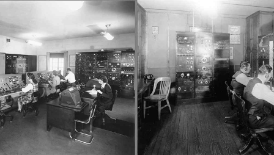

A datacenter can be defined as follows:

> [!div class="alert is-tip"]
> ### Datacenter
>
> _(definition)_ Infrastructure dedicated to housing computer and networking equipment, including power and cooling.

The term _datacenter_ became popular in 1990s, referring to large rooms dedicated to housing computer and networking equipment, though computer rooms themselves date back much farther. Early computers (mainframes) were massive—the size of many refrigerators. They also generated a lot of heat and required air filtration to increase reliability. For these reasons, early computers could not be placed into a regular office, so custom rooms were built. A lot of these same ideas go into server rooms today. The only difference is that instead of housing one computer, they hold from dozens to hundreds to even tens of thousands of servers in a single facility.

Modularity is important for datacenters because it allows an organization to expand as needed. One of the enablers of a modular datacenter is standardized racks, onto which IT equipment is mounted. Historically, server racks evolved from early relay racks found in railroad signaling. It is unclear why the railroad companies chose the original 19-inch post-to-post width, but the same form factor made its way into early telecommunications and then audiovisual equipment at radio and television stations. Figure 15 shows early equipment racks in a radio operators' room.

> [!div class="alert is-tip"]
> ### Did you know?
>
> The width of early railroad relays dictated the width of a modern 19-inch rack. But the standard gauge of modern railroad tracks (4 feet, 8 1/2 inches) dates back to ancient Greek stone pathways, which the Romans adopted and brought to Europe during the age of the Roman Empire ([Wikipedia](http://en.wikipedia.org/wiki/Railroad_gauge#Early_origins_of_the_standard_gauge), 2014).

_Figure 15: 1940s radio operators' room showing early equipment racks_ ([Inland Marine Radio History Archive](http://www.imradioha.org/wmi.htm))

A 1933 US patent, F.C. Lavarack, 1,919,166, is an example of a standardized equipment rack for relays. In the following figure, you can see some of the original drawings in the patent.

Some of the advantages of Lavarack's design over common predecessors include:

- Fire safety: Rack posts and other fittings were cast out of iron (and later steel). This was superior to earlier wooden enclosures that could possibly ignite and damage the equipment inside.
- Field assembly: Racks could be assembled using common hand tools and low-skill workers.
- Hole spacing: Regularly spaced holes supported a wide variety of equipment.
- Mounting surface: A vertical mounting surface meant easier installation, maintenance, and wiring.

Many of today's standard 19-inch equipment racks have evolved from Lavarack's design.

_Figure 16: Relay rack patent drawings_ (see [patent](https://patents.google.com/patent/US6223908B1/))

***
