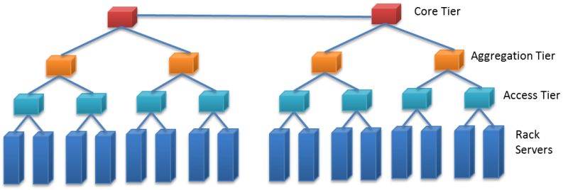

With the advent of cloud computing, it becomes critical for datacenter designers to address the cloud's current and evolving needs. In this paradigm, datacenters physically host all the cloud services that are delivered to users. In turn, the cloud services are abstracted from the underlying physical resources on varying scales (over a private IP network like a private cloud or over the internet like a public cloud), on demand, and for potentially millions of subscribers. Datacenter design requirements vary according to use, size, and desired functionalities. The cloud model redefines the way datacenter assets are designed and consumed. Cloud-based services and scale impose new requirements on datacenters whereby traffic flows vary, I/O bandwidth and performance demands are significantly increased, and new security concerns are induced. We describe some of the challenges that cloud computing puts on datacenters and identify associated requirements for designing cloud-centric datacenters.

## Scalability

With cloud computing, there is an ever-growing need for expansion and high capacity. For that sake, cloud datacenters are typically designed around virtual machines (or instances), which are the units of computing in the cloud paradigm. In contrast to enterprise datacenters, cloud datacenters offer services to potentially millions of users. To address increasing user demands for services on the cloud, virtualization techniques are usually adopted. With virtualization, datacenter operators can automatically provision and deprovision virtual machines (VMs) as required, without adding or reconfiguring physical devices. Today, it is not uncommon to provision 20 or more VMs per rack-mount or blade server. Clearly, this load can greatly stress server's resources (for example, CPU, RAM, and network cards). In addition, this can dramatically increase the number of logical servers that operate over the physical datacenter network. For instance, with a rack of 64 servers and 20 VMs per a server, a cloud provider would require as many as 1,200 IP subnets and VLANs. (In networking, a LAN can be segmented into different broadcast domains, each referred to as a VLAN.) Furthermore, with only 10 racks, 12,000 IP subnets and VLANs will be needed. This demand creates a major problem because it exceeds the limit (such as 4,094) of usable VLANs specified by the IEEE 802.1Q standard, let alone straining physical switches/routers. Cloud datacenter providers need to find solutions for such problems.

On the other hand, even with maximal use of virtualization techniques, at a point in time it will be necessary to add physical capacity to support growth. As such, cloud datacenters need to be based on modular designs in order to support the easy addition of physical capacity without disrupting applications and services. Designers should specify chassis capacity to support long-term growth so that datacenter operators can include additional components to the chassis as necessary.

## Network topologies

_Figure 20: Traditional hierarchical, tree-style datacenter network topology_

Most of today's datacenter networks are based on hierarchical, tree-style designs consisting of three main tiers: an access tier, an aggregation tier, and a core tier. The figure shows a sample of a traditional tree-style network topology. First, the access tier is made up of cost-effective Ethernet switches connecting rack servers and IP-based storage devices (typically 10/100-Mbps or 1-GbE connections). Second, multiple access switches are connected via Ethernet (typically 1/10-GbE connections) to a single aggregation switch. Third, a set of aggregation switches is connected to a layer of core switches. Because layer 2 VLANs do not involve IP routing, they are typically implemented across access and aggregation tiers. Conversely, layer 3 routing is implemented at core switches that forward traffic between aggregation switches, to an intranet, and to the internet. A salient point is that the bandwidth between two servers is dependent on their relative locations in the network topology. For instance, nodes that are on the same rack have higher bandwidth between them, as opposed to nodes that are off rack.

Indeed, the network is a key component in cloud datacenters. Hierarchical topologies, as depicted in the figure, don't truly suit clouds because they enforce inter-server traffic to traverse multiple switch layers, each adding to latency. Latency in this context refers to the delays incurred by the number of switches traversed, required processing, and buffering. Minimal delays in clouds can result in users' perception of poor performance and loss of productivity. Hence, flatter network topologies with fewer layers to accommodate delay- and volume-intensive traffic are typically required for cloud datacenters.

## Greater utilization and resiliency

Usually, contemporary tree-style datacenter networks rely on some variant of the Spanning Tree Protocol (STP) for resiliency. STP is a data link management protocol that ensures a loop-free topology when switches/bridges are interconnected via multiple paths. STP allows only one active path across two switches, with the rest being set to inactive (assuming many paths are available). On an active path failure, STP automatically selects another available inactive path instead of the failed one. This selection might take STP several seconds, which could turn unsuitable for delay-sensitive cloud applications (for example, web conferencing). Furthermore, setting idle backup paths is not the best choice for cloud datacenters, especially with the exponential increase in user demands. Cloud datacenters require more streamlined and resilient network designs that make full use of network resources and recover from failures in milliseconds to meet demands speedily and utilize resources efficiently.

## Secure multitenant environment

_Figure 21: Workload-to-workload communications in a virtualized environment_

In modern datacenters, workloads (for example, databases, user applications, web hosting) are typically deployed on distinct physical servers, with workload-to-workload communications occurring over physical connections. Accordingly, securing users can be achieved by conventional network-based intrusion detection/prevention systems. On the other hand, in cloud datacenters, multiple VMs can be provisioned on a single rack server, with each belonging to a different user. Thus, workload-to-workload communications can occur within the same server over virtual connections in a manner completely transparent to existing security systems, as shown in the figure. Therefore, cloud datacenters need to isolate users, protect virtual resources, and secure intra-server communications.

## Virtual machine mobility

Cloud datacenters can host user VMs at servers in one rack, across racks but in the same datacenter, or at servers across datacenters. A cloud can encompass multiple datacenters (for example, Amazon allows users to provision virtualized instances across many datacenters). For executing routine maintenance, balancing loads, and tolerating faults, clouds need to periodically and seamlessly migrate VMs between physical servers without impacting user services and applications. This migration does not only require expanding the layer 3 domain (the domain in which IP routing is required, like WAN) to move VMs across datacenters. It also requires extending the layer 2 domain (the domain in which no routing occurs and only broadcasting is employed, like LAN) in order to span multiple datacenters.

## Fast and highly available storage transport

Storage in a cloud datacenter must support VM mobility and be continually available. VMs that are migrated need to maintain communication with their storage systems. One way to get around this is to move VMs with pertaining storage/data. Clearly, this would require highly available, low-latency, and bandwidth-intensive cloud datacenter connectivity. Multiple storage models (for example, Storage over IP [SoIP], Fibre Channel over Ethernet [FCoE], and traditional Fibre Channel) are in use today and would further require high-performance and highly available cloud networks.

In summary, datacenters tailored for clouds would require the following:

- Modular designs to support exponential growth and the easy addition of physical capacity without any service disruption.
- Flatter network topologies with fewer layers and less equipment and cabling to accommodate delay- and volume-intensive traffic.
- More efficient and resilient network designs that make full use of network resources and recover from failures in milliseconds.
- Capability to fully isolate cloud users, protect virtual resources, and secure intra-server communications.
- VM mobility to execute routine maintenance, achieve load balancing, and tolerate faults seamlessly and speedily.
- 24/7, 365-days-a-year service availability and the ability to keep migratory VMs connected to their storage systems.

## Requirements for cloud datacenters

Datacenter designers can address the previously discussed requirements at the infrastructure layer, the virtualization layer, or both. For instance, the scalability requirement needs to be addressed at both layers, whereas secure multitenancy can be mainly addressed at the virtualization layer. Resource sharing and virtualization are covered in detail in a later module. In this module, we're concerned with the infrastructure layer. Accordingly, we present only some of the IT devices (for example, switches, routers), platforms, and protocols that can contribute to satisfying the requirements for cloud datacenters. Because this is a cloud computing course, we do not discuss how the devices, protocols, and platforms work but focus on the benefits they bring to cloud datacenters.

To start, datacenter planners can consider Multiprotocol Label Switching (MPLS) to address cloud infrastructure requirements. MPLS is a highly scalable mechanism that directs data from one server to another based on short path labels rather than long network addresses. Specifically, MPLS labels data packets and enables packet forwarding without examining the contents of packets, which makes packet forwarding quite fast because it avoids routing table lookups and solely depends on packet labels. Consequently, MPLS allows creating end-to-end circuits across any type of transport medium, a key requirement for server-to-server communication across cloud datacenters.

As previously discussed, in cloud computing, different types of traffic are imposed, and variant bandwidth requirements are induced. Without considering MPLS, separate layer 2 networks might be necessary to build, which clearly is not a scalable solution in cloud datacenters and can greatly increase both capital and operational expenses. By contrast, with MPLS, networks can be shared via creating virtual network connections called label switched paths (LSPs). Furthermore, quality of traffic flows over the LSPs can be flexibly controlled. Such traffic control facilitates end-to-end quality of service (QoS) and provides fast network convergence (approximately 50 ms) in case of link failures, a remarkable improvement over STP. As a result, the transparency of network failures can be highly improved, and service disruptions can be reduced, which are other key requirements for greater resiliency on cloud datacenters.

MPLS also allows enabling a virtual private LAN service (VPLS) to extend layer 2 connectivity across multiple datacenters. VPLS is a virtual private network (VPN) technology. VPN is typically utilized to implement secure connections between LANs located at different sites, like datacenters that use public internet links. VPLS allows different LANs at different datacenters to communicate as if they are one LAN, a key requirement for streamlining VM mobility. VM mobility can also benefit from the aforementioned traffic controlling capability offered by MPLS.

## Current developments

Several vendors are now marketing cloud-centric networking and compute products to address several of the design goals stated earlier. Most of these products are variations on what you would find in a traditional datacenter, with a shifted focus on density and concurrent users. A datacenter designer who wants to support private or public clouds has a growing catalog of products from which to choose.

Datacenter design has evolved rapidly over the last 5 years; this trend is not slowing down. The datacenters 5 or 10 years from now will most likely look very different from the datacenters of today. Datacenter designers are addressing new requirements while improving efficiency and the TCO to deliver a cloud service. With the advent of pre-engineered modular datacenters, soon the facilities will become interchangeable components, much like the IT equipment itself. To meet the growing consumer demand for new cloud-based services, as well as address IT infrastructure needs of existing enterprises, we will see more and more datacenters, with each generation more efficient than its predecessor.
