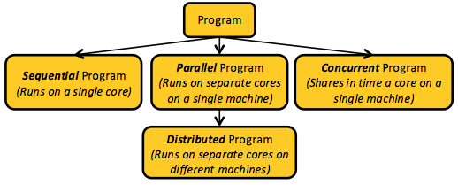
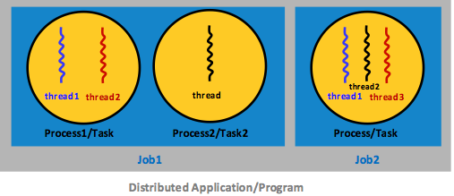

A computer program embodies a computational algorithm and comprises variable declarations, variable assignments, expressions, and flow-control statements, which are all typically expressed in a high-level programming language, such as Java or C++. Before execution, programs are usually compiled and then converted to machine instructions/code that a central processing unit (CPU) can run either sequentially or concurrently. A **sequential** program runs in program order (i.e., the original, programmer-specified statement sequence). 

A **concurrent** program, in contrast, is a set of sequential programs that, while executing, share one or more CPUs in time. This **timesharing** allows multiple programs to take turns in using a single computational resource. For instance, given that a CPU can run only one program at a time, running multiple sequential programs on one processor requires the operating system (OS) to employ a scheduling strategy, such as round-robin, to allocate the resource to each program for a specified interval. 

_Figure 1: Our taxonomy of programs_

The general term **application** refers, often ambiguously, to both sequential and concurrent programs, and the latter are sometimes called parallel programs. A parallel program is a set of sequential programs that overlap in time by running on separate CPUs. In multiprocessor systems, such as chip multicore machines, related sequential programs executing in different cores constitute a parallel program. By contrast, related sequential programs sharing a single CPU in time represent a **concurrent program**. For this unit, we further distinguish a parallel program comprising multiple sequential programs running on distinct, networked machines (versus different cores on one machine) as a **distributed program**. The previous figure illustrates this program taxonomy. 

Another term common in parallel/distributed programming is **multitasking**, which refers to overlapping one program's computation with that of another. This concept is central to all modern operating systems and describes a scheduling mechanism that enables an OS to juggle several programs at once. Multitasking has become so useful that almost all modern programming languages now support it through **multithreading** constructs.

The term "thread" was popularized by Pthreads (POSIX threads)[1][^1], which is a specification of concurrency constructs that has been widely adopted, especially in UNIX systems.[2][^2] A **thread of execution** is the smallest sequence of instructions an OS can manage through its scheduler. Threads are intimately related to processes: a thread runs within the address space of a **process**, while a process runs within its own address space. Thus, a process can contain one or more threads, and the threads are not standalone work units. In principle, different processes do not share memory, while threads within a process all share their parent's address space. 

_Task_ is another term that refers to a small unit of work, and in this unit, we use it to mean "process." In addition, we collectively denote tasks (possibly only one) that belong to the same program/application as a **job**. An application can encompass several jobs. For instance, a fluid dynamics application typically consists of three jobs, individually responsible for structural, fluid, and thermal analyses. In addition, each job can carry out its work through multiple tasks. The following figure demonstrates the concepts of processes, threads, tasks, jobs, and applications. 

_Figure 2: A demonstration of the concepts of processes, threads, tasks, jobs, and applications_
 
***
### References

1. _Barney, Blaise (last updated 07/2019). [POSIX Threads Programming](https://computing.llnl.gov/tutorials/pthreads/) Lawrence Livermore National Laboratory_
2. _M. Ben-Ari (March 6, 2006). [Principles of Concurrent and Distributed Programming](https://www.oreilly.com/library/view/principles-of-concurrent/9780321312839/) Addison-Wesley_

***

[^1]: <https://computing.llnl.gov/tutorials/pthreads/> "Barney, Blaise (last updated 07/2019). *POSIX Threads Programming* Lawrence Livermore National Laboratory"
[^2]: <https://www.oreilly.com/library/view/principles-of-concurrent/9780321312839/> "M. Ben-Ari (March 6, 2006). *Principles of Concurrent and Distributed Programming* Addison-Wesley"
