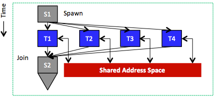
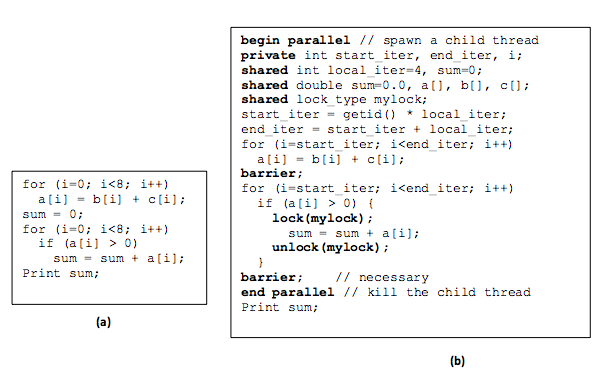

Programming models embody concepts and offer tools that support developers in building large computational systems. A distributed programming model, in particular, facilitates translating sequential algorithms into distributed programs that can execute over distributed systems. The model's design determines how easily a programmer can specify an algorithm as a distributed program. A model that abstracts architectural/hardware details, automatically parallelizes and distributes computation, and transparently supports fault tolerance is considered easy to use. 

A model's efficiency, however, depends on the effectiveness of its underlying techniques. For a distributed program running on a system of distributed computers, one essential requirement is a communication mechanism that enables coordinating component tasks across multiple networked resources. Two traditional models, message passing and shared memory, meet this need, although in a relatively basic form. Additional challenges in the distributed programs typical of cloud environments have led to more sophisticated programming models that, when implemented as distributed analytics engines, can automatically parallelize and distribute tasks and can tolerate faults. 
<!-- Hadoop MapReduce <cite entry="_25" /> <cite entry="_26" /> , Pregel <cite entry="_42" /> and GraphLab <cite entry="_40" /> -->

### Shared-memory model

_Figure 4: Tasks running in parallel and sharing an address space_

The shared-memory model's key abstraction says that every task can access any location in an application's distributed memory space. Tasks thus communicate by reading from and writing to memory locations in the distributed memory space, as is the case with threads in a single process, where all threads share the process address space (Figure 4). With shared memory, tasks exchange data implicitly via sharing and not by explicitly sending and receiving messages. The shared-memory model, consequently, supports synchronization mechanisms that distributed programs must use to control the order in which various tasks can perform read/write operations. In particular, multiple tasks must not be able to write simultaneously to a shared-data location, which could corrupt data or make it inconsistent. This goal typically can be achieved using semaphores, locks, and/or barriers. A semaphore is a point-to-point synchronization mechanism that involves two parallel/distributed tasks. Semaphores use two operations: post and wait. The post operation acts like depositing a token, signaling that data has been produced. The wait operation blocks until signaled by the post operation that it can proceed to consume data. Locks protect critical sections, which are regions that only one task can access (typically write) at a time. Locks involve two operations, lock and unlock, for acquiring and releasing a lock associated with a critical section. A lock can be held by only one task at a time, and other tasks cannot acquire it until it is released. Last, a barrier defines a point beyond which a task is not allowed to proceed until every other task reaches that point. The efficiency of semaphores, locks, and barriers is a critical and challenging goal in developing distributed/parallel programs for the shared-memory programming model. 

Figure 5 shows an example that transforms a simple sequential program into a distributed one using the shared-memory programming model. The sequential program adds the elements of two arrays, `b` and `c`, storing the results in array `a`. Subsequently, any element greater than `0` in `a` is added to a grand sum. The corresponding distributed version assumes only two tasks and splits the work evenly between them. For every task, start and end variables are specified to correctly index the (shared) arrays, obtain data, and apply the given algorithm. Clearly, the grand sum is a critical section and so protected by a lock. In addition, no task can print the grand sum before every other task has finished its work, thus inserting a barrier before the printing statement. As shown in the program, communication between the two tasks is implicit (via reads and writes to shared arrays and variables) and synchronization is explicit (via locks and barriers). Last, as pointed out earlier, the underlying distributed system must provide data-sharing functionality. Specifically, the infrastructure must create the illusion that the memories of all computers in the system form a single, shared space that is addressable by all tasks. A common example of systems that offer such an underlying shared (virtual) address space on a cluster of computers (connected by a LAN) is called DSM.[1][^1], [2][^2] A common programming language that can be used on DSMs and other distributed shared systems is OpenMP.[3][^3]

_Figure 5: Sequential (a) and shared-memory (b) versions_

### Message-passing programming model

In the message-passing programming model, distributed tasks communicate by sending and receiving messages. Here, distributed tasks do not share an address space in which they can access each other's data (see Figure 6). The key abstraction resembles processes that, unlike threads, each maintain a private memory space. To send and receive data via explicit messages, this model incurs communication overheads (e.g., variable network latency and potentially excessive data transfers). Balancing these overheads, the explicit message exchanges implicitly synchronize the operation sequence in communicating tasks. Figure 7 demonstrates an example that transforms the sequential program shown in Figure 5 (a) into a distributed version that uses message passing. Initially, only a main task with `id = 0` can access the arrays `b` and `c`. Thus, assuming the existence of only two tasks, the main task first sends parts of the arrays to the other task (using an explicit send operation) in order to split the work evenly between the two tasks. The second task receives the required data (using an explicit receive operation) and performs a local sum. When the local sum is done, the second task sends back that sum to the main task. Likewise, the main task performs a local sum on its data part and collects the local sum of the other task before aggregating and printing a grand sum. As shown, for every send operation, there is a corresponding receive operation, and no explicit synchronization is needed. Last, the message-passing programming model does not necessitate any support from the underlying distributed system. Specifically, the interacting tasks require no illusion of a single, shared address space. A popular example of a message-passing programming model is provided by the message passing interface (MPI).[4][^4] MPI is an industry-standard message-passing library (more precisely, a specification of what a library can do) for writing message-passing programs. A popular high-performance and widely portable implementation of MPI is MPICH.[5][^5]

_Figure 6: Tasks running in parallel using the message-passing programming model, whereby the interactions happen only via sending and receiving messages over the network_

The following table compares the shared-memory and message-passing programming models in terms of five aspects: development effort, tuning effort, communication, synchronization, and hardware support. 

Shared-memory programs are initially easier to develop because programmers need not worry about how data is laid out or communicated. Furthermore, the code structure of a shared-memory program is often quite similar to that of its sequential counterpart. Typically, programmers only insert additional directives to specify parallel/distributed tasks, scope of variables, and synchronization points. In contrast, message-passing programs require a shift in programmer thinking to consider, a priori, how to partition data across tasks, collect data, and communicate and aggregate results with explicit messaging. 

How data is laid out and where it is stored begin to affect performance significantly as data and resources scale up. For instance, large-scale distributed systems such as the cloud imply nonuniform access latencies (e.g., accessing remote data takes much more time than accessing local data), thus encouraging programmers to keep data close to the tasks that use it. Although message-passing programmers must plan ahead to partition data across tasks, shared-memory programmers will (most of the time) address that issue during postdevelopment, typically through data migration or replication. This adjustment can involve significant tuning effort compared to a message-passing design. 

In large-scale systems, synchronization points can become performance bottlenecks: as the number of users attempting to access a critical section increases, associated delays and waits also increase. We return to synchronization and other challenges involved in programming for the cloud in a later module. 

_Figure 7: A distributed program that corresponds to the sequential program in Figure 5 (a) and is coded using the message-passing programming model_

| Aspect | Shared-memory model | Message-passing model |
| --- | --- | --- |
| **Communication** | Implicit | Explicit |
| **Synchronization** | Explicit | Implicit |
| **Hardware support** | Usually required | Not required |
| **Initial development effort** | Lower | Higher |
| **Tuning effort upon scaling up** | Higher | Lower |

 

***
### References

1. _A. S. Tanenbaum (September 4, 1994). [Distributed Operating Systems](https://cds.cern.ch/record/400319/files/p101.pdf) Prentice Hall, First Edition_
2. _K. Li (1986). [Shared Virtual Memory on Loosely Coupled Multiprocessors](https://dl.acm.org/doi/book/10.5555/913626) Yale University, New Haven, CT (USA)_
3. _[OpenMP](http://openmp.org/)_
4. _[Message Passing Interface](http://www.mcs.anl.gov/research/projects/mpi/)_
5. _[MPICH](http://www.mpich.org/)_

***

[^1]: <https://cds.cern.ch/record/400319/files/p101.pdf> "A. S. Tanenbaum (September 4, 1994). *Distributed Operating Systems* Prentice Hall, First Edition"
[^2]: <https://dl.acm.org/doi/book/10.5555/913626> "K. Li (1986). *Shared Virtual Memory on Loosely Coupled Multiprocessors* Yale University, New Haven, CT (USA)"
[^3]: <http://openmp.org/> "OpenMP"
[^4]: <http://www.mcs.anl.gov/research/projects/mpi/> "Message Passing Interface"
[^5]: <http://www.mpich.org/> "MPICH"
