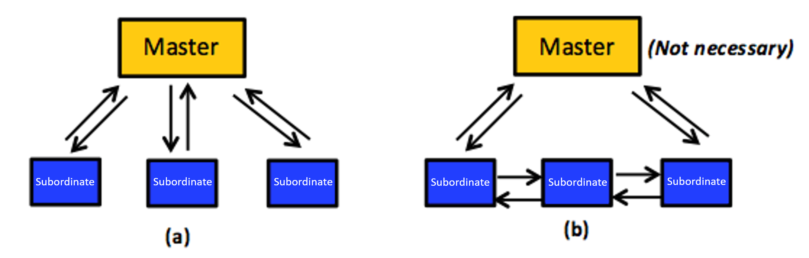

The third design consideration is one of organizational structure. An application developer typically organizes a distributed program in a **master-subordinate** (asymmetric, and also known as master-slave) or **peer-to-peer** (symmetric) architecture, as shown in Figure 12. Other organizations, such as hybrids, may be appropriate for special circumstances.[1][^1] For the purpose of this unit, we are only concerned with the master-subordinate and peer-to-peer organizations. 

### Asymmetric master-subordinate organization 

In a master-subordinate organization, a central process, called the _master_, handles all the logic and controls, and all other processes are denoted as subordinate processes. Thus, interaction between processes is asymmetrical: bidirectional connections enable the master to communicate with each subordinate, and no interconnection is permitted between any two subordinates (see Figure 12 (a)). This situation requires the master to keep track of each subordinate's network location in what is called a _metadata structure_, and, further, that each subordinate can always identify and locate the master. 

_Figure 12: (a) A master-subordinate organization. (b) A peer-to-peer organization. The master in such an organization is optional (usually employed for monitoring the system and/or injecting administrative commands)._

In asymmetric organizations, the master can distribute work among the subordinates using one of two following protocols: 

- **Push-based**: This strategy assigns work to subordinates unilaterally, without their asking. Clearly, this situation allows the master to apply fairness constraints over the subordinates via distributing the work equally among them. Alternately, this arrangement could also overwhelm/congest subordinates currently experiencing slowness/failures and who are thus unable to keep up with work. Consequently, load imbalance might occur, which usually leads to performance degradation. Nevertheless, the master can implement smart strategies. In particular, the master can assign work if and only if the subordinate is observed to be ready. For this tactic to work, the master must continuously monitor all subordinates and apply some logic (usually complex) to accurately identify available subordinates. To maintain fairness and enhance performance, the master must also decide upon the amount of work to assign. In clouds, the probability of faulty and slow processes increases due to heterogeneity, performance unpredictability, and scalability. These limitations can make the push-based protocol inefficient on the cloud.
- **Pull-based**: This strategy, on the other hand, requires subordinates to request assignment of work. This protocol significantly reduces complexity and potentially avoids load imbalance because the decision of whether a particular subordinate is ready or not is delegated to the subordinate itself. Nonetheless, the master still needs to monitor the subordinates, usually to track the progress of tasks at subordinates and/or apply fault-tolerance mechanisms (e.g., to effectively address faulty and slow tasks, commonly present in large-scale clouds). Hadoop MapReduce and Pregel utilize the pull-based protocol.

To this end, we note that the master-subordinate organization suffers from a single point of failure (SPOF). Specifically, if the master fails, the entire distributed program comes to a grinding halt. Furthermore, having a central process (the master) for controlling and managing everything might not scale well beyond a few hundred subordinates, unless efficient strategies are applied to reduce the contention on the master (e.g., caching metadata at the subordinates so as to avoid accessing the master on each request). In contrast, using a master-subordinate organization simplifies decision making (e.g., allowing a write transaction on certain shared data). In particular, the master is always the sole entity that controls everything and can make any decision singlehandedly without bothering anything else. This simplicity averts the employment of voting mechanisms,[3][^3], [1][^1], [2][^2] which are typically needed when only a group of entities (not a single entity) has to make decisions. The basic idea of voting mechanisms is to require a task to request and acquire the permission for a certain action from at least half of the tasks plus one (a majority). Voting mechanisms usually complicate implementations of distributed programs. 

### Symmetric peer-to-peer organization 

In symmetric organizations, all tasks are equal, with logic, control, and work distributed evenly among them. Specifically, each task can communicate directly with those around it, without having to contact a master process (see Figure 12 (b)). A master may be adopted, but only for purposes such as monitoring the system and/or injecting administrative commands. In other words, peer tasks do not require a master to function correctly. Moreover, although tasks communicate with one another, their work can be totally independent and may even be unrelated. Peer-to-peer organizations eliminate the potential for an SPOF and bandwidth bottlenecks, so they typically exhibit good scalability and robust fault tolerance. Making decisions in peer-to-peer organizations, however, must be carried out collectively, usually through voting mechanisms. This arrangement typically implies increased implementation complexity as well as higher communication overhead and latency, especially in large-scale systems such as the cloud. GraphLab, which we discuss in later sections, employs a peer-to-peer organization. 
 
***
### References

1. _A. S. Tanenbaum and M. V. Steen (October 12, 2006). [Distributed Systems: Principles and Paradigms](https://dl.acm.org/doi/book/10.5555/1202502) Prentice Hall, Second Edition_
2. _R. H. Thomas (1979). [A Majority Consensus Approach to Concurrency Control for Multiple Copy Databases](https://dl.acm.org/doi/10.1145/320071.320076) ACM Transactions on Database Systems (TODS)_
3. _D. K. Gifford (1979). [Weighted Voting for Replicated Data](https://dl.acm.org/doi/10.1145/800215.806583) In Proceedings of the Seventh ACM Symposium on Operating Systems Principles_

***

[^1]: <https://dl.acm.org/doi/book/10.5555/1202502> "A. S. Tanenbaum and M. V. Steen (October 12, 2006). *Distributed Systems: Principles and Paradigms* Prentice Hall, Second Edition"
[^2]: <https://dl.acm.org/doi/10.1145/320071.320076> "R. H. Thomas (1979). *A Majority Consensus Approach to Concurrency Control for Multiple Copy Databases* ACM Transactions on Database Systems (TODS)"
[^3]: <https://dl.acm.org/doi/10.1145/800215.806583> "D. K. Gifford (1979). *Weighted Voting for Replicated Data* In Proceedings of the Seventh ACM Symposium on Operating Systems Principles"
