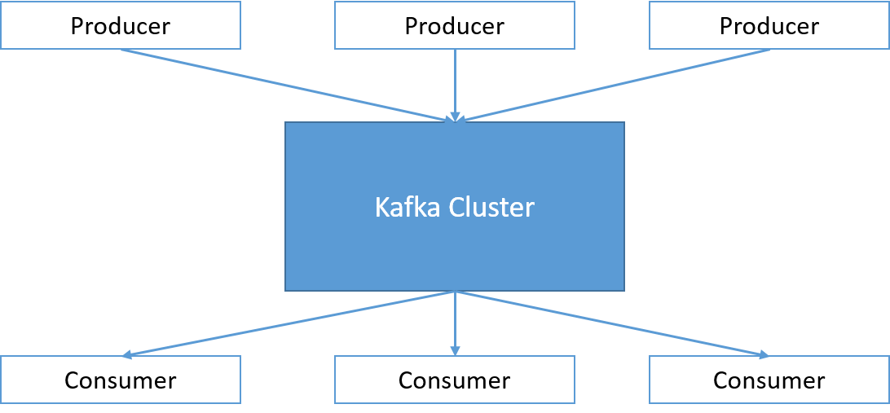
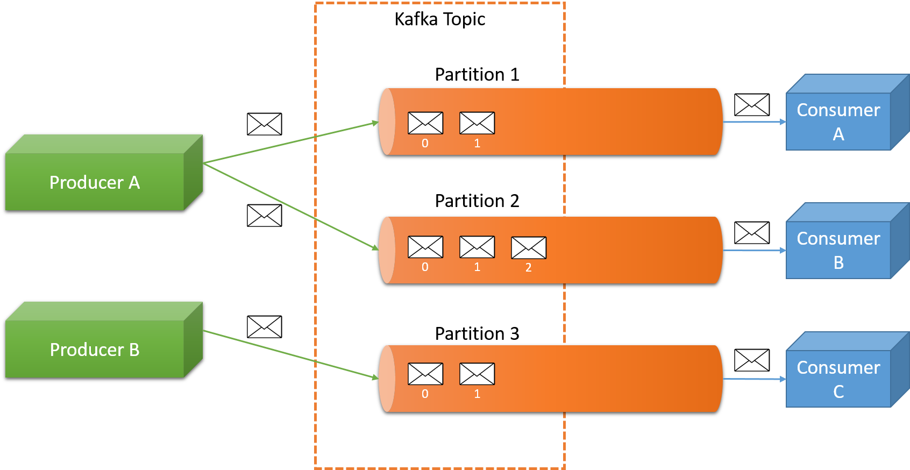
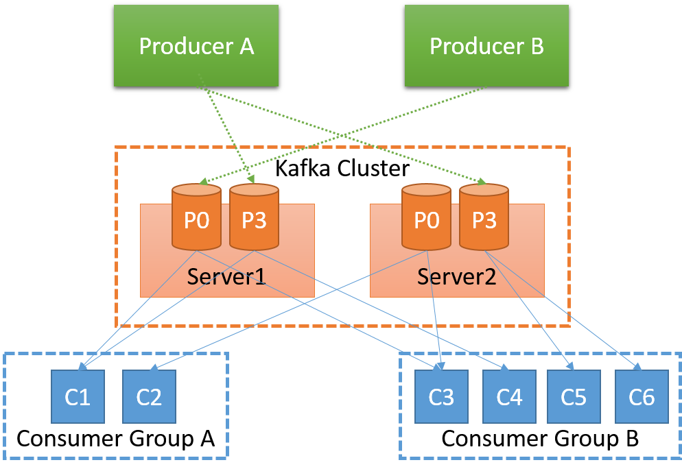

Previously, we looked at message queue systems in general. We saw that general-purpose message queue systems for interprocess communication have been around for a while, and more specialized message queues for client-server systems or web service architectures have emerged. While there are several different systems with unique designs and features, we will look at a system that has been built from the ground up for scalability and elasticity: Apache Kafka.

## Apache Kafka

Kafka is responsible for handling messages originating from a set of programs (known as producers), and sending them to a set of machines that may be interested in the messages (known as consumers). The messages are published by the producers into a Kafka topic. Consumers can listen to specific topics by subscribing to them, and messages will be delivered to the consumers by Kafka. Hence, Apache Kafka can be described as an open-source distributed publish-subscribe messaging system. 

_Figure 3: A Kafka cluster_

Topics represent a user-defined category to which messages are published. An example topic one might find at an advertising company could be AdClickEvents. All consumers of data can read from one or more topics. Internally, each topic is maintained as a partitioned commit log, as illustrated in Figure 4. It is important to note that a topic can consist of multiple partitions, and a Kafka cluster can handle multiple topics.

_Figure 4: Message queuing in Kafka_

Formally, each partition is an ordered, immutable sequence of messages that is continually appended to a commit log. The messages in the partitions are each assigned a sequential ID number called the offset. It uniquely identifies each message within the partition, and it cannot be used to order messages in a topic across partitions.

The partitions in the log serve several purposes. First, they allow the log to scale beyond a size that will fit on a single server. Each individual partition must fit on the servers that host it, but a topic may have many partitions so it can handle an arbitrary amount of data. Second, they act as the unit of parallelism, allowing for individual partitions of the log to be distributed among multiple machines. Producers not only have control over the topic of a message, they can explicitly control the partition that a message is sent to, if needed, using a semantic partitioning function (much like the partitioning functions used in MapReduce). By default, messages in a particular topic are round-robin distributed over the partitions for that topic.

The Kafka cluster retains all published messages—whether they have been consumed or not—for a configurable period of time (the default is 7 days). Messages that are past this retention period are automatically purged by Kafka to create free space for new messages.

Kafka also keeps track of the progress of each consumer in reading the messages of the log file for a particular topic, known as the offset for a consumer. Most consumers advance this offset value linearly as they consume messages. Consumers are in control of this offset variable and can move forward or backward to read older or newer messages, if needed.

This combination of features means that Kafka consumers are very cheap. They can come and go without much impact on the cluster or on other consumers. 

## Guarantees provided by Apache Kafka

Kafka provides a set of high-level guarantees that application developers can rely on: 

- Messages sent by a producer to a particular topic partition will be appended in the order they are sent. That is, if a message M1 is sent by the same producer as a message M2, and M1 is sent first, then M1 will have a lower offset than M2 and appear earlier in the log.
- A consumer instance sees messages in the order they are stored in the log.
- For a topic with replication factor $N$, we will tolerate up to $N - 1$ server failures without losing any messages committed to the log.

Notice that the delivery guarantees are not very strict. This includes the fact that consumers may obtain the same message twice, in rare instances.

## Architecture of Apache Kafka

_Figure 5: Kafka architecture_

The servers that transfer messages from publishers (producers) to subscribers (consumers) are known as the Kafka brokers. The Kafka brokers are responsible for message persistence and replication. The partitions of each topic are distributed over the brokers, and each broker stores one or more partitions. 

The brokers are organized in a decentralized manner, as there is no fixed master broker. In order for the brokers to achieve consensus about the state of the system, Apache ZooKeeper is employed. ZooKeeper provides a highly available quorum consensus service in the form of a file-system-like API. ZooKeeper is used in Kafka for the following tasks:

- Detecting the addition and removal of brokers and consumers in the system
- Triggering a rebalance of partitions when the number of brokers or consumers changes
- Maintaining the consumption relationship and keeping track of the consumed offsets for each partition

As mentioned earlier, the smallest unit of parallelism in Kafka is a partition in a topic. This means that all messages of a partition are consumed by one consumer at any given time. This saves Kafka from doing expensive coordination among multiple brokers if it were to guarantee order across partitions. 

Partitions are replicated among multiple brokers for fault tolerance. One of the brokers is designated as the leader for a particular partition, and all reads and writes for that particular partition go to the master replica by default. A message is considered committed only when all the replicas have committed the message to their log. Only committed messages are forwarded to the consumers. Producers can choose to block until a message is committed by Kafka or choose to continuously stream messages in a non-blocking fashion. There are multiple techniques employed by Kafka to speed up the log replication process. For details, see the [Apache Kafka documentation](http://kafka.apache.org/documentation.html).

Since Kafka brokers are expected to process large amounts of messages, there are two "liveness" properties that Kafka monitors for every node in the cluster:

- Each node maintains a session with ZooKeeper via a heartbeat mechanism.
- Each subordinate must replicate the master's updates and should not fall "too far" behind. The replica lag is a configurable property in a Kafka cluster.

### Producer interaction 

Producers can send messages to a Kafka cluster using the Kafka API. Producers are aware of the topics and partitions configured. Kafka and a producer typically direct messages to the appropriate broker that is responsible for handling the particular partition of a message. The API also allows for metadata requests to be made. This allows producers to query and locate the appropriate broker for a topic and partition. As mentioned earlier, the partitioning of a topic is configurable, and random load balancing or content-aware semantic partitioning of a topic can be employed.

In addition, producers interacting with a Kafka broker have the option of asynchronous communication of messages as well as request batching, which accumulates messages and sends them in batches. These are also configurable, in terms of the number of messages to batch or a fixed latency bound, allowing the application to trade off latency for throughput. 

### Consumer interaction 

Kafka consumers issue fetch requests from the brokers for individual partitions that need to be consumed. A consumer can specify an offset in the Kafka log with each request and then receive a chunk of messages that begin from that position. Consumers can rewind to any offset and request messages, provided those messages are within the retention window for the Kafka cluster. 

## Kafka use cases

**Messaging queue**: Unsurprisingly, Kafka can be used as a replacement for traditional messaging queues such as ActiveMQ or RabbitMQ. Kafka is particularly significant as it is designed from the ground up for high availability and scalable message delivery, with configurable latency and throughput requirements. 

**Website activity tracking**: Kafka was originally built by LinkedIn to build a user activity pipeline and make real-time decisions for content and ad placement for LinkedIn users. In this scenario, topics can be constructed by user interaction type (e.g., a topic for page views and scrolling information, another one for search terms, and another topic for user clicks). Various back-end services, such as real-time processing and monitoring of user activity, can subscribe to the relevant topics and process the streams as they come in. 

**Log aggregation**: Kafka can be used to aggregate the logs from multiple services and make them available in a central location for processing. In comparison to log-centric systems like Scribe or Flume, Kafka offers equally good performance, stronger durability guarantees due to replication, and much lower end-to-end latency. 
