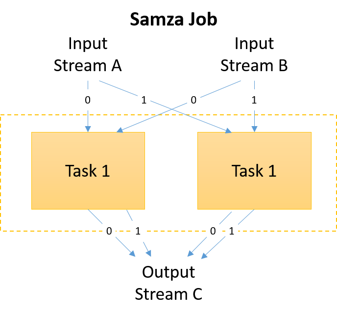
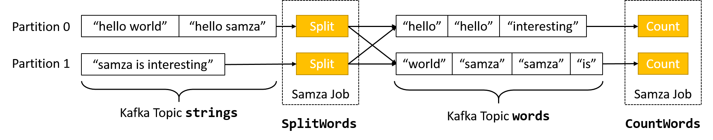
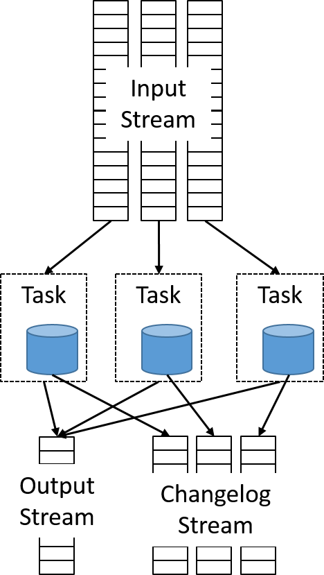

Now that we have seen how streaming architectures evolved, we can look at one specific framework, Apache Samza.

## Apache Samza

The Samza project was developed at LinkedIn as a distributed stream processing framework. It converts an input stream of messages to a modified output stream, based on stateful or stateless processing. Samza was developed alongside Kafka (discussed earlier), which was a low-latency distributed messaging system. Samza enabled the real-time processing of these Kafka messages. 

Samza is divided into three layers: 

- A streaming layer that provides partitioned, replicated, and durable streams
- An execution layer that schedules and coordinates tasks on a cluster 
- A processing layer that transforms the input stream and generates a new output stream, changes databases, triggers events, and in general, reacts to the input messages 

_Figure 9: The three layers of a Samza application_

The streaming and execution layers are pluggable. A default implementation uses Kafka as the streaming message broker. The input and output streams are immutable message sequences, which can be partitioned across nodes. Within a partition, messages are globally ordered and uniquely identifiable by the offset within the stream. The default execution layer uses YARN, though Mesos is another common resource manager that could be used. Using YARN makes it easier for a Samza application to ensure fault tolerance, simplify deployment, and use the built-in logging and resource isolation features. Using YARN with HDFS also allows Samza to benefit from data locality. 

Samza also uses cgroups to process single-core containers that run JVMs to execute one or multiple tasks within a single job. Cgroups is a Linux kernel feature that enables a collection of processes to have a collective bound on CPU, memory, and file system access. In Samza, each container is logically executed as single thread when processing a message, in the sense that only a single task within a container is executing at any point in time. The processing is done by custom code written using the Samza API. 

To gain more parallelism, Samza simply spawns more containers. For this reason, developers are discouraged from using multithreading within their job's code. Samza uses multiple threads internally for communications and processing; however, the single thread runs as an event loop that handles message I/O, checkpointing, windowing, and flushing metrics. 

_Figure 10: Input and output streams in a Samza job_

Samza clients initiate Samza jobs into YARN. Samza has its own Application Master, which negotiates for resources with the YARN Resource Manager (RM). The YARN RM talks to various Node Managers to allocate resources to a Samza application. YARN spawns SamzaContainers (Task Runners) that run custom code that implements the Samza StreamTask API. These are often co-located with the containers for Kafka brokers in order to maximize data locality. 

_Figure 11: A Samza job is split into tasks, which can be grouped within a container. As there is only one thread per container, only one task is active at any time._

Samza relies on horizontal scaling for performance improvements. This is done by increasing the number of tasks within a job. Each task operates on a single partition from the job's input streams. Thus, to be able to run more parallel tasks, a stream must be broken into a larger number of partitions. This has been described in the earlier topic on Kafka. For each input topic, there is at least one StreamTask instance initiated for each partition. Each stream task independently processes a single partition. 

_Figure 12: Samza applications run on YARN in isolated containers_

Of course, the streaming example shown above simply transforms an incoming stream into an output. There are many stream processing applications where the computation performed on any input message is independent of all other messages. Examples include data filtering based on rules or simple time-based modifications. 

However, more interesting use cases for stream processing require connecting multiple streams, performing message aggregation, or making decisions based on a window of data. All of these scenarios require the storage of state information. Samza implements durability using the KeyValueStore abstraction. Each StreamTask instance stores state on a separate embedded data store on the same machine. By default, Samza uses RocksDB, which provides low latency and high throughput and is write optimized. Using an embedded database reduces the overhead of relying on expensive network calls to query data. 

_Figure 13: Ensuring durability of a task's local state using an embedded data store_

This implementation can be thought of as sharding a remote database and co-locating each shard with a unique data partition. To ensure that failures do not lead to a loss of state, any modification to a local database is emitted using a separate changelog stream, which is a separate Kafka topic. A separate background process runs log compaction to reduce the amount of data in the changelog. 

_Figure 14: Each local embedded database writes to a changelog output stream_

Thus, tasks can be easily scaled out by launching a new container with its own database and writing to another parallel changelog stream. In case of any failures, a new container can be launched and restored to a consistent state by consuming from the output changelog of the failed partition. 

_Figure 15: Failure recovery in Samza_
