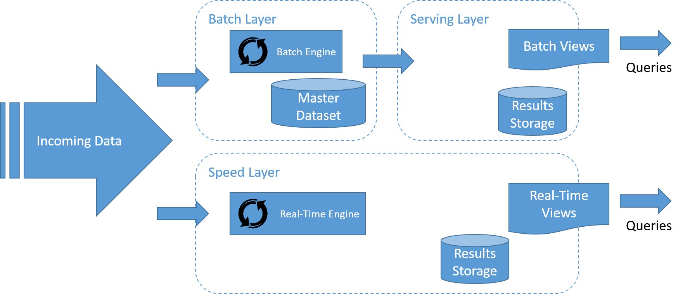
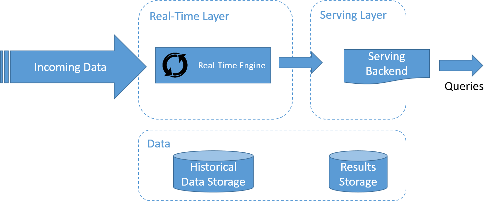

In this module, we have covered the basic ideas behind distributed programming and analytics engines, as well as the challenges of large-scale, big data processing. We saw a number of frameworks, including MapReduce, Spark, and GraphLab, as well as stream processing frameworks. To cap our discussion, we now present some of the ongoing attempts to define an architectural paradigm to help build systems that can handle both real-time and historical data: the Lambda and Kappa architectures.

For example, digital assistants such as Microsoft's Cortana often use complex machine learning algorithms for speech recognition and for understanding user queries. Incoming user queries can be considered to be a stream that needs to be responded to in low latency. However, over time the historical data of user queries can be used to re-train the machine learning system for better speech recognition and query understanding. The latter can use some sort of batch processing system to update the machine learning models for future queries. 

## Lambda architecture

The Lambda architecture is a data processing architecture designed to handle massive quantities of data by taking advantage of both batch and stream processing methods. Lambda attempts to balance latency, throughput, and fault tolerance by using batch processing to provide comprehensive and accurate views of batch data, while simultaneously using real-time stream processing to provide views of online data.

The Lambda architecture describes a system consisting of three layers: the batch layer, the speed (or real-time) processing layer, and a serving layer for responding to queries. 

_Figure 16: A stream processing system must process data in-stream, with a separate pipeline for storage, if needed, which does not lie on the "critical path"_

The flow of data in the lambda architecture is represented in the figure. The steps are as follows:

1. All data entering the system is dispatched to both the batch layer and the speed layer for processing.
1. The batch layer manages the master dataset, and pre-computes the batch views. 
1. The serving layer indexes the batch views so that they can be queried in a low-latency, ad hoc manner. 
1. The speed layer builds real-time views of the incoming data in a manner that is much faster than the batch and serving layers, but may not be as accurate. 
1. Any incoming query can be answered by merging results from batch views and real-time views. 

### Batch layer

The batch layer has important functions within the Lambda architecture: 

- First, the batch layer typically manages the master dataset. The master dataset is the source of truth in the Lambda architecture, and could be used to reconstruct any data that is served by the system in case of failures in any of the layers of the system. Data in the batch layer is typically organized as an immutable, append-only log, which contains new data as it arrives into the system. 
- Second, the batch layer builds the batch views of the data. The batch layer aims at perfect or near-perfect accuracy by being able to process all available data when generating the batch views. This means it can fix any errors by recomputing against the complete data set, and then updating the existing batch views. Output from the batch layer is stored in the serving layer. 

Apache Hadoop is the de facto, standard batch processing system used in most high-throughput architectures, and is the typical choice for implementing the batch layer. The processing can be done using MapReduce or any of the higher-level batch processing systems that are built on top of Hadoop.

### Serving layer 

Output from the batch layers (the batch views) is stored in the serving layer and made available for querying by applications. It is tightly tied to the batch layer. The serving layer is typically distributed among many machines for scalability. The serving layer typically consists of some type of database and is typically NoSQL in nature. The serving layer requirements are as follows: 

- Batch writable: The batch views for a serving layer are produced from scratch. When a new version of a view becomes available, it must be possible to completely swap out the older version with the updated view. As a result, serving layer systems do not need to be optimized for fast random writes, unlike traditional database systems. 
- Scalable: A serving layer database must be capable of handling views of arbitrary size. As with the distributed file systems and batch computation framework previously discussed, this requires it to be distributed across multiple machines. 
- Random reads: A serving layer database must support random reads, with indexes providing direct access to small portions of the view. This requirement is necessary to have low latency on queries. 
- Fault tolerant: Because a serving layer database is distributed, it must be tolerant of machine failures.

Common examples of data stores used in the serving layer include Apache Hive, HBase, and Impala. 

### Speed layer 

The speed layer processes data streams in real time with the lowest possible latency to generate real-time views of the data. Essentially, the speed layer is responsible for filling the "gap" caused by the batch layer's lag in providing views based on the most recent data. 

This layer's views may not be as accurate or complete as the ones eventually produced by the batch layer, but they are available almost immediately after data is received, and can be replaced when the batch layer's views for the same data become available. Using incremental or stream processing approaches that we discussed previously in this module, the processing can be done in a more efficient manner if the computation can be expressed as a function of the previous real-time view and the recent data, to produce the updated real-time views. 

_Figure 17: A stream processing system must process data in-stream, with a separate pipeline for storage, if needed, which does not lie on the "critical path"_

Stream-processing technologies typically used in this layer include Apache Samza, Apache Storm, SQLstream, and Apache Spark. Output is typically stored on fast NoSQL-style databases for low-latency querying. 

## Kappa architecture

_Figure 18: A stream processing system must process data in-stream, with a separate pipeline for storage, if needed, which does not lie on the "critical path"_

The Kappa architecture, popularized by LinkedIn, is shown in the figure. One of the important motivations of the Kappa architecture was to avoid maintaining two separate code bases for the batch and speed layers. The key idea is to handle both real-time data processing and continuous data reprocessing using a single stream processing engine. 

Data reprocessing is an important requirement for making visible the effects of code changes on the results. As a consequence, the Kappa architecture is composed of only two layers: stream processing and serving. 

The stream processing layer runs the stream processing jobs. Normally, a single stream processing job is run to enable real-time data processing. Data reprocessing is only done when some code of the stream processing job needs to be modified. This is achieved by running another modified stream processing job and replaying all previous data. Finally, similar to the Lambda architecture, the serving layer is used to query the results. 

Lambda vs. Kappa architecture is an ongoing debate in the community for big data processing. The choice of architectures depends on some characteristics of the application that is to be implemented. A simple approach suggested by Ericsson is the following: 

1. If the algorithms used for the historical and real-time data are identical, then it is generally better to go with the Kappa approach. Some form of batch computation may be necessary to bootstrap the views, depending on the amount of historical data present and the rate of arrival of new data. 
1. In certain types of applications, such as machine learning applications, the output of the batch and real-time systems differs in accuracy because of the amount of data that it is computed upon. This makes it very difficult to merge the batch and real-time processing results into a consistent view, and a Lambda-based architecture may be better for the application. 
1. In some cases, the batch algorithm can be optimized thanks to the fact that it has access to the complete historical dataset, and then outperform (in terms of processing throughput) the real-time algorithm. Here, choosing between Lambda and Kappa becomes a choice between favoring batch execution performance over code base simplicity. 
