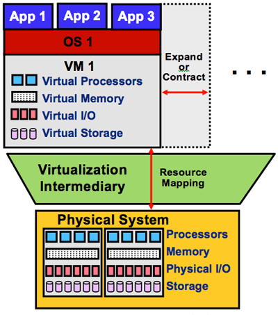
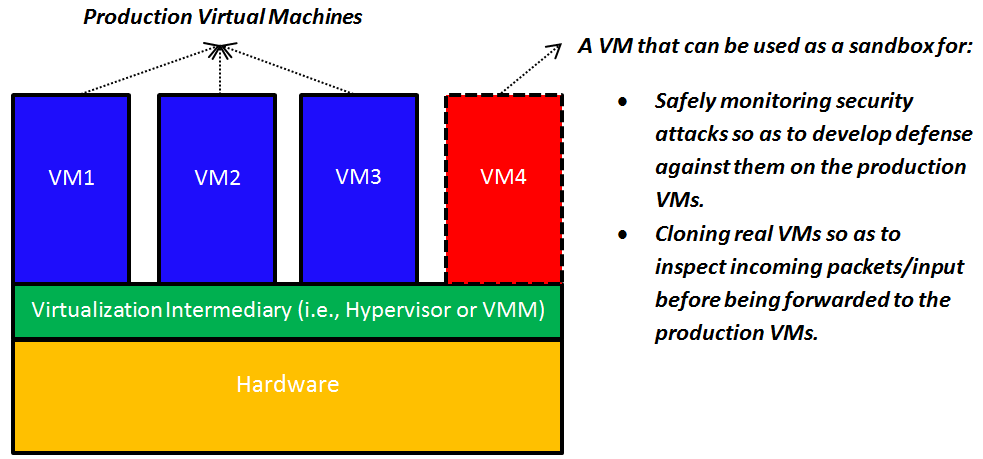
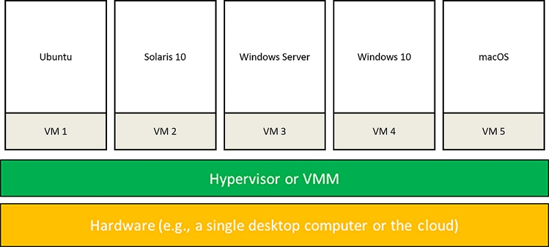

Virtualization is predominantly used by programmers to make software development and testing easier. It is used by IT datacenters to consolidate dedicated servers into more cost-effective hardware, and by the cloud to isolate users who share a single hardware layer and offer elasticity, among other features. 

_Figure 1: Provisioning a VM on a physical system_

## Areas that enable virtualization on the cloud

The following six areas enable virtualization on the cloud:

- **Cloud computing system model**: A major use case of virtualization is cloud computing. As discussed earlier, cloud computing adopts a model whereby software, computation, and storage are offered as services. These services range from arbitrary applications (called software as a service, or SaaS) like Office Online (PaaS) like Azure Functions to physical infrastructures (IaaS) like VMs. For example, IaaS allows cloud users to provision VMs for their own use. As shown in Figure 1, provisioning a VM entails obtaining virtual versions of every physical machine component, including CPU, memory, I/O, and storage. Virtualization makes this possible via a virtualization intermediary called the hypervisor or the virtual machine monitor (VMM). Examples of leading hypervisors are Xen Project[1][^1] and VMware.

- **Elasticity**: A major property of the cloud is elasticity or the ability to respond quickly to user demands by including or excluding resources either manually or automatically. This applies to all types of cloud platforms, i.e., SaaS, PaaS, and IaaS. As shown in Figure 1, virtualization enhances elasticity by allowing providers/users to increase or decrease services on the cloud. For instance, Azure Functions automatically expands servers during demand spikes and contracts them during demand lulls. On the other hand, VMs allow users to expand and contract their own virtual clusters, either manually (by default) or automatically (by using auto scaling). In short, virtualization is the key technology needed for elasticity on the cloud.

- **Resource sandboxing**: A system VM provides a sandbox that can isolate one environment from others, ensuring a level of security that may not be applicable with conventional operating systems (OSs). First, a user running an application on a private machine might be reluctant to move her applications to the cloud unless guarantees are provided that her applications and activities cannot be accessed and monitored by any other user on the cloud. Virtualization is an important part in creating a safe environment for every user by making it impossible for one user to observe or alter the data or activity of another user. Second, because the cloud can also execute user applications concurrently, a software failure of one application cannot generally propagate to others if all are running on different VMs. Such a property is usually called *fault containment*. Clearly, this protection increases the robustness of the system. In a nonvirtualized environment, however, erratic behavior in one application can bring down the whole system. 

   

   _Figure 2: Using virtual sandboxes to develop defenses against attacks and to monitor incoming data_

   Sandboxing, as provided by virtualization, opens up interesting possibilities, as well. As illustrated in Figure 2, a specific VM can be used as a sandbox whereby security attacks (e.g., denial-of-service attacks and inserting a malicious packet into a legitimate IP communication stream) can be safely permitted and monitored. This allows one to inspect the effects of such attacks, gather information on their specific behaviors, and replay them if necessary to design a defense against future attacks (by learning how to detect and quarantine them before they can cause any harm). Furthermore, suspicious network packets or input can be sent to a clone (a specific VM) before it is forwarded to the intended VM to preclude any potential ill effect. A VM can be thrown away after it has served its purpose.

- **Improved system utilization and reduced costs and energy consumption**: It is well known that computer hardware resources are often underutilized. The concept of resource sharing has been successfully applied in multiprogramming OSs to improve system utilization. Resource sharing in multiprogramming OSs is based on the process abstraction. Virtualization takes this a step forward by creating an illusion of a complete system whereby multiple VMs can be supported simultaneously, each running its own system image (e.g., OS) and associated applications. For instance, in virtualized datacenters (e.g., Amazon EC2), seven or more VMs can be provisioned on a single server, providing resource utilization of approximately 60% to 80%[2][^2]. In contrast, approximately only 5% to 10% average resource utilization is accomplished in nonvirtualized datacenters.[2][^2] By enabling multiple VMs on a single physical server, virtualization allows consolidating physical servers into <!-- SCG: Isn't this the other way around? --> virtual servers that run on many fewer physical servers (a concept called _server consolidation_). Clearly, this consolidation can lead not only to improved system utilization but to reduced costs.

   Server consolidation as provided by virtualization leads not only to improved system utilization and reduced costs but to optimized energy consumption in cloud datacenters. Datacenters hosting cloud applications consume tremendous amounts of energy, resulting in high operational costs and high carbon dioxide emissions.[5][^5] Server consolidation is considered an effective way to improve the energy efficiency of datacenters by consolidating applications running on multiple physical <!-- SCG: Isn't this the other way around? --> servers into fewer virtual servers. Idle physical servers can subsequently be switched off to decrease energy consumption.[7][^7] Studies show that server consolidation can save up to 20% of datacenter energy consumption.[5][^5], [6][^6], [7][^7] A large body of research work illustrates the promise of virtualization in reducing energy consumption in cloud datacenters. Indeed, mitigating the explosive energy consumption of cloud datacenters is currently deemed one of the key challenges in cloud computing.

- **Mixed-OS environment**: As shown in Figure 3 and pointed out in the previous subsection, a single hardware platform can support multiple OSs simultaneously. This provides great flexibility for users, i.e., they can install their own OSs, libraries, and applications. For instance, a user can install one OS for office productivity tools and another OS for application development and testing, all on a single desktop computer or on the cloud (e.g., Amazon EC2).

   

   _Figure 3: Mixed-OS environment offered by system virtualization_

- **Facilitates research**: Running an OS on a VM allows the hypervisor to instrument access to hardware resources and count specific event types (e.g., page faults), or even log detailed information about the nature and origin of each event. It can then record how each operation is satisfied. Moreover, traces of executions and dumps of machine states at points of interests can be taken at the VM level, an action that cannot be performed on native systems. Last, system execution can be replayed on VMs from some saved state for analyzing system behavior under various scenarios. Indeed, the complete state of a VM can be saved, cloned, encrypted, moved, and/or restored—actions that are not so easy to perform with physical machines.[3][^3] As such, it has become common for OS researchers to conduct most of their experiments using VMs rather than native hardware platforms.[4][^4]
 
***
### References

1. _Barham et al. (2003). [Xen and the Art of Virtualization](https://www.cl.cam.ac.uk/research/srg/netos/papers/2003-xensosp.pdf) In Proceedings of the 19th ACM Symposium on Operating Systems Principles (SOSP '03). ACM, New York, NY, USA_
2. _Michelle Bailey (2009). [The Economics of Virtualization: Moving Toward an Application-Based Cost Model](https://docplayer.net/8213094-White-paper-the-economics-of-virtualization-moving-toward-an-application-based-cost-model.html) VMware Sponsored White Paper_
3. _Chen and Noble (2001). [When Virtual Is Better than Real](https://www.researchgate.net/publication/221150845_When_Virtual_is_Better_than_Real) IEEE Computer Society, Washington, DC, USA_
4. _JE Smith and Nair (2005). [Virtual Machines: Versatile Platforms for Systems and Processes](https://www.sciencedirect.com/book/9781558609105/virtual-machines) Morgan Kaufmann_
5. _A. Beloglazov and R. Buyya (2010). [Energy Efficient Allocation of Virtual Machines in Cloud Data Centers](https://ieeexplore.ieee.org/document/5493430) CCGrid_
6. _A. Beloglazov, J. Abawajy, and R. Buyya (2012). [Energy-Aware Resource Allocation Heuristics for Efficient Management of Data Centers for Cloud Computing](https://www.researchgate.net/publication/235720422_Energy-Aware_Resource_Allocation_Heuristics_for_Efficient_Management_of_Data_Centers_for_Cloud_Computing) Future Generation Computer Systems_
7. _Y. Jin, Y. Wen, and Q. Chen (2012). [Energy Efficiency and Server Virtualization in Data Centers: An Empirical Investigation](https://ieeexplore.ieee.org/document/6193474) Computer Communications Workshops (INFOCOM WKSHPS)_
8. _Silicon Valley Leadership Group (2008). Accenture's Data Center Energy Forecast Report 2008_

***

[^1]: <https://www.cl.cam.ac.uk/research/srg/netos/papers/2003-xensosp.pdf> "Barham et al. (2003). *Xen and The Art of Virtualization* In Proceedings of the nineteenth ACM symposium on operating systems principles (SOSP '03). ACM, New York, NY, USA"
[^2]: <https://docplayer.net/8213094-White-paper-the-economics-of-virtualization-moving-toward-an-application-based-cost-model.html> "Michelle Bailey (2009). *The Economics of Virtualization: Moving Toward an Application-Based Cost Model* VMware Sponsored Whitepaper"
[^3]: <https://www.researchgate.net/publication/221150845_When_Virtual_is_Better_than_Real> "Chen and Noble (2001). *When Virtual Is Better Than Real* IEEE Computer Society, Washington, DC, USA"
[^4]: <https://www.sciencedirect.com/book/9781558609105/virtual-machines> "JE Smith and Nair (2005). *Virtual Machines: Versatile Platforms For Systems and Processes* Morgan Kaufmann"
[^5]: <https://ieeexplore.ieee.org/document/5493430> "A. Beloglazov and R. Buyya (2010). *Energy Efficient Allocation of Virtual Machines in Cloud Data Centers* CCGrid"
[^6]: <https://www.researchgate.net/publication/235720422_Energy-Aware_Resource_Allocation_Heuristics_for_Efficient_Management_of_Data_Centers_for_Cloud_Computing> "A. Beloglazov, J. Abawajy, and R. Buyya (2012). *Energy-Aware Resource Allocation Heuristics for Efficient Management of Data Centers for Cloud Computing* Future Generation Computer Systems"
[^7]: <https://ieeexplore.ieee.org/document/6193474> "Y. Jin, Y. Wen, and Q. Chen (2012). *Energy Efficiency and Server Virtualization in Data Centers: An Empirical Investigation* Computer Communications Workshops (INFOCOM WKSHPS)"
