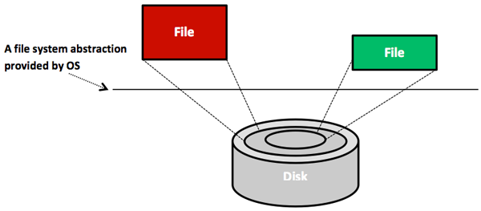

Modern computers are among the most advanced human-engineered structures. These structures are typically very complex. Such complexity stems from incorporating various silicon chips, such as processors, memories, disks, displays, keyboards, mice, and network interfaces, on which programs are operated and services are offered. The key to managing complexity in computer systems is dividing system components into levels of abstractions separated by well-defined interfaces.

## Levels of abstractions

The first aspect of managing computer complexity is creating abstractions for the components of the computer. A reasonable abstraction for a component will hide many of the details and expose only the essential features of the component. For instance, logic gates are an abstraction built on electronic circuits; binary is an abstraction built on gates; machine languages are an abstraction built on binary; programming languages are an abstraction built on machine languages; and operating systems, along with associated applications, are an abstraction built on programming languages. Another abstraction that almost every computer user understands and uses is the file. Files are <!-- SCG: I don't think Files are abstractions of disks. We could say that Files are an storage abstraction which allows the user to ignore the details of how disks work, or some such. --> abstractions of disks. As demonstrated in Figure 5, the details of a hard disk are abstracted by the OS so that disk storage appears to applications as a set of variable-size files. Consequently, programmers need not worry about locations and sizes of cylinders, sectors, and tracks or bandwidth allocations at disk controllers. They can simply create, read, and write files without knowledge of the way the hard disk is constructed or organized. 

_Figure 5: Files are abstractions of disks_

Another common example of abstraction is the process. Processes are abstractions of CPUs and memories. Hence, programmers need not worry about whether their processes will monopolize the CPU or consume all the memory. The OS creates and manages all user processes without any involvement from the users. Abstractions for displays are also provided by drawing and windowing packages. Mouse clicks are abstracted as invocations to program functions. Keydown events at keyboards are abstracted as inputs of characters. Finally, abstractions for networks include layers/protocols, such as IP, UDP, and TCP. As shown in Figure 6, distributed systems (e.g., the cloud) build on network layers and involve extra layers, such as sockets, remote method invocations (RMIs), and remote procedure calls (RPCs). In short, the ability to abstract system components enables the simplified design, programming, and use of computer systems.

_Figure 6: Abstraction layers in distributed systems_

To this end, we note that abstractions can be applied at the hardware or software levels. At the hardware level, components are physical (e.g., CPU and RAM). Conversely, at the software level, components are logical (e.g., RMI and RPC). In this unit, we are most concerned with abstractions at the software or near the hardware/software levels.
