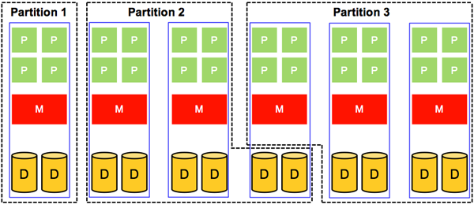

What we have discussed so far has to do with sharing a single system component (for example, CPU, memory, and disk) in space and in time. Now we address the sharing of a whole system, which is accomplished by sharing all of its components. In principle, this can be applied to uniprocessor and multiprocessor systems (of course, sharing a multiprocessor system is always more involved). In this section, we focus mainly on sharing multiprocessor systems. Figure 8 depicts a multiprocessor system partitioned in space into three partitions. Each partition is assigned resources that are physically distinct from the resources used by the other partitions. 

Clearly, sharing in space allows a partition to own its resources physically. Hence, the number of partitions that can be supported in a multiprocessor system shared in space is limited to the number of available physical processors. In addition, it is often the case that each of the physical partitions is underutilized. Thus, sharing multiprocessor systems in space usually is a suboptimal solution for system utilization. Nonetheless, sharing multiprocessor systems in space has its own advantages. First, it protects each partition from the possibility of intentional or unintentional denial-of-service attacks by other partitions. Second, it does not require sophisticated algorithms for scheduling and management of resources.

_Figure 8: Sharing in space of a multiprocessor system_

Compared to sharing in space, sharing multiprocessor systems in time makes it possible to partition an _n_-way system into a system with more than _n_ partitions (i.e., we are no longer limited by the number of available physical processors). Figure 9 demonstrates a multiprocessor system with physical resources being shared in a time-multiplexed manner. Clearly, sharing in time allows better system utilization because it is permissible for two partitions to share the resources of a single system board. This, however, comes at the cost of requiring mechanisms to provide safe and efficient ways of sharing resources. 

_Figure 9: Sharing in time of a multiprocessor system_

As pointed out previously, sharing resources in multiprocessor systems is more involved than in uniprocessor systems. For instance, in a uniprocessor system, scheduling is one-dimensional. In particular, after the scheduler defines a specific quantum, it mainly decides which process should go next. In a multiprocessor system, however, after defining the quantum, the scheduler has to decide which process should go next and on which CPU. This latter, extra dimension introduces some complexity, as illustrated in Figure 10. The figure reveals a way to deal with scheduling on multiprocessors in which a single, systemwide data structure (for example, a list or a queue) is adopted. In Figure 10(a), the four CPUs are busy, and multiple processes are waiting on a shared queue (i.e., seen and accessed by all CPUs), assuming a round-robin algorithm. In Figure 10(b), CPU2 finishes its work and polls for the shared queue. When CPU2 gets access to the queue, it locks it and selects the next ready process as dictated by the round-robin algorithm. Locking the shared queue is done to avoid inconsistent access by multiple, idle CPUs. 

Scheduling, as demonstrated by Figure 10, is easy to implement and provides some efficiency with respect to automatic load balancing. Specifically, load balancing is automatically offered because one CPU will never be idle while others are overloaded. In contrast, such a scheduling strategy exhibits a critical deficiency with regards to scalability. Particularly, as the number of <!-- SCG: context switching overhead should increase as a side effect of the next paragraph. Not sure why it is mentioned here. --> CPUs is increased, both contention on the queue and context-switching overhead will increase.

Another complexity that has to do with scheduling on multiprocessor systems is the potential inefficiency of exploiting caching. Specifically, after process A in Figure 10 uses its quantum at CPU2, it gets context-switched and later resumed (when its turn comes again), probably at a different CPU. When A has executed on CPU2, it is likely that the cache of CPU2 became full of A's cache blocks. Consequently, when A is resumed at a different CPU, it will suffer from a high cache miss rate that will affect its overall performance. Some multiprocessor systems address this problem by applying what is called _affinity scheduling_. The basic idea of affinity scheduling is to attempt to schedule a process on a CPU that it used in its previous quantum. More on affinity scheduling can be found in Vaswani and Zahorjan's _The Implications of Cache Affinity on Processor Scheduling for Multiprogrammed, Shared Memory Multiprocessors_.[1][^1]

_Figure 10: Using a single, systemwide data structure (a queue, in this case) to pursue CPU scheduling in a multiprocessor system. The queue is shared across all the CPUs and exemplifies a round-robin algorithm. (a) All CPUs are assumed to be busy. (b) CPU2 finishes its work and gets the next process, B, from the queue. CPU2 has to lock the queue due to being shared by all CPUs before getting B._

To this end, we note that resource sharing as described in this page (i.e., in the context of the OS) also applies to virtualization. Indeed, a core task of the hypervisor is to share/multiplex the underlying system components among various virtual machines. Similar to traditional OSs, the hypervisor can apply sharing strategies in space and in time.
 
***
### References

1. _Raj Vaswani and John Zahorjan (1991). [The Implications of Cache Affinity on Processor Scheduling for Multiprogrammed, Shared Memory Multiprocessors](https://dl.acm.org/citation.cfm?id=121140) SIGOPS Oper. Syst. Rev. 25, 5_

***

[^1]: <https://dl.acm.org/citation.cfm?id=121140> "Raj Vaswani and John Zahorjan (1991). *The Implications of Cache Affinity on Processor Scheduling for Multiprogrammed, Shared Memory Multiprocessors* SIGOPS Oper. Syst. Rev. 25, 5"
