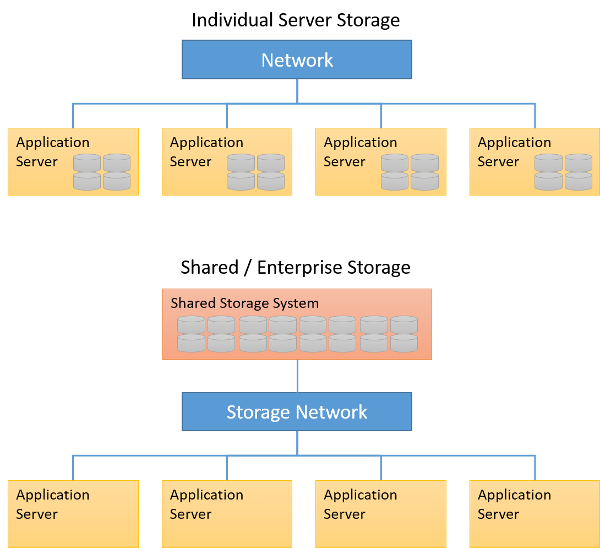

In previous units, we discussed the various types of online storage devices that are in use—primarily **magnetic** and **solid-state drives**. We also looked at how these devices can be deployed in a number of ways in a datacenter. They are reproduced here for your convenience:

_Figure 6: Individual server storage versus shared or enterprise storage_

**Individual server storage** is a typical storage architecture that you're familiar with, where individual disks are present on each server. This type of configuration is usually the cheapest option as it does not require any specialized hardware or networking devices, but also requires the most amount of management. Disk failures may cause data loss and/or loss of availability unless the server applications are explicitly replicating data and are configured for fault tolerance. Due to the lower cost of hardware, this type of storage is typical in large-scale data analytics clusters that run frameworks such as Hadoop or Spark, where fault tolerance and reliability are dealt with in the software and cluster architecture.

**Shared or enterprise storage** refers to storage architecture that is decoupled from individual servers, typically through the use of dedicated storage **servers**, **arrays**, or **appliances**. These systems provide shared storage (as block devices, file systems, or object storage systems) to multiple servers. These systems are connected to the servers using a regular Ethernet network, or using dedicated storage network fabrics (such as Fibre Channel or iSCSI over Ethernet). The benefit of this approach is the loose coupling of servers and storage, allowing for the components to be individually configured and upgraded as needed. This is a popular approach used with many applications, including database-driven applications, small to medium web services, and IaaS cloud providers. Specifically for IaaS services, the ability to spin up a virtual machine with attached virtual disk images is made much simpler by the use of shared storage systems.

Typically, enterprise-grade storage systems are specified, configured, and deployed based on the needs of an application. For example, a content delivery server may require a storage system that is vastly different from one that meets the requirements of a transactional database for a bank. A content delivery server may require higher bandwidth to transfer large amounts of data to clients (such as photos or video), while a transactional database for a bank requires fast, low-latency transactions (which are small amounts of data), with strong backup and persistence guarantees. Traditional infrastructure deployments would include storage specifications that are optimized to the needs of the application deployed on the infrastructure. 

With the advent of cloud computing and multi-tenancy in the datacenter, different users may have very different storage needs. However, they are restricted to the service offerings of the cloud provider, which may not have enough granularity to express the exact requirements of the users' application. Users may specify service-level objectives (SLOs) with regard to storage, such as a certain capacity and latency or bandwidth requirement of their application. In addition, these requirements can change dynamically as the application is running; users would like the flexibility to vary their storage requirements based on their demand. For example, in Amazon Web Services' Elastic Block Store service, users can specify a specific amount of provisioned I/O operations per second (IOPS) that they expect to get from the virtual disk. Users can, for a price, demand higher throughput and lower latency from storage services. However, designing systems that can dynamically serve these types of resource requests is challenging.
