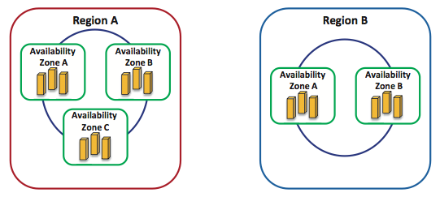

Amazon EC2 is designed using virtualization technology in order to meet certain performance, scalability, flexibility, security, and reliability criteria. In this unit, we'll take a closer look at the EC2 properties.

## Elasticity

In leveraging a major benefit offered by virtualization, Amazon EC2 allows users to statically and dynamically scale up and down their EC2 clusters. In particular, users can always provision and deprovision virtual EC2 instances by manually starting and stopping any number of them using the AWS management console, the Amazon command-line tools, and/or the Amazon EC2 API. In addition, users can employ Amazon's CloudWatch to monitor EC2 instances in real time and automatically respond to changes in computing requirements. CloudWatch is an Amazon service that allows users to collect statistics about their cluster resource utilization, operational performance, and overall resource demand patterns. Metrics, such as CPU utilization, disk operations, and network traffic, can be aggregated and fed to the Amazon's Auto Scaling process enabled by CloudWatch. The Auto Scaling process can subsequently add or remove instances so that performance is maintained and costs are saved. In essence, Auto Scaling allows users to closely follow the demand curve of their applications and synergistically alter their EC2 clusters according to conditions they define (e.g., add three more instances to the cluster when the average CPU utilization exceeds 80%).

## Scalability and performance

EC2 divides its instances into five types:

- General purpose
- Compute optimized
- Memory optimized
- Storage optimized
- GPU instances

The general-purpose instances have a blend of CPUs, network I/O, RAM, and disk that should work well for a typical workload. The "optimized" instance classes often trade off one feature for another (for instance, the same price may purchase an instance with twice the number of cores but only half the memory). These are typically used for specific tasks where a single resource acts as the bound.

All EC2 instances are launched using a base image, which is a snapshot of the disk at a particular stage in time. There are two classes of instances: HVM (or hardware virtual machines) and PV (or paravirtual machines). While traditionally both were feasible options, AWS now recommends using HVM instances as they use hardware-assist technology for enhanced networking performance. With HVM, instances run as though on bare hardware, with a few exceptions (like storage drivers). For all its newer-generation instances, AWS has slowly been phasing out PV instances.

Typically, users are encouraged to run their application as a pilot on all different types of instance types to determine the best fit for the budget and target workload.

Amazon EC2 instances can scale to more than 255 pCPUs per host,[1][^1] 128 vCPUs per guest, 1 TB of RAM per host, up to 1 TB of RAM per unmodified guest, and 512 GB of RAM per paravirtualized guest.[2][^2] In addition, Amazon EC2 reduces the time needed to boot a fresh instance to seconds, thus expediting scalability as the computing needs vary. The vCPU capacity of an instance is expressed in terms of elastic compute units (ECU). Amazon EC2 uses ECU as an abstraction of vCPU capacity, whereby one ECU provides the equivalence of a 1.0-GHz to 1.2-GHz 2007 Opteron or 2007 Xeon processor.[3][^3] Different instances with different ECUs provide different application runtimes. The performances of instances with identical types and ECUs may also vary as a result of what is called performance variation[4][^4], [8][^8] in cloud computing.

## Flexibility

Amazon EC2 users are provided with complete control over EC2 instances, with root access to each instance. They can create Amazon Machine Images (AMIs) with software of their choice and apply many Amazon services, including Amazon Simple Storage Service (Amazon S3), Amazon Relational Database Service (Amazon RDS), Amazon SimpleDB, and Amazon Simple Queue Service (Amazon SQS). These services and the various available Amazon EC2 instance types can jointly deliver effective solutions for computing and query processing, and provide storage across a wide range of applications. For example, users running I/O-intensive applications, such as data warehousing and Hadoop MapReduce[7][^7], can exploit high-storage instances. On the other hand, for tightly coupled, network-intensive applications, users can utilize high-performance computing (HPC) clusters.[5][^5], [6][^6]

In addition, users have the flexibility to choose among multiple storage types that can be associated with their EC2 instances. First, users can rent EC2 instances with local instance-store disks as root devices. Instance-store volumes are volatile storage and cannot survive stops and terminations. Second, elastic block storage (EBS) volumes can be attached to EC2 instances, which provide the instances with raw block devices. The block devices can then be formatted and mounted with any file system on EC2 instances. EBS volumes are <!-- SCG: "at EC2 instances"? --> persistent storage and can survive any EC2 instance state, including stops and terminations. EBS volumes of sizes from 1 GB to 1 TB can be defined, and RAID arrays can be created by combining two or more volumes. EBS volumes can even be attached or detached from instances while they are running. They can also be moved from one instance to another, thus remaining independent of any instance. Finally, applications running on EC2 instances can access Amazon S3 through a defined API. Amazon S3 is a storage service that makes web-scale computing easier for developers, whereby any amount of data can be stored and retrieved at any time and from anywhere on the web.

_Figure 2: Regions and availability zones in the AWS cloud platform. Regions are geographically dispersed to avoid disasters. Availability zones are engineered as autonomous failure zones within regions._

To this end, Amazon EC2 users not only have the flexibility of choosing among many instance and storage types but also have the capability of mapping elastic IP addresses to EC2 instances without a network administrator's help or the need to wait for DNS to propagate new bindings. Elastic IP addresses are static IP addresses but tailored for the dynamicity of the cloud. For example, unlike a traditional static IP address, an elastic IP address enables tolerating an instance failure by programmatically remapping the address to any other healthy instance under the same user account. Thus, elastic IP addresses are associated with user accounts and not EC2 instances. Elastic IP addresses exist until explicitly removed and persist even when accounts have no current running instances.

## Fault tolerance

Amazon EC2 users are capable of placing instances and storing data at multiple locations represented as regions and availability zones. As shown in Figure 2, a region can consist of one or many availability zones, and an availability zone can consist of many servers. Regions are independent collections of AWS resources that are dispersed geographically to avoid catastrophic disasters. An availability zone is a distinct location in a region designed to act as an autonomous failure zone. Specifically, an availability zone does not share a physical infrastructure with other availability zones, thus limiting failures from transcending its own boundaries. Furthermore, when a failure occurs, automated AWS processes start moving customer traffic away from the affected zone. Consequently, applications that run in more than one availability zone across regions can inherently achieve higher availability and minimize downtime. Amazon EC2 guarantees 99.95% availability for each region.[3][^3]

Last, EC2 instances that are attached to Amazon EBS volumes can attain improved durability over EC2 instances with local stores (or the so-called "ephemeral storage"). Amazon EBS volumes are replicated automatically in the back end of a single availability zone. Moreover, with Amazon EBS, point-in-time consistent snapshots of EBS volumes can be created and reserved in Amazon S3. Amazon S3 storage is automatically replicated across multiple availability zones, not only in a single availability zone. Amazon S3 helps maintain the durability of users' data by quickly detecting and repairing losses. Amazon S3 is designed to provide 99.999999999% durability and 99.99% availability of data over a given year.[3][^3] A snapshot of an EBS volume can also serve as the starting point for a new EBS volume in case the current one fails. Therefore, with the availability of regions and availability zones, the virtualized environment provided by Xen[1][^1],[2][^2], and Amazon's EBS and S3 services, Amazon EC2 users can achieve long-term protection, failure isolation, and reliability.

## Security

Security in Amazon EC2 is provided at multiple levels. First, as pointed out earlier, EC2 instances are controlled completely by users. Users have full root access, or administrative control, over their instances, accounts, services, and applications. AWS does not have any access rights to user instances and cannot log in to their guest OSs.[9][^9] Second, Amazon EC2 provides a complete firewall solution, whereby the default state is to deny all incoming traffic to any user instance. Users must explicitly open ports for specific inbound traffic. Third, API calls to start/stop/terminate instances, alter firewall configurations, and perform other related functions are all signed by the user's Amazon Secret Access Key. Without the Amazon Secret Access Key, API calls on Amazon EC2 instances cannot be made. Fourth, the virtualized environment provided by Xen provides a clear security separation between EC2 instances and the hypervisor as they run at different privileged modes. Fifth, the AWS firewall is placed in the hypervisor between the physical network interface and the virtual interfaces of instances. Hence, because packet requests are all privileged, they must trap to the hypervisor and accordingly pass through the AWS firewall. Consequently, any two communicating instances are treated as separate virtual machines on the internet, even if they are placed on the same physical machine. Finally, because Amazon EBS volumes can be associated with EC2 instances, their accesses are restricted to the AWS accounts that created the volumes. This indirectly denies all other AWS accounts (and corresponding users) from viewing and accessing the volumes. We note, however, that this does not impact the flexibility of sharing data on the AWS cloud platform. In particular, users can still create Amazon S3 snapshots of their Amazon EBS volumes and share them with other AWS accounts/users. Nevertheless, only the users who own the volumes are allowed to delete or alter EBS snapshots.
 
***
### References

1. _[Xen 4.1 Release Notes](https://wiki.xen.org/wiki/Xen_4.1_Release_Notes)_
2. _[Xen 4.0 Release Notes](https://wiki.xen.org/wiki/Xen_4.0_Release_Notes)_
3. _[Amazon Elastic Compute Cloud](https://aws.amazon.com/ec2/)_
4. _B. Farley, V. Varadarajan, K. Bowers, A. Juels, T. Ristenpart, and M. Swift (2012). [More for Your Money: Exploiting Performance Heterogeneity in Public Clouds](https://dl.acm.org/citation.cfm?id=2391249)_
5. _S. Ghemawat, H. Gobioff, and S. T. Leung (Oct. 2003). [The Google File System](https://static.googleusercontent.com/media/research.google.com/en//archive/gfs-sosp2003.pdf) SOSP_
6. _[Hadoop](https://hadoop.apache.org/)_
7. _J. Dean and S. Ghemawat (Dec. 2004). [MapReduce: Simplified Data Processing On Large Clusters](https://static.googleusercontent.com/media/research.google.com/en//archive/mapreduce-osdi04.pdf) OSDI_
8. _M. S. Rehman and M. F. Sakr (Nov. 2010). [Initial Findings for Provisioning Variation in Cloud Computing](https://ieeexplore.ieee.org/document/5708489) CloudCom_
9. _Amazon (May 2011). [Amazon Web Services: Overview of Security Processes](https://personal.utdallas.edu/~muratk/courses/cloud11f_files/AWS_Security_Whitepaper.pdf) Amazon Whitepaper_

[^1]: <https://wiki.xen.org/wiki/Xen_4.1_Release_Notes> "Xen 4.1 Release Notes"
[^2]: <https://wiki.xen.org/wiki/Xen_4.0_Release_Notes> "Xen 4.0 Release Notes"
[^3]: <https://aws.amazon.com/ec2/> "Amazon Elastic Compute Cloud"
[^4]: <https://dl.acm.org/citation.cfm?id=2391249> "B. Farley, V. Varadarajan, K. Bowers, A. Juels, T. Ristenpart, and M. Swift (2012). *More for Your Money: Exploiting Performance Heterogeneity in Public Clouds*"
[^5]: <https://static.googleusercontent.com/media/research.google.com/en//archive/gfs-sosp2003.pdf> "S. Ghemawat, H. Gobioff, and S. T. Leung (Oct. 2003). *The Google File System*"
[^6]: <https://hadoop.apache.org/> "Hadoop"
[^7]: <https://static.googleusercontent.com/media/research.google.com/en//archive/mapreduce-osdi04.pdf> "J. Dean and S. Ghemawat (Dec. 2004). *MapReduce: Simplified Data Processing On Large Clusters*"
[^8]: <https://ieeexplore.ieee.org/document/5708489> "M. S. Rehman and M. F. Sakr (Nov. 2010). *Initial Findings for Provisioning Variation in Cloud Computing*"
[^9]: <https://personal.utdallas.edu/~muratk/courses/cloud11f_files/AWS_Security_Whitepaper.pdf> "Amazon (May 2011). *Amazon Web Services: Overview of Security Processes*"
