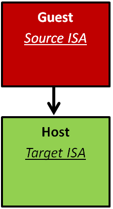
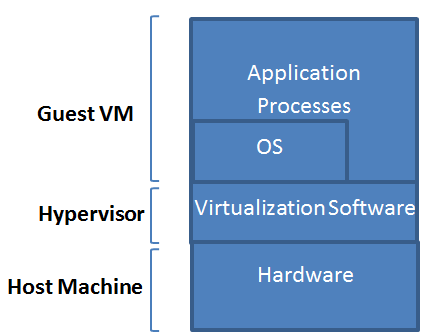

There are two main implementations of virtual machines (VMs): process VMs and system VMs. The following video covers the taxonomy of virtual machine types:
 

> [!VIDEO https://www.microsoft.com/videoplayer/embed/RE4pXG1]

We first cover process VMs and then system VMs.

## Process virtual machines

_Figure 4: Process virtual machines_

A process VM is a VM capable of supporting an individual process as long as the process is alive. Figure 4 demonstrates process VMs. A process VM terminates when the hosted process ceases. From a process VM perspective, a machine consists of a virtual memory address space, user-level registers, and instructions assigned to a process to execute a user program. According to this definition, a process in a general-purpose OS can also be called a machine. However, a regular process in an OS can only support user program binaries compiled for the ISA of the host machine. That is, executing binaries compiled for an ISA different from that of the host machine is not supported by regular processes. Conversely, a process VM allows that to happen. Process VMs can support ISAs that differ from host ISAs via emulation. As shown in Figure 5, emulation is the process of allowing the interfaces and functionalities of one system (the source) to be implemented on a system with different interfaces and functionalities (the target). Emulation is discussed in detail later. The abstraction of the process VM is provided by a piece of virtualizing software called the runtime (see Figure 4). The runtime is placed at the application binary interface (ABI) on top of the host OS and the underlying hardware. It is this runtime that emulates the VM instructions and/or system calls when guest and host ISAs are different.

_Figure 5: Emulation process_

Finally, a process VM may not directly correspond to any physical platform; it is employed mainly to offer cross-platform portability. Such kinds of process VMs are called high-level language VMs (HLL VMs). An HLL VM abstracts away details of the underlying hardware resources and the OS and allows programs to run the same way on any platform. Java VM (JVM) and Microsoft Common Language Infrastructure (CLI) are examples of HLL VMs. 

In summary, a process VM is similar to a regular process running on an OS. However, a process VM allows, via emulation, the execution of an application compiled for an ISA different from that of the host machine.

## System virtual machines

Contrary to process VMs, a system VM is a VM capable of virtualizing a full set of hardware resources, including processors, memories, and I/O devices, thus providing a complete system environment. A system VM can support an OS along with its associated processes as long as the system environment is alive. Figure 6 illustrates system VMs. As defined previously, the hypervisor (or the VM monitor [VMM]) is a piece of software that provides the abstraction for the system VM. It can be placed at the ISA level directly on top of the raw hardware and below system images (for example, OSs). The hardware resources of the host platform can be shared among multiple guest VMs. The hypervisor manages the allocation of and access to the hardware resources by the guest VMs. In practice, the hypervisor provides an elegant way to logically isolate multiple guest VMs sharing a single physical system. Each guest VM is given the illusion of acquiring all of the underlying hardware resources.

_Figure 6: System virtual machines_

There are different classes of system VMs. Figure 7 exhibits three of these classes as well as traditional systems. In a conventional time-shared system, the OS runs in a privileged mode (system mode), while the applications associated with it run in an unprivileged mode (user mode). (More details on system privileges are discussed later.) With system virtualization, however, the guest OS(s) might run in an unprivileged mode, while the hypervisor operates in a privileged mode. Such a system is called a native system VM. In a native system VM, every privileged instruction issued by a user program in any guest OS has to trap to the hypervisor. In addition, the hypervisor needs to specify and implement every function required for managing hardware resources. On the other hand, if the hypervisor operates in an unprivileged mode on top of a host OS, the guest OS(s) will also operate in an unprivileged mode. This system is called a user-mode hosted system VM. In this case, privileged instructions from guest OS(s) still need to trap to the hypervisor. In return, the hypervisor needs also to trap to the host OS. Clearly, this requirement increases the overhead by adding one more trap for every privileged instruction. Nonetheless, the hypervisor can utilize the functions already available on the host OS to manage hardware resources. Finally, the hypervisor can operate partly in a privileged mode and partly in user mode in a system called a dual-mode hosted system VM. This way, the hypervisor can make use of the host OS's resource-management functions and preclude the one more trap for each privileged instruction imposed in user-mode hosted system VMs.

_Figure 7: Different system VM classes_
