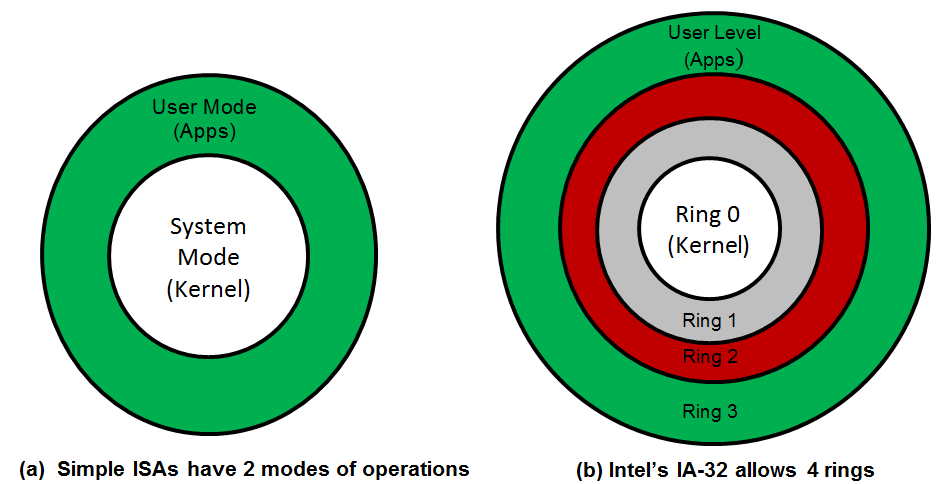
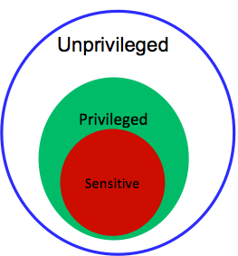

The key to virtualizing a CPU lies in the execution of both privileged and unprivileged instructions issued by guest virtual processors. The set of any processor instructions is documented and provided in the ISA. The following video outlines the issues regarding virtualizing an ISA:

> [!VIDEO https://www.microsoft.com/en-us/videoplayer/embed/RE4pFkf]

 Special privileges to system resources are permitted by defining modes of operations (or rings) in the ISA. Each CPU ISA usually specifies two modes of operations, system (or supervisor/kernel/privileged) mode and user mode (see Figure 1a). System mode allows a wide accessibility to system components, while user mode restricts such accessibility. In an attempt to provide security and resource isolations, OSs in traditional systems are executed in system mode, while associated applications are run in user mode. Some ISAs, however, support more than two rings. For instance, the Intel IA-32 ISA supports four rings (see Figure 1b). In traditional systems, when Linux is implemented on an IA-32 ISA, the OS is executed in Ring 0 and application processes are executed in Ring 3.

_Figure 1: System modes of operations (or rings)_

A **privileged instruction** is defined as an instruction that traps in user mode and does not trap in system mode. A trap is a transfer of control to system mode wherein the hypervisor (as in virtualization) or the OS (as in traditional OSs) performs some action before switching control back to the originating process. Traps occur as side effects of executing instructions. Overall, instructions can be classified into two different categories: **sensitive** and **innocuous**. Sensitive instructions can be either **control sensitive** or **behavior sensitive**. Control-sensitive instructions are those that attempt to modify the configuration of resources in a system, such as changing the mode of operation or CPU timer. An example of control-sensitive instructions is **load processor status word (LPSW)** (IBM System/370). LPSW loads the processor status word from a location in memory if the CPU is in system mode; otherwise, it traps. LPSW contains bits that determine the state of the CPU. For instance, one of these bits is the **P** bit, which specifies whether the CPU is in user mode or system mode. If executing this instruction is allowed in user mode, a malicious program can easily change the mode of operation to privileged and obtain control over the system. Hence, to protect the system, such an instruction can only be executed in system mode. Behavior-sensitive instructions are those whose behaviors are determined by the current configuration of resources in a system. An example of behavior-sensitive instructions is Pop Stack into Flags Register (POPF) (Intel IA-32). POPF pops the flag registers from a stack held in memory. One of these flags, called the interrupt enable flag, can be altered only in system mode. If POPF is executed in user mode by a program that attempts to pop the interrupt enable flag, POPF will act as a **no op** (i.e., no operation). Therefore, the behavior of POPF depends on the mode of operation, rendering as behavior sensitive. Finally, if the instruction is neither control sensitive nor behavior sensitive, it is innocuous. 

According to Popek and Goldberg (1974), a hypervisor can be constructed if it satisfies three properties: **efficiency**, **resource control**, and **equivalence**. Efficiency entails executing all innocuous instructions directly on hardware without any interference by the hypervisor. Resource control suggests that it is not possible for any guest software to change the configuration of resources in a system. Equivalence requires identical behavior of a program running on a VM or on a traditional OS with no virtualization. One exception is a difference in performance. Popek and Goldberg's proposal (or theorem) implies that a hypervisor can be constructed only if the set of sensitive instructions is a subset of the set of privileged instructions. That is to say, instructions that interfere with the correct functioning of the system (i.e., sensitive instructions, such as LPSW) should always trap in user mode. Figure 2 illustrates Popek and Goldberg's theorem.[1][^1]

_Figure 2: Popek and Goldberg's theorem_

Finally, let us discuss how a trap can be handled in a system. Specifically, we describe traps in the context of CPU virtualization. Figure 3 demonstrates how a hypervisor can handle an instruction trap. The hypervisor's trap-handling functions can be divided into three main parts: dispatcher, allocator, and a set of interpreter routines. First, a privileged instruction traps to the hypervisor's dispatcher. If the hypervisor recognizes that the instruction is attempting to alter system resources, it directs it to the allocator; otherwise, it sends it to a corresponding interpreter routine. The allocator decides how system resources are to be allocated in a nonconflicting manner and satisfies the instruction's request accordingly. The interpreter routines emulate (more on emulation shortly) the effects of the instruction when operating on virtual resources. When the instruction is handled fully (i.e., done), control is passed back to the guest software at the instruction that comes immediately after the one that caused the trap.

_Figure 3: Demonstration of a trap to a hypervisor. The hypervisor includes three main components: the dispatcher, the allocator, and the interpreter routines_
 
 
***
### References

1. _Popek, J., and Goldberg, R. (1974). [Formal Requirements for Virtualizable Third Generation Architectures](http://citeseerx.ist.psu.edu/viewdoc/download?doi=10.1.1.141.4815&rep=rep1&type=pdf) Commun. ACM, Vol. 17, No. 7._

***

[^1]: <http://citeseerx.ist.psu.edu/viewdoc/download?doi=10.1.1.141.4815&rep=rep1&type=pdf>  "Popek, J., and Goldberg, R. (1974). *Formal Requirements for Virtualizable Third Generation Architectures*"
