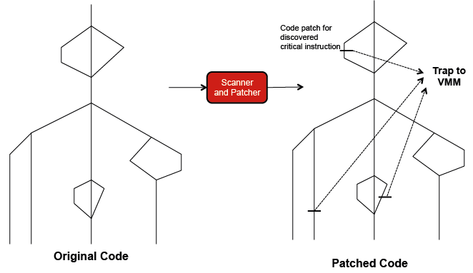

A problem arises when an instruction that is both sensitive and unprivileged is issued by a process running on a VM in user mode. According to Popek and Goldberg (1974), sensitive instructions have to trap to the hypervisor if executed in user mode. However, as explained earlier, sensitive instructions can be privileged (e.g., LPSW) and unprivileged (e.g., POPF). Unprivileged instructions do not trap to the hypervisor. Instructions that are sensitive and unprivileged are called critical (see Figure 4). ISAs that contain critical instructions do not satisfy Popek and Goldberg's theorem.[1][^1] The following video covers this concept and ways around it:
 

> [!VIDEO https://www.microsoft.com/videoplayer/embed/RE4pPUc]

The challenge is constructing a hypervisor in the presence of critical instructions. It can be done, but Smith and Nair[2][^2] distinguish between a hypervisor that complies with Popek and Goldberg's theorem and one that does not comply by referring to the former as a **true** or an **efficient** hypervisor and to the latter simply as a hypervisor.

_Figure 4: Instructions that don't satisfy Popek and Goldberg's theorem are called critical instructions_

If a processor does not satisfy Popek and Goldberg's virtualization requirement, a hypervisor can be constructed by using **code patching**, **full virtualization**, and/or **paravirtualization**. As illustrated in Figure 5, code patching requires the hypervisor to scan the guest code before execution, discover all critical instructions, and replace them with traps (system calls) to the hypervisor. Full virtualization emulates all instructions in the ISA. Emulation degrades performance because it reproduces the behavior of every source instruction by first translating it to a target instruction, and then running it on a target ISA (more on emulation shortly). Paravirtualization deals with critical instructions by modifying guest OSs. Specifically, it entails rewriting every critical instruction as a hypercall that traps to the Xen hypervisor. Accordingly, paravirtualization improves performance by avoiding emulation at the expense of modifying the guest OS. In reverse, full virtualization avoids modifying guest OSs at the expense of degrading system performance. As examples, VMware uses full virtualization, while Xen employs paravirtualization. Xen supports most major OSs, including Windows, Linux, Solaris, and NetBSD.

_Figure 5: Code scanning and patching to enforce critical instructions to trap to the hypervisor. The code is shown in a format close to a control flow diagram._
 
 
***
### References

1. _Popek, J., and Goldberg, R. (1974). [Formal Requirements for Virtualizable Third Generation Architectures](http://citeseerx.ist.psu.edu/viewdoc/download?doi=10.1.1.141.4815&rep=rep1&type=pdf) Commun. ACM, Vol. 17, No. 7._
2. _Smith, J. E., and Nair, R. (2005). [The Architecture of Virtual Machines Computer](https://www.csd.uoc.gr/~hy428/reading/smith_nair_2005.pdf), 38(5), 32-38._

***

[^1]: <http://citeseerx.ist.psu.edu/viewdoc/download?doi=10.1.1.141.4815&rep=rep1&type=pdf>  "Popek, J., and Goldberg, R. (1974). *Formal Requirements for Virtualizable Third Generation Architectures*"
[^2]: <https://www.csd.uoc.gr/~hy428/reading/smith_nair_2005.pdf> "Smith, J. E., and Nair, R. (2005). *The Architecture of Virtual Machines Computer*, 38(5), 32-38."

