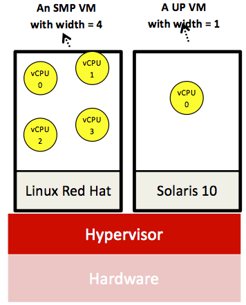

As described earlier, a virtual CPU (vCPU) acts as a proxy to a physical CPU (pCPU). In other words, a vCPU is a representation of a pCPU to a guest OS (i.e., an OS that runs on a VM). A vCPU can be initiated in a VM and mapped to an underlying pCPU by the hypervisor. In principle, a VM can have one or many vCPUs. For instance, a VM in VMware ESX 4 can have up to eight vCPUs. The amount of vCPUs represents the width of a VM. A VM with a width greater than one is called a symmetric multiprocessing (SMP) VM. In reverse, a VM with a width equal to one is called a uniprocessor (UP) VM. The following video discusses multiprocessor VMs in detail:
 

> [!VIDEO https://www.microsoft.com/videoplayer/embed/RE4q0ep]

The following figure demonstrates an SMP native system VM with a width of four and a UP native system VM, both running on the same hardware.

_Figure 6: An SMP native system VM with a width of four and a UP native system VM, both running on the same hardware_

Similar to a process on a general-purpose OS, a vCPU can be in different states, such as running, ready, and wait states. At a certain point in time, a vCPU can be scheduled by the hypervisor at only a single core (akin to scheduling an OS process on a core). For instance, a UP VM running on a host machine equipped with two Xeon 5405 processors (i.e., a total of eight pCPUs) will run on only one of the eight available cores. Inherently parallel workloads, such as MapReduce applications, prefer SMP VMs. We next discuss how the hypervisor schedules vCPUs on pCPUs.

##  Virtual CPU scheduling and Xen schedulers

General-purpose OSs support two levels of scheduling, process and thread scheduling. With a hypervisor, one extra level of scheduling is added, vCPU scheduling. The hypervisor schedules vCPUs on the underlying pCPU(s), thereby providing each guest VM a portion of the underlying physical processing time.

We (briefly) discuss two popular schedulers from Xen, Simple Earliest Deadline First (SEDF) and Credit Scheduler (CS). As its name suggests, SEDF is simple, whereby only two parameters, _n_ (the slice) and _m_ (the period), are involved. A VM (or domain Ui in Xen's parlance) can request _n_ every _m_. SEDF specifies a deadline for each vCPU computed in terms of _n_ and _m_. The deadline is defined as the latest time a domain can be run to meet its deadline. For instance, a domain Ui can request _n_ = 10 ms and _m_ = 100 ms. Accordingly, a vCPU at this domain can be scheduled by SEDF as late as 90 ms into the 100-ms period, yet still meet its deadline. SEDF operates by searching across the set of all runnable vCPUs, held in a queue, and selecting the one with the earliest deadline.

Xen's CS is more involved than SEDF. First, in configuring a VM, each vCPU in the VM is set with two properties: the weight and the cap. The weight determines the share of a pCPU's capacity that should be provided to a vCPU. For instance, if two vCPUs, vCPU-1 and vCPU-2, are specified with weights of 256 (the default) and 128, respectively, vCPU-1 will obtain double the share of vCPU-2. Weights can range from 1 to 65,535. The cap determines the total percentage of a pCPU that should be given to a vCPU. The cap can modify the behavior of the weight. Nonetheless, a vCPU can be kept uncapped.

CS converts each vCPU's weight to credits. Credits from a vCPU will be deducted as long as it is running. A vCPU is marked as over once it runs out of credits and is otherwise marked as under. CS maintains a queue for each pCPU (assuming a chip multiprocessor architecture) and stores all under vCPUs first, followed by all over vCPUs. CS operates by picking the first under vCPU in the queue to go next. CS keeps track of each vCPU's credits, and when switching a vCPU out, it places it in the queue at the end of the appropriate category. Finally, CS applies load balancing by allowing a pCPU with no under vCPUs to pull under vCPUs from queues of other pCPUs. More details on SEDF and CS can be found in Chisnall's _The Definitive Guide to the Xen Hypervisor_[1][^1].

Xen is an open-source hypervisor. Hence, it is possible to devise and add your own scheduler. Chisnall provides an excellent and comprehensive coverage of Xen's internals as well as step-by-step instructions for adding a new scheduler to Xen.
 
***
### References

1. _David Chisnall (2007). [The Definitive Guide to the Xen Hypervisor](http://213.55.83.214:8181/Bussiness%20Ebook/Computer/505709%20(46).pdf) Prentice Hall_

***

[^1]: <http://213.55.83.214:8181/Bussiness%20Ebook/Computer/505709%20(46).pdf>  "David Chisnall (2007). *The Definitive Guide to the Xen Hypervisor* Prentice Hall"