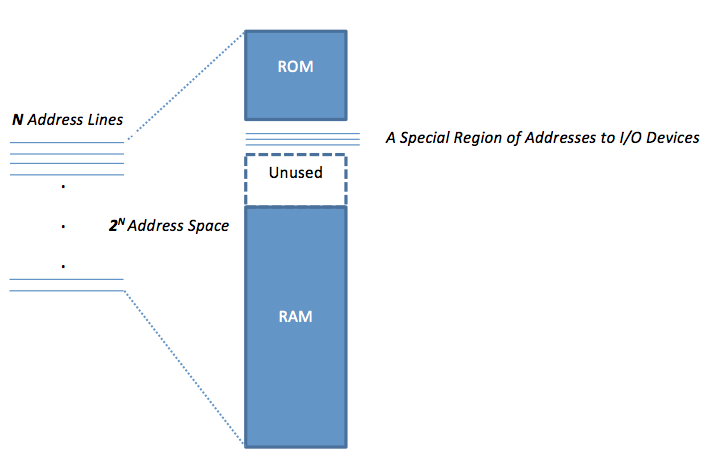
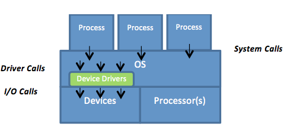

To begin, each I/O device has a device controller. A device controller can typically be signaled either by a **privileged I/O instruction** or by **memory-mapped I/O**. I/O instructions are provided by some ISAs. Intel IA-32 is an example of a processor that provides I/O instructions in its ISA. Many recent processors, however, allow performing I/O between the CPU and the device controllers through memory-mapped I/O (e.g., RISC processors). As shown in Figure 1, with memory-mapped I/O, a specific region of the physical memory address space is reserved for accessing I/O devices. These addresses are recognized by the memory controller as commands to I/O devices and do not correspond to actual physical memory locations. Different memory-mapped addresses are used for different I/O devices. Finally, in order to protect I/O devices, both I/O instructions and memory-mapped addresses are handled in system mode, thus becoming privileged.

_Figure 1: Memory-mapped I/O with a specific region in the RAM address space for accessing I/O devices_

Because I/O operations are executed in system mode, user programs can invoke them only through OS system calls (assuming traditional systems). The OS abstracts most of the details of I/O devices and makes them accessible through only well-defined interfaces. Figure 2 shows the three major interfaces that come into play when a user program places an I/O request. These are the **system call interface**, the **device driver interface**, and the **operation-level interface**. Starting an I/O operation, a user I/O request causes an OS system call that transfers control to the OS. Next, the OS calls device drivers (a set of software routines) via the device driver interface. A relevant device driver routine converts the I/O request to an operation specific to the requested physical device. The converted operation is subsequently carried through the operation-level interface to the corresponding physical device.

_Figure 2: The three major interfaces involved in I/O operations: system call, device driver, and operation-level interfaces_
