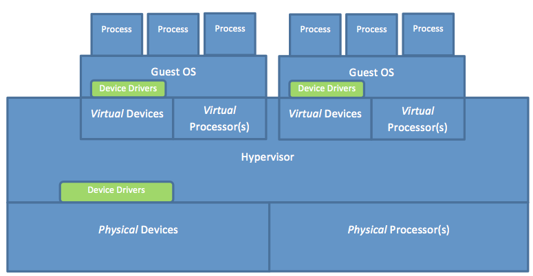

I/O virtualization allows a single physical I/O device to be shared by more than one guest OS. Figure 3 demonstrates how multiple guest OSs running in native system VMs share a single hardware machine. As shown, the hypervisor constructs virtual devices from physical devices. Notice that both the guest OSs and the hypervisor must have device drivers encapsulating the interfaces to the devices. This means that with virtualization, two different device drivers must be supported for each device, versus only one without virtualization. In reality, this is a problem because vendors of devices usually supply drivers for only the major OSs but not for hypervisors (though this could change in the near future). One way to circumvent such a problem is to collocate the hypervisor with a major OS on the same machine. This way, I/O requests can be handled by the OS that holds all requisite I/O drivers. This is the approach adopted by Xen Project and discussed on the next page.

_Figure 3: Logical locations of device drivers in multiple guest OSs in native system VMs sharing a single hardware machine_

Moreover, with I/O virtualization, every I/O request issued by a user program at a guest VM should be intercepted by the hypervisor because I/O requests are all privileged and thus need to be controlled by the hypervisor. Clearly, this would entail a trap to the guest OS for every I/O request. All I/O requests are privileged, whether issued using I/O instructions or memory-mapped I/O; hence, they are not critical instructions, and they all trap to the hypervisor. As such, the hypervisor can easily intercept every I/O request simply when it traps into the guest OS. In principle, the hypervisor can intercept I/O requests at any of the three interfaces: the system call interface, the device driver interface, or the operation-level interface.

If the hypervisor intercepts an I/O request at the operation-level interface, some essential information about the I/O action might be lost. The hypervisor needs that information to handle I/O requests correctly. When an I/O request arrives at the device driver interface, it might get transformed into a sequence of instructions. When the sequence of instructions is received at the operation-level interface, it becomes difficult for the hypervisor to identify them as instructions for a single I/O request. For example, a disk write becomes multiple store instructions in case of memory-mapped I/O or multiple ISA I/O instructions. Hence, intercepting I/O requests at the operation-level interface typically is avoided. In contrast, intercepting an I/O request at the device driver interface allows the hypervisor to efficiently map the request to the respective physical device and transmit it through the operation-level interface. Clearly, this process is a natural point for I/O virtualization; yet it would oblige hypervisor developers to learn about the different device driver interfaces of various guest OSs in order to be able to intercept I/O requests. Last, intercepting I/O requests at the system call interface (i.e., the application binary interface [ABI]) might theoretically make the I/O virtualization process easier, whereby the entire I/O operation could be handled for each request by the hypervisor (the solo controller in this case). To achieve that goal, however, the hypervisor has to emulate the ABI routines of every guest OS (different OSs have different ABI routines). Consequently, hypervisor developers need also to learn about the internals of every potential guest OS. Furthermore, emulating ABI routines can degrade system performance due to the overhead imposed by the emulation process. In practice, intercepting I/O requests at the device driver interface can be more efficient. In the following video, we discuss the overall network virtualization process as applied to a physical network adapter. 
 

> [!VIDEO https://www.microsoft.com/videoplayer/embed/RE4q0ev]

As explained in the video, one physical adapter card can appear as multiple virtual network interface cards (vNICs), each with a separate MAC address and on the same network as the physical one. To network infrastructures, such as LANs and SANs, vNICs appear as regular physical cards.
