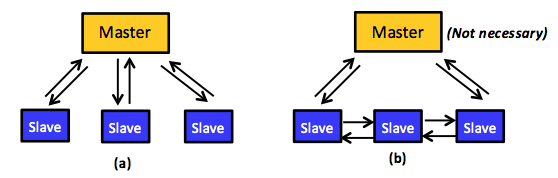

<!-- Original file: C:\Users\Mark\Desktop\CMU-source\v_5_3\content\_u05_distributed_programming_analytics_engines\_u05_m01_intro\x-oli-workbook_page\_u05_m01_4_program_cloud.xml -->
##  Distributed Systems and Clouds

Distributed programs run on networked computers. Networks of computers are ubiquitous. The Internet, high-performance computing (HPC) clusters, mobile phones, and in-car networks, among others, present common examples. Many networks of computers are deemed distributed systems. We define a **distributed system** as one in which networked computers communicate using message passing and/or shared memory and coordinate their actions to solve a particular problem or offer a specific service. Because a cloud is defined as a set of Internet-based software, platform, and infrastructure services offered through a cluster (or clusters) of networked computers (i.e., data centers), a cloud is thus a distributed system. Another consequence of our definition is that distributed programs (versus sequential or parallel) will be the norm in clouds. In particular, we define distributed programs in the section  as parallel programs that run on separate processors at different machines. Thus, the only way for tasks in distributed programs to interact over a distributed system is either by sending and receiving messages explicitly or by reading and writing from/to a shared distributed memory supported by the underlying distributed system (e.g., by using distributed shared memory [DSM] hardware architecture). We next identify the different models by which distributed programs for clouds (or _cloud programs_) can be built and recognize some of the challenges that cloud programs must address.
##  Programming the Cloud

The effectiveness of cloud programs hinges on the manner in which they are designed, implemented, and executed. The development process must address several considerations:

1. Which underlying programming model is most appropriate, message passing or shared memory? 
1. Does the application better fit a synchronous or asynchronous computation model? 
1. <!-- How best -->What is the best way to configure data for computational efficiency: by using data parallelism or graph parallelism? 
1. Which architectural and management structure will most enhance program complexity, efficiency, and scalability: master-slave or peer to peer? 

For cloud programs in particular, several issues—spanning design, implementation, tuning, and maintenance—require special attention:

1. Computational scalability is hard to achieve in large systems (e.g., clouds) for several reasons, including inability to parallelize algorithms completely, high probability of load imbalance, and inevitability of synchronization and communication overheads. 
1. Communication that exploits data locality and minimizes network traffic can be tricky, particularly on (public) clouds, where network topologies are usually hidden. 
1. Two common cloud realities—virtual environments and data center component diversity—introduce heterogeneity that complicates scheduling tasks and masks hardware and software differences among cloud nodes. 
1. To avoid deadlocks and transitive closures and to guarantee mutually exclusive access, which are highly desirable capabilities in distributed settings, the underlying system must provide, and the designer must exploit, effective synchronization mechanisms. 
1. As failure likelihood increases with cloud scale, system designs must employ fault-tolerance mechanisms, including task resiliency, distributed checkpointing, and message logging. 
1. For effective and efficient execution, task and job schedulers must support control of task locality, parallelism, and elasticity as well as service-level objectives (SLOs). 

Addressing all of these development considerations and cloud issues imposes a major burden on programmers. Designing, developing, verifying, and debugging all (or even some) of these capabilities present inherently difficult problems and can introduce significant correctness and performance challenges, in addition to consuming significant time and resources. 

Modern distributed analytics engines promise to relieve developers of these responsibilities. These engines provide application programming interfaces (APIs) that enable users to present their programs as simple, sequential functions. The engines then automatically create, parallelize, synchronize, and schedule tasks and jobs. They also handle failures without requiring user involvement. At the end of this unit, we detail how distributed analytics engines effectively abstract and address the challenges of developing cloud programs. In the next section, however, we first present the two traditional distributed programming models: shared memory and message passing. Second, we discuss the computation models that cloud programs can employ. Specifically, we explain the synchronous and asynchronous computation models. Third, we present the two main parallelism categories of cloud programs, data parallelism and graph parallelism. Last, we describe the architectural models that cloud programs can typically utilize: master-slave and peer-to-peer architectures. 
##  Models for Building Cloud Programs

Programming models embody concepts and offer tools that support developers in building large computational systems. A distributed programming model, in particular, facilitates translating sequential algorithms into distributed programs that can execute over distributed systems. The model's design determines how easily a programmer can specify an algorithm as a distributed program. A model that abstracts architectural/hardware details, automatically parallelizes and distributes computation, and transparently supports fault tolerance is considered easy to use. 

A model's efficiency, however, depends on the effectiveness of its underlying techniques. For a distributed program running on a system of distributed computers, one essential requirement is a communication mechanism that enables coordinating component tasks across multiple, networked resources. Two traditional models, message passing and shared memory, meet this need, although in a relatively basic form. Additional challenges in the distributed programs typical of cloud environments have led to more sophisticated programming models that, when implemented as distributed analytics engines, can automatically parallelize and distribute tasks and can tolerate faults. 
<!-- Hadoop MapReduce <cite entry="_25" /> <cite entry="_26" /> , Pregel <cite entry="_42" /> and GraphLab <cite entry="_40" /> -->
###  The Shared-Memory Model

_Figure 5.4: Tasks running in parallel and sharing an address space_

The shared-memory model's key abstraction says that every task can access any location in an application's distributed memory space. Tasks thus communicate by reading from and writing to memory locations in the distributed memory space, as is the case with threads in a single process, where all threads share the process address space (Figure 5.4). With shared memory, tasks exchange data implicitly via sharing and not by explicitly sending and receiving messages. The shared-memory model, consequently, supports synchronization mechanisms that distributed programs must use to control the order in which various tasks can perform read/write operations. In particular, multiple tasks must not be able to write simultaneously to a shared-data location, which could corrupt data or make it inconsistent. This goal typically can be achieved using semaphores, locks, and/or barriers. A semaphore is a point-to-point synchronization mechanism that involves two parallel/distributed tasks. Semaphores use two operations: post and wait. The post operation acts like depositing a token, signaling that data has been produced. The wait operation blocks until signaled by the post operation that it can proceed to consume data. Locks protect critical sections, which are regions that only one task can access (typically write) at a time. Locks involve two operations, lock and unlock, for acquiring and releasing a lock associated with a critical section. A lock can be held by only one task at a time, and other tasks cannot acquire it until released. Last, a barrier defines a point beyond which a task is not allowed to proceed until every other task reaches that point. The efficiency of semaphores, locks, and barriers is a critical and challenging goal in developing distributed/parallel programs for the shared-memory programming model (see the section ). 

Figure 5.5 shows an example that transforms a simple sequential program into a distributed one using the shared-memory programming model. The sequential program adds the elements of two arrays, `b` and `c`, storing the results in array `a`. Subsequently, any element greater than `0` in `a` is added to a grand sum. The corresponding distributed version assumes only two tasks and splits the work evenly between them. For every task, start and end variables are specified to correctly index the (shared) arrays, obtain data, and apply the given algorithm. Clearly, the grand sum is a critical section and so protected by a lock. In addition, no task can print the grand sum before every other task has finished its work, thus inserting a barrier before the printing statement. As shown in the program, communication between the two tasks is implicit (via reads and writes to shared arrays and variables) and synchronization is explicit (via locks and barriers). Last, as pointed out earlier, the underlying distributed system must provide data-sharing functionality. Specifically, the infrastructure must create the illusion that the memories of all computers in the system form a single, shared space that is addressable by all tasks. A common example of systems that offer such an underlying shared (virtual) address space on a cluster of computers (connected by a LAN) is called DSM. A common programming language that can be used on DSMs and other distributed shared systems is OpenMP.

_Figure 5.5: Sequential and shared-memory versions_

###  The Message-Passing Programming Model

In the message-passing programming model, distributed tasks communicate by sending and receiving messages. Here, distributed tasks do not share an address space in which they can access each other’s data (see Figure 5.6), and the key abstraction resembles processes that, unlike threads, each maintain a private memory space. To send and receive data via explicit messages, this model incurs communication overheads (e.g., variable network latency and potentially excessive data transfers). Balancing these overheads, the explicit message exchanges implicitly synchronize the operation sequence in communicating tasks. Figure 5.7 demonstrates an example that transforms the sequential program shown in Figure 5.5(a) into a distributed version that uses message passing. Initially, only a main task with `id = 0` can access the arrays `b` and `c`. Thus, assuming the existence of only two tasks, the main task first sends parts of the arrays to the other task (using an explicit send operation) in order to split the work evenly between the two tasks. The second task receives the required data (using an explicit receive operation) and performs a local sum. When done, it sends back its local sum to the main task. Likewise, the main task performs a local sum on its data part and collects the local sum of the other task before aggregating and printing a grand sum. As shown, for every send operation, there is a corresponding receive operation, and no explicit synchronization is needed. Last, the message-passing programming model does not necessitate any support from the underlying distributed system. Specifically, the interacting tasks require no illusion of a single, shared address space. A popular example of a message-passing programming model is provided by the message passing interface (MPI). MPI is an industry-standard, message-passing library (more precisely, a specification of what a library can do) for writing message-passing programs. A popular high-performance and widely portable implementation of MPI is MPICH.

_Figure 5.6: Tasks running in parallel using the message-passing programming model whereby the interactions happen only via sending and receiving messages over the network_

Table 5.1 compares the shared-memory and the message-passing programming models in terms of five aspects: development effort, tuning effort, communication, synchronization, and hardware support. 

Shared-memory programs are initially easier to develop because programmers need not worry about how data are laid out or communicated. Furthermore, the code structure of a shared-memory program is often quite similar to that of its sequential counterpart. Typically, programmers only insert additional directives to specify parallel/distributed tasks, scope of variables, and synchronization points. In contrast, message-passing programs require a shift in programmer thinking to consider, a priori, how to partition data across tasks, collect data, and communicate and aggregate results with explicit messaging. 

How data are laid out and where it is stored begin to affect performance significantly as data and resources scale up. For instance, large-scale distributed systems such as the cloud imply nonuniform access latencies (e.g., accessing remote data takes much more time than accessing local data) thus encouraging programmers to keep data close to the tasks that use them. Although message-passing programmers must plan ahead to partition data across tasks, shared memory programmers will (most of the time) address that issue during postdevelopment, typically through data migration or replication. This adjustment can involve significant tuning effort compared to a message-passing design. 

In large-scale systems, synchronization points can become performance bottlenecks: as the number of users attempting to access a critical section increases, associated delays and waits also increase. We return to synchronization and other challenges involved in programming for the cloud in the section . 

_Figure 5.7. A distributed program that corresponds to the sequential program in Figure 5.5(a) and is coded using the message-passing programming model_

|Aspect|Shared-Memory Model|Message-Passing Model|
|--|--|--|
|Communication|Implicit|Explicit|
|Synchronization|Explicit|Implicit|
|Hardware Support|Usually required|Not required|
|Initial Development Effort|Lower|Higher|
|Tuning Effort upon Scaling Up|Higher|Lower|

_Table 5.1: A comparison between the shared-memory and the message-passing programming models_

##  Synchronous and Asynchronous Computation Models

_Figure 5.8: The bulk synchronous parallel (BSP) model_

Independent of the programming model used, a developer can specify distributed computation as either **synchronous** or **asynchronous**. This distinction refers to the presence or absence of a (global) coordination mechanism that synchronizes task operations. A distributed program is synchronous if and only if the component tasks operate in lockstep. That is, for some constant `(c ≥ 1)`, if and only if any task has taken `(c + 1)` steps, then every other task must have taken at least _c_ steps. Subsequently, if any task has taken (c + 2) steps, then every other task must have taken at least (c + 1) steps. Clearly, this constraint requires a coordination mechanism through which task activities can be synchronized and their timing be accordingly enforced. Such mechanisms usually have an important effect on performance. Typically, in synchronous programs, distributed tasks must wait at predetermined points for the completion of certain computations or for the arrival of certain data. A program that is not synchronous is an asynchronous program. Asynchronous programs impose no requirement to wait at predetermined points or for the arrival of certain data. Computational asynchrony obviously has less effect on performance but implies that the correctness/validity of the program must be assessed. 

MapReduce and Pregel programs, for example, involve synchronous computation, while those under GraphLab are asynchronous. Pregel employs the bulk synchronous parallel (BSP) model, which is a synchronous model commonly employed for effectively implementing distributed programs. BSP combines three attributes: components, a router, and a synchronization method. A BSP component comprises a processor and data stored in local memory, but the model does not preclude other arrangements, such as holding data in remote memories. BSP is neutral about the number of processors, be it two or a million, and BSP programs can be written for `v` virtual distributed processors to run on `p` physical distributed processors, where `(v > p)`. 

BSP builds on the message-passing programming model, sending and receiving messages through a router that, in principle, can only pass messages point-to-point between pairs of components (the model provides no broadcasting facilities, although developers can implement them using multiple point-to-point communications). To achieve synchrony, BSP splits every computation into a sequence of steps called **super-steps**. In every super-step, `S`, each component is assigned a task encompassing (local) computation. Components in `S` can send messages to `(c + 1)` components in super-step `(S + 1)` and are implicitly allowed to receive messages from components in super-step `(S – 1)`. In every super-step, tasks operate simultaneously and do not communicate with each other. Across super-steps, tasks move in a lockstep mode: no task in `(S + 1)` can start before every task in S commits. To satisfy this condition, BSP applies a global, barrier-style synchronization mechanism, as shown in Figure 5.8. Because BSP does not provide simultaneous accesses to a single memory location, it does not require any synchronization mechanism beyond barriers. 

Another primary concern in a distributed setting lies in allocating data so that computation will not be slowed by nonuniform memory access latencies or uneven loads among individual tasks. BSP promotes uniform access latencies by using local data: data are communicated across super-steps before triggering actual task computations, and the model thus divorces computation and communication. Such separation implies that no particular network topology is favored beyond the requirement to deliver high throughput. Butterfly, hypercube, and optical crossbar topologies are all acceptable. 

Across tasks within a super-step, data volumes can still vary, and task loading depends mainly on the distributed program and the responsibilities it imposes on its constituent tasks. Accordingly, the time required to finish a super-step becomes bound by its slowest task (a super-step cannot commit before its slowest task completes). This limit presents a major challenge for the BSP model because it can create load imbalance, which usually degrades performance. Load imbalance can also be caused by heterogeneous clusters, especially on the cloud (see the section ). Note that although BSP suggests several design choices, it does not make their use obligatory. Indeed, BSP leaves many design choices open (e.g., barrier-based synchronization can be implemented at a finer granularity or completely switched off if unneeded for the given application). 
##  Data and Graph Parallelism Models

A second consideration in developing distributed programs involves specifying the type of parallelism, data or graph parallelism. The data parallelism design emphasizes the distributed nature of data and spreads it across multiple machines. Computation, meanwhile, can remain the same among all nodes and be applied on different data. Alternately, tasks on different machines can perform different computational tasks. When the tasks are identical, we classify the distributed program as single program, multiple data (SPMD); otherwise, we categorize it as multiple program, multiple data (MPMD). 

The basic idea of **data parallelism** is simple: by distributing a large file across multiple machines, it becomes possible to access and process different parts of the file in parallel. As discussed in Unit 4, one popular technique for distributing data is file striping, in which a single file is partitioned and distributed across multiple servers. Another form of data parallelism is to distribute whole files (without partitioning) across machines, especially if files are small and their contained data exhibit very irregular structures. We note that data can be distributed among distributed tasks either explicitly, by using message passing, or implicitly, by using shared memory, assuming the underlying distributed system supports shared memory. 

_Figure 5.9: An SPMD distributed program using the shared-memory programming model_

Data parallelism is achieved when each node runs one or many tasks on different pieces of distributed data. As a specific example, assume array A is shared among three machines in a distributed shared-memory system. Consider also a distributed program that simply adds all elements of array A. It is possible to command machines 1, 2, and 3 to run the addition task, each on one-third of array A, or 50 elements, as shown in Figure 5.9. The data can be allocated across tasks using the shared-memory programming model, which requires a synchronization mechanism. Clearly, such a program is SPMD. In contrast, array A can also be distributed evenly (using message passing) by a (master) task among three machines, including the master's machine, as shown in Figure 5.10. Each machine will run the addition task independently; nonetheless, summation results will have to be eventually aggregated at the master task in order to generate a grand total. In such a scenario, every task is similar in a sense that it is performing the same addition operation, yet on a different part of array A. The master task, however, is also distributing data to all tasks and aggregating summation results, thus making it slightly different from the other two tasks. Clearly, this makes the program MPMD. As will be discussed in the MapReduce section, MapReduce uses data parallelism with MPMD programs. 

_Figure 5.10: An MPMD distributed program using the message-passing programming model_

**Graph parallelism**, on the other hand, focuses on distributing computation as opposed to data. Most distributed programs actually fall somewhere on a continuum between the two forms. Graph parallelism is widely used in many domains such as machine learning, data mining, physics, and electronic circuit design, among others. Many problems in these domains can be modeled as graphs in which vertices represent computations and edges encode data dependencies or communications. Recall that a graph 
<!-- TODO fix
<m:math display="inline" xmlns:m="m"><m:mrow><m:mi>G</m:mi></m:mrow></m:math>
-->

 is a pair 
<!-- TODO fix
<m:math display="inline" xmlns:m="m"><m:mrow><m:mo stretchy="false">(</m:mo><m:mi>V</m:mi><m:mo>,</m:mo><m:mi>E</m:mi><m:mo stretchy="false">)</m:mo></m:mrow></m:math>
-->

, where 
<!-- TODO fix
<m:math display="inline" xmlns:m="m"><m:mrow><m:mi>V</m:mi></m:mrow></m:math>
-->

 is a finite set of vertices and 
<!-- TODO fix
<m:math display="inline" xmlns:m="m"><m:mrow><m:mi>E</m:mi></m:mrow></m:math>
-->

 is a finite set of pairwise relationships, 
<!-- TODO fix
<m:math display="inline" xmlns:m="m"><m:mrow><m:mi>E</m:mi><m:mo lspace="2px" rspace="2px">sub</m:mo><m:mo stretchy="false">(</m:mo><m:mi>V</m:mi><m:mo lspace="2px" rspace="2px">times</m:mo><m:mi>V</m:mi><m:mo stretchy="false">)</m:mo></m:mrow></m:math>
-->

, called edges. Weights can be associated with vertices and edges to indicate the amount of work at each vertex and the communication data on each edge. 

Consider a classical problem from circuit design: the common goal of keeping certain pins of several components electrically equal by wiring them together. If we assume `n` pins, then an arrangement of `(n – 1)` wires, each connecting two pins, can be employed. Of all such arrangements, the one requiring the minimum number of wires is normally the most desirable. Obviously, this wiring problem can be modeled as a graph problem. In particular, each pin can be represented as a vertex, and each interconnection between a pair of pins 
<!-- TODO fix
<m:math display="inline" xmlns:m="m"><m:mrow><m:mo stretchy="false">(</m:mo><m:mi>u</m:mi><m:mo>,</m:mo><m:mi>v</m:mi><m:mo stretchy="false">)</m:mo></m:mrow></m:math>
-->

 can be represented as an edge. A weight 
<!-- TODO fix
<m:math display="inline" xmlns:m="m"><m:mrow><m:mi>w</m:mi><m:mo stretchy="false">(</m:mo><m:mi>u</m:mi><m:mo>,</m:mo><m:mi>v</m:mi><m:mo stretchy="false">)</m:mo></m:mrow></m:math>
-->

 can be set between 
<!-- TODO fix
<m:math display="inline" xmlns:m="m"><m:mrow><m:mi>u</m:mi></m:mrow></m:math>
-->

 and 
<!-- TODO fix
<m:math display="inline" xmlns:m="m"><m:mrow><m:mi>v</m:mi></m:mrow></m:math>
-->

 to encode the cost (the amount of wires needed) to connect 
<!-- TODO fix
<m:math display="inline" xmlns:m="m"><m:mrow><m:mi>u</m:mi></m:mrow></m:math>
-->

 and 
<!-- TODO fix
<m:math display="inline" xmlns:m="m"><m:mrow><m:mi>v</m:mi></m:mrow></m:math>
-->

. The problem becomes how to find an acyclic subset, 
<!-- TODO fix
<m:math display="inline" xmlns:m="m"><m:mrow><m:mi>S</m:mi></m:mrow></m:math>
-->

, of edges, 
<!-- TODO fix
<m:math display="inline" xmlns:m="m"><m:mrow><m:mi>E</m:mi></m:mrow></m:math>
-->

, that connects all the vertices, 
<!-- TODO fix
<m:math display="inline" xmlns:m="m"><m:mrow><m:mi>V</m:mi></m:mrow></m:math>
-->

, and whose total weight 
<!-- TODO fix
<formula><m:math display="inline" xmlns:m="m"><m:mrow><m:mi>w</m:mi><m:mfenced open="(" close=")"><m:mi>S</m:mi></m:mfenced><m:mo>=</m:mo><m:mrow><m:msub><m:mo>sum</m:mo><m:mrow><m:mfenced open="(" close=")"><m:mrow><m:mi>u</m:mi><m:mo>,</m:mo><m:mi>v</m:mi></m:mrow></m:mfenced><m:mo lspace="2px" rspace="2px">isin</m:mo><m:mi>S</m:mi></m:mrow></m:msub><m:mrow><m:mi>w</m:mi><m:mfenced open="(" close=")"><m:mrow><m:mi>u</m:mi><m:mo>,</m:mo><m:mi>v</m:mi></m:mrow></m:mfenced></m:mrow></m:mrow></m:mrow></m:math></formula>
-->

is the minimum. As _S_ is acyclic and fully connected, it must result in a tree known as the _minimum spanning tree_. Consequently, solving the wiring problem morphs into solving the minimum spanning tree problem, a classical problem that is solvable with Kruskal's and Prim's algorithms, to mention a few.

_Figure 5.11: A graph partitioned using the edge-cut metric_

Once modeled as a graph, a program can be distributed over machines in a distributed system using a graph-partitioning technique, which involves dividing the work (vertices) over distributed nodes for efficient distributed computation. As with data parallelism, the basic idea is simple: by distributing a large graph across multiple machines, it becomes possible to process different parts of the graph in parallel, resulting in a graph-parallel design. The standard objective of graph partitioning is to distribute work uniformly over _p_ processors by partitioning the vertices into _p_ equally weighted partitions while minimizing internode communication reflected by edges. Such an objective is typically referred to as the standard edge-cut metric. While the graph partitioning problem is NP-hard, heuristics can achieve near optimal solutions. As a specific example, Figure 5.11 demonstrates three partitions, P1, P2, and P3, at which vertices {v1, …, v8} are divided using the edge-cut metric. Each edge has a weight of two corresponding to one unit of data communicated in each direction. Consequently, the total weight of the shown edge cut is 10. Other cuts will result in more communication traffic. Clearly, for communication-intensive applications, graph partitioning is critical and can play a dramatic role in dictating the overall application performance. Some of the challenges pertaining to graph partitioning are discussed in the section. Both Pregel and GraphLab employ graph partitioning, and we further discuss each in later sections. 
##  Symmetrical and Asymmetrical Architectural Models

The third design consideration is one of organizational structure. An application developer typically organizes a distributed program in a **master-slave** (asymmetric) or **peer-to-peer** (symmetric) architecture, as shown in Figure 5.12. Other organizations, such as hybrids, may be appropriate for special circumstances. For the purpose of this unit, we are only concerned with the master-slave and peer-to-peer organizations. 
###  Asymetric Master-Slave Organization 

In a master-slave organization, a central process, called the _master_, handles all the logic and controls, and all other processes are denoted as slave processes. Thus, interaction between processes is asymmetrical: bidirectional connections enable the master to communicate with each slave, and no interconnection is permitted between any two slaves (see Figure 5.12(a)). This situation requires the master to keep track of each slave's network location in what is called a _metadata structure_, and, further, that each slave can always identify and locate the master. 

_Figure 5.12. (a) A master-slave organization. (b) A peer-to-peer organization. The master in such an organization is optional (usually employed for monitoring the system and/or injecting administrative commands)._

In asymmetric organizations, the master can distribute work among the slaves using one of two following protocols: 

1. The **push-based** strategy assigns work to slaves unilaterally, without their asking. Clearly, this situation allows the master to apply fairness constraints over the slaves via distributing the work equally among them. Alternately, this arrangement could also overwhelm/congest slaves currently experiencing slowness/failures and who are thus unable to keep up with work. Consequently, load imbalance might occur, which usually leads to performance degradation. Nevertheless, the master can implement smart strategies. In particular, the master can assign work if and only if the slave is observed to be ready. For this tactic to work, the master must continuously monitor all slaves and apply some logic (usually complex) to accurately identify available slaves. To maintain fairness and enhance performance, the master must also decide upon the amount of work to assign. In clouds, the probability of faulty and slow processes increases due to heterogeneity, performance unpredictability, and scalability (see the section ). These limitations can make the push-based protocol inefficient on the cloud.
1. The **pull-based** strategy, on the other hand, requires slaves to request assignment of work. This protocol significantly reduces complexity and potentially avoids load imbalance because the decision of whether a particular slave is ready or not is delegated to the slave itself. Nonetheless, the master still needs to monitor the slaves, usually to track the progress of tasks at slaves and/or apply fault-tolerance mechanisms (e.g., to effectively address faulty and slow tasks, commonly present in large-scale clouds). Hadoop MapReduce and Pregel utilize the pull-based protocol.

To this end, we note that the master-slave organization suffers from a single point of failure (SPOF). Specifically, if the master fails, the entire distributed program comes to a grinding halt. Furthermore, having a central process (the master) for controlling and managing everything might not scale well beyond a few hundred slaves, unless efficient strategies are applied to reduce the contention on the master (e.g., caching metadata at the slaves so as to avoid accessing the master on each request). In contrart, using a master-slave organization simplifies decision making (e.g., allowing a write transaction on a certain shared data). In particular, the master is always the sole entity that controls everything and can make any decision singlehandedly without bothering anything else. This simplicity averts the employment of voting mechanisms, which are typically needed when only a group of entities (not a single entity) has to make decisions. The basic idea of voting mechanisms is to require a task to request and acquire the permission for a certain action from at least half of the tasks plus one (a majority). Voting mechanisms usually complicate implementations of distributed programs. 
###  Symmetric Peer-to-Peer Organization 

In symmetric organizations, all tasks are equal, with logic, control, and work distributed evenly among them. Specifically, each task can communicate directly with those around it, without having to contact a master process (see Figure 5.12(b)). A master may be adopted, however, but only for purposes such as monitoring the system and/or injecting administrative commands. In other words, peer tasks do not require a master to function correctly. Moreover, although tasks communicate with one another, their work can be totally independent and may even be unrelated. Peer-to-peer organizations eliminate the potential for an SPOF and bandwidth bottlenecks, thus they typically exhibit good scalability and robust fault tolerance. Making decisions in peer-to-peer organizations, however, must be carried out collectively, usually through voting mechanisms. This arrangement typically implies increased implementation complexity as well as higher communication overhead and latency, especially in large-scale systems such as the cloud. GraphLab, which we discuss in later sections, employs a peer-to-peer organization. 

### References

1. _A. S. Tanenbaum (September 4, 1994). Distributed Operating Systems Prentice Hall, First Edition_
2. _Hadoop ().  http://hadoop.apache.org/_
3. _Hadoop Tutorial ().  http://developer.yahoo.com/hadoop/tutorial/_
4. _G. Malewicz, M. H. Austern, A. J. Bik, J. C. Dehnert, I. Horn, N. Leiser, and G. Czajkowski (2010). Pregel: A System for Large-Scale Graph Processing In Proceedings of the 2010 ACM SIGMOD International Conference on Management of_
5. _Y. Low, D. Bickson, J. Gonzalez, C. Guestrin, A. Kyrola, and J. M. Hellerstein (2012). Distributed GraphLab: A Framework for Machine Learning and Data Mining in the Cloud Proceedings of the VLDB Endowment_
6. _K. Li (1986). Shared Virtual Memory on Loosely Coupled Multiprocessors Yale University, NewHaven, CT (USA)_
7. _A. S.Tanenbaum (September 4, 1994). Distributed Operating Systems Prentice Hall, First Edition_
8. _OpenMP ().  http://openmp.org/wp/_
9. _Message Passing Interface ().  http://www.mcs.anl.gov/research/projects/mpi/_
10. _MPICH ().  http://www.mpich.org/_
11. _A. S. Tanenbaum and M. V. Steen (October 12, 2006). Distributed Systems: Principles and Paradigms Prentice Hall, Second Edition_
12. _L. G. Valiant (1990). A Bridging Model for Parallel Computation Communications of the ACM_
13. _D. P. Bertsekasand and J. N. Tsitsiklis (January 1, 1997). Parallel and Distributed Computation: Numerical Methods Athena Scientific; First Edition_
14. _T. H. Cormen, C. E. Leiserson, R. L. Rivest, and C. Stein (July 31, 2009). Introduction to Algorithms MIT Press, Third Edition_
15. _B. Hendrickson and T. G. Kolda (2000). Graph Partitioning Models for Parallel Computing Parallel Computing_
16. _M. R. Garey, D. S. Johnson, and L. Stockmeyer (1976). Some Simplified NP-Complete Graph Problems Theoretical Computer Science_
17. _B. Hendrickson and R. Leland (1995). The Chaco User's Guide Version 2.0 Technical Report SAND95-2344, Sandia National Laboratories_
18. _G. Karypis and V. Kumar (1998). A Fast and High Quality Multilevel Scheme for Partitioning Irregular Graphs SIAM Journal on Scientific Computing_
19. _R. H. Thomas (1979). A Majority Consensus Approach to Concurrency Control for Multiple Copy Databases ACM Transactions on Database Systems (TODS)_
20. _D. K. Gifford (1979). Weighted Voting for Replicated Data In Proceedings of the Seventh ACM Symposium on Operating Systems Principles_