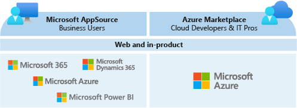

After meeting with your company’s executive team, you start to compile some information about the commercial marketplace to report back to the group during your next meeting. So far, you’ve learned that the commercial marketplace is a cloud-based, on-demand market that lets Microsoft partners publish their solutions into Microsoft’s online product catalog.

## Built for customers

For your current and future customers, the commercial marketplace is a powerful tool to find, try, buy, and deploy best-in-class solutions that they can use to accelerate digital transformation and innovate in the cloud. For your customers that are already Microsoft customers, purchasing solutions from the commercial marketplace has an added benefit: they can include commercial marketplace purchases in their existing Microsoft purchase agreements and receive a consolidated invoice from Microsoft.

## Built for partners

The commercial marketplace is free to join. You can use the commercial marketplace as a dynamic sales and marketing channel to access new markets, customer segments, and Microsoft cloud users with your software and services. You can also leverage it as a means to find best-in-class solutions you can deploy for use within your own cloud infrastructure to build your own solutions.

## Multiple access points

When you list your company’s solutions in the commercial marketplace, customers will be able to find them in two online stores, through the Microsoft network of resellers and through in-product experiences in products like Microsoft 365, Dynamics 365, the Power Platform, and Azure.

The commercial marketplace has two online stores, **Microsoft AppSource** and **Azure Marketplace**, which are designed to serve different buyer roles within your customers’ organizations.

Between the two online stores and the in-product experiences, the commercial marketplace draws millions of active users per month, with each unique user representing a potential customer for your company. Because Microsoft products and services are used widely by organizations around the world, these monthly users represent companies of all sizes in every industry.

## Summary

The potential to get your products in front of all these people sounds like the opportunity your executive team asked you to find, but you still need to learn more about the online stores. Your company sells solutions that were built with different customer groups in mind, and you need to understand how those solutions would fit into the commercial marketplace.

To determine which online store is best suited for your solutions, you decide to reference the [commercial marketplace documentation](/azure/marketplace/overview) to learn more about **Microsoft AppSource** and **Azure Marketplace.**
