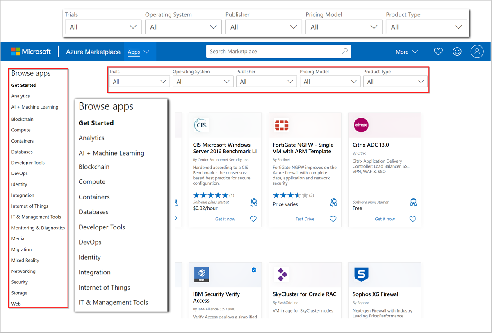
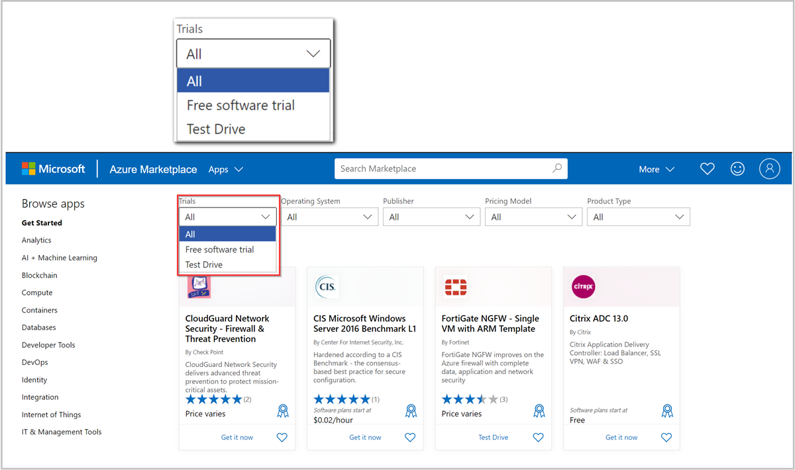

While drinking your morning coffee and reading your LinkedIn feed, you come across a post from a friend recommending an application she bought from Azure Marketplace. In the post, she talks about how Azure Marketplace made it easy find, try, and buy the software.

Excited by the possibilities, you decide to do some research to find out how Azure Marketplace can help accomplish your cloud migration goals.

Let's start by reviewing what you find about using Azure Marketplace to find and try the software your organization needs.

## Finding software and services in Azure Marketplace

Azure Marketplace has thousands of software applications built by Microsoft and a vast network of industry-leading technology providers. You can also use Azure Marketplace to connect with certified Microsoft partners who provide consulting services to help with cloud migration, systems integration, data management and analytics, and other cloud projects.

Azure Marketplace is a part of Azure and can be accessed from the Azure portal and the Azure Marketplace online store.

To access Azure Marketplace from the Azure portal, log in with your Azure account credentials at <https://portal.azure.com> and select **Create a resource** on the homepage. This opens the Azure Marketplace experience, where you’ll be able to start browsing the catalog of software and services.

You can also get to Azure Marketplace by visiting the online store at <https://azuremarketplace.microsoft.com>. In addition to software and services you can find in the Azure Marketplace experience in the Azure portal, the online store includes consulting services from certified Microsoft partners, including industry leading systems integrators. You can browse the consulting services section of the online store by selecting **Consulting services** from the menu at the top of the page.

Azure Marketplace streamlines the process of finding IT solutions by organizing products and services into categories like analytics, networking, security, databases, and other common cloud solution areas. In addition to browsing by category, you can also use the search filters in both the Azure portal and the Azure Marketplace online store to narrow your search results to products that fit your organization’s needs.

## Trying software from Azure Marketplace

When deciding if an application is the right fit for your team, it’s helpful to try it before you buy it. In the past, setting up a free trial for an application might have involved speaking with a sales rep, who activated a trial license or arranged a product demonstration. Azure Marketplace makes it easier for you to try software before purchasing with hundreds of available free trials that you can activate through Microsoft. This gives you the power to make purchasing decisions at your own pace.

Azure Marketplace has two kinds of trial experiences: **free trials** and **test drives**.

### Free trials

Free trials are offered for 30- or 90-day periods, depending on the product. Free software trials let you use the software for the trial period without paying any subscription fees and seamlessly transition to a paid subscription when the trial period expires.

### Test drives

Another way to try software is to start a test drive. Test drives are ready-to-go, pre-provisioned environments that let you try a solution without configuring any settings or uploading any data. Instead, you can focus on evaluating the user experience, key product features, and the benefits the solution offers. Once provisioned, the test drive will be available for a limited time, typically a few hours.

### Evaluating software at small scale

With Azure Marketplace, you can start small and then scale up. Thousands of products have plans that make it easy for you to purchase a product at a small scale, such as small virtual machine sizes or software with a limited number of users. This gives your team the opportunity to experiment with a product before committing to a full-scale implementation, limiting up-front costs to your company. If you find that the product is a good fit, you can upgrade your software plan and scale across your Azure infrastructure.

## Summary

After your initial research, you can already see how Azure Marketplace would help solve some of your cloud procurement problems. Now that you understand how much time you can save by using Azure Marketplace to find and try cloud software and services, you’re ready to learn how you can use it to simplify your company’s IT purchasing processes.
