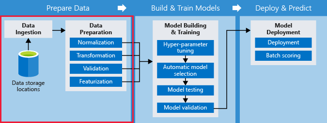

The steps of going from preparing data, building and training models, and deployment are collectively known as the machine learning *pipeline*. Pipelines can be simple or complex, and the level of automation can vary. However, as the number and complexity of machine learning pipelines increase, the need for automation grows. This is where [Azure Machine Learning pipelines](https://docs.microsoft.com/azure/machine-learning/service/concept-ml-pipelines) comes in.

Azure Machine Learning pipelines solve the problems of creating and managing machine learning pipelines. It enables data scientists to manage multiple workflows at the same time, whether they are simple or complex, thus enabling data scientists to focus on machine learning rather than the infrastructure.

The Azure Machine Learning pipeline consists of multiple steps, each of which is a distinct computational unit. Steps make it possible to rerun only the needed part of a pipeline. A typical pipeline consists of  steps such as data preparation, model training, model deployment, and potentially using the model to score new batches of data. An individual step such as data preparation can involve many tasks. The following diagram illustrates the four major phases of a pipeline with the data ingestion and preparation steps highlighted.

The first step is to load the source data. This is referred to as _data ingestion_. Once the data has been loaded, there are several steps that might be necessary to prepare the data for processing including:

- **Data normalization** translates some input data to be in a certain range. For example, normalize the input RGB value of an image pixel, usually from 0–255, to 0–1.
- **Data transformation** involves converting a piece of data to something that a model can consume. For example, for a monthly sales forecast, you might need to transform the sales data from date and time (01/01/2000 15:32:43) to month (01/2001).
- **Data validation** verifies that data values are valid. For example, the age column should only have a number, and alphabetical values should be rejected.
- **Data featurization** is the process of creating model features from data. For example, text values should be encoded into a categorical format that a model understands.

If you have a lot of data, each of the previous steps could be computationally expensive. Azure Machine Learning pipelines can be used so data sources and intermediate data are automatically reused inside the pipeline, unchanged steps are automatically skipped, and the retraining process becomes much faster and less expensive.

> [!TIP]
> You can use the [Azure Machine Learning SDK for Python](https://docs.microsoft.com/azure/machine-learning/service/concept-ml-pipelines#the-python-sdk-for-pipelines) to create machine learning pipelines and to submit and track individual pipeline runs.

With Azure Machine Learning pipelines and the AutoML capability, you can more easily train your algorithms with just a few lines of code. The next two units discuss AutoML.