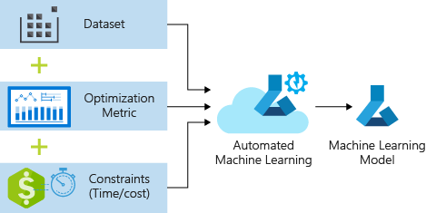

Data science involves model selection and the determination of hyperparameter values. Consider the problem of predicting the price of a house. There are multiple model choices, such as linear regression, random forest, and so on. Which model should a data scientist select? Often, many models might be good options, so a data scientist must try each one and compare the results of all the models. This process is time-consuming and requires significant domain knowledge. 

Automated machine learning (AutoML) provides an automated solution.  It does this by letting the Azure Machine Learning service run all the models concurrently, comparing the results, and recommending the best model for the job based on the training scores.

Many models include parameters that can't be learned from the model-training process. These are called *hyperparameters*, and they usually have a large effect on model accuracy. Data scientists typically experiment with different values until they find the optimal values. This is a time-consuming manual process. The AutoML HyperDrive service makes it possible to find optimal hyperparameter values automatically.

Using the AutoML capability of Azure Machine Learning involves several steps. 

1. **Select your experiment type**. You begin by selecting the type of machine learning problem you want to solve. AutoML supports three types:
    - _Classification_ where you predict what group a set of data belongs to. The produced model can then provide predictions over a dataset - filtering email for spam as an example.
    - _Regression_ where you want to predict continuous values such as the price of a house based on location, size, and amenities.
    - _Forecasting_ where you are predict future values based on past data trends.

1. **Ingest the data**. The data used in the experiment must be loaded from your local computer, or read from the cloud if it's located in Azure Blob Storage.

1. **Configure the targets**. You must configure the _compute targets_ which will run the experiment. This can be a local machine or a cloud resource, such as an Azure Machine Learning Compute, Azure HDInsight or a remote virtual machine.

1. **Configure the AutoML job**. Next, you need to configure the AutoML job. This controls the parameters used as Azure Machine Learning iterates over different models and hyperparameter settings.  It also identified what metrics to look at when determining the best model.

1. **Submit the training run**. Finally, you submit the training run. 

AutoML concurrently runs multiple model-training processes with different models and hyperparameter values. It will stop when it hits the iteration limits you provide in configuration, or when it reaches the target value for the metrics you specified. The result will be a recommended model with associated hyperparameter values based on all the experiments run.