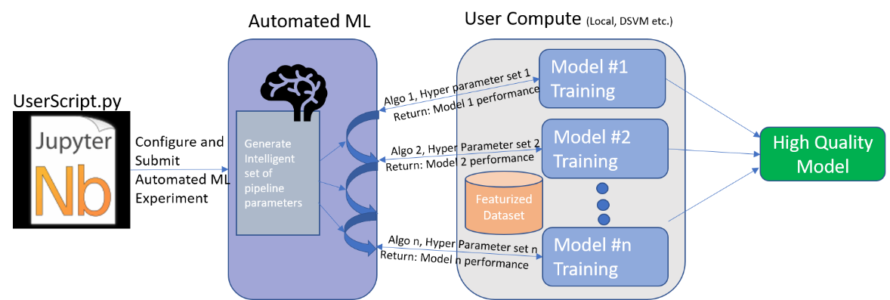
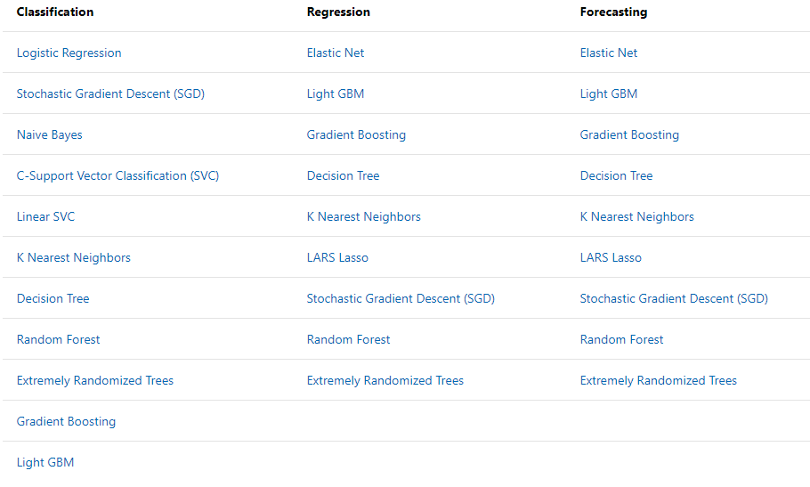
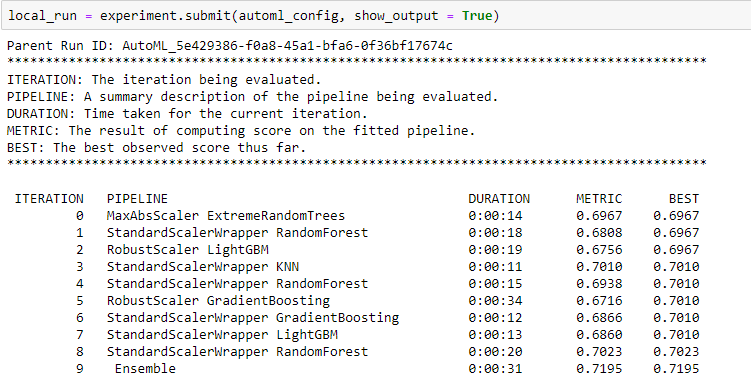
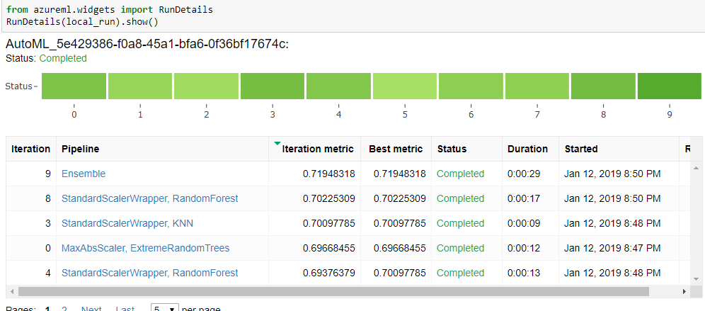
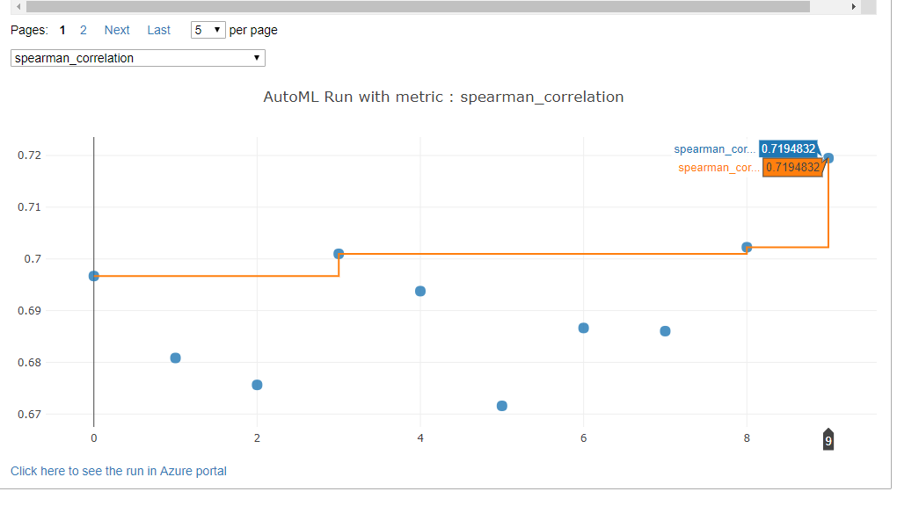

Let's use an example to illustrate how to use AutoML to generate a model recommendation for a certain problem. Here, we'll walk through some Python code to show how to execute an AutoML task and retrieve results.



As the diagram illustrates, AutoML automates the processes for model selection and hyperparameter tuning. To use it, you must:

- Define the source and format of the model-training data.
- Configure the compute target to run the experiment.
- Define the machine learning objective and constraints.
- Start the AutoML process.  This  allows the Azure Machine Learning service to select the right algorithm and tune the hyperparameters automatically. In the process, AutoML iterates over different combinations of algorithms and hyperparameters until it finds the best model based on the objective.
- Retrieve and test the best model.

## Connect to your workspace

You created a workspace earlier in, **Introduction to the Azure Machine Learning service**.  If that workspace is not available, you can create a new one to run the following code in. You will need to sign in with your Azure account and replace the *name*, *subscription_id*, and *resource_group* parameters with ones from your workspace:

```python
from azureml.core import Workspace, Experiment, Run
ws = Workspace.get(name='{name}',
                   subscription_id='{azure-subscription-id}',
                   resource_group='{resource-group-name}'
                  )
```

Now, you'll create an experiment in this workspace by using the following code:

```python
experiment = Experiment(workspace = ws, name = "my-third-experiment")
```

## Define the machine learning objective and constraints

The first step is to define the machine learning objective by using AutoMLConfig, as illustrated in the following code:

```python
from azureml.core.experiment import Experiment
from azureml.core.workspace import Workspace
from azureml.train.automl import AutoMLConfig
import logging

automl_config = AutoMLConfig(task = 'regression',
                  iteration_timeout_minutes = 10,
                  iterations = 10,
                  primary_metric = 'spearman_correlation',
                  n_cross_validations = 5,
                  debug_log = 'automl.log',
                  verbosity = logging.INFO,
                  X = X_train, 
                  y = y_train,
                  path = project_folder)
```

In this example, the following properties are set:

- **task**: This is the type of model that is required, such as classification, regression, or forecasting. After you specify the type, AutoML will automatically pick the best algorithm of that type for you. The following screenshot contains a complete list of the algorithms that AutoML will pick. In this example, a regression task was used.

    

- **primary_metric**: This is the metric that you want AutoML to optimize. In the regression example are several metrics: *normalized_root_mean_squared_error*, *r2_score*, *normalized_mean_absolute_error*, and *spearman_correlation*. In this example, the Spearman correlation was the primary metric, which basically measures the similarity of two datasets. For more information about how these metrics work, refer to the [documentation](https://docs.microsoft.com/azure/machine-learning/service/how-to-configure-auto-train#explore-model-metrics).

- **iterations_time_out_minutes**: Iterations is how many model pipeline executions you want to use and the time limit for each iteration.

- **n_cross_validations**: This is the number of cross-validation splits.

Depending on what you want to do, you might need to set other properties.  AutoML will run multiple experiments in parallel and select the best algorithm and hyperparameters for you during the run.

## Start the AutoML process

After the objective and the constraints are defined, you can start the AutoML job as illustrated in the following code:

```python
local_run = experiment.submit(automl_config, show_output = True)
```

You will receive the following output, indicating the models used, the running time for each iteration, the current metrics, and the best metrics.



## Retrieve the best model

Azure Machine Learning has a widget to display the information for each run. By using the code below, you can compare the best model across different iterations:

```python
from azureml.widgets import RunDetails
RunDetails(local_run).show()
```

Here's an example of an AutoML run that shows the iterations explored and the scores.



In the visualization below, you can see the primary metric (in this case, the Spearman correlation) for each iteration. The orange line represents the best result for different iterations.



Looking at the data, it's clear that the 9th run (the ensemble) has the best result. The best model can also be retrieved by running the following code:

```python
best_run, fitted_model = local_run.get_output()
```

## Test the best model

After confirming the best model, you can run it on the test dataset. The best model is used in the following code and visualization for the training set and the test set:

```python
y_pred_train = fitted_model.predict(X_train)
y_residual_train = y_train - y_pred_train
y_pred_test = fitted_model.predict(X_test)
y_residual_test = y_test - y_pred_test
```