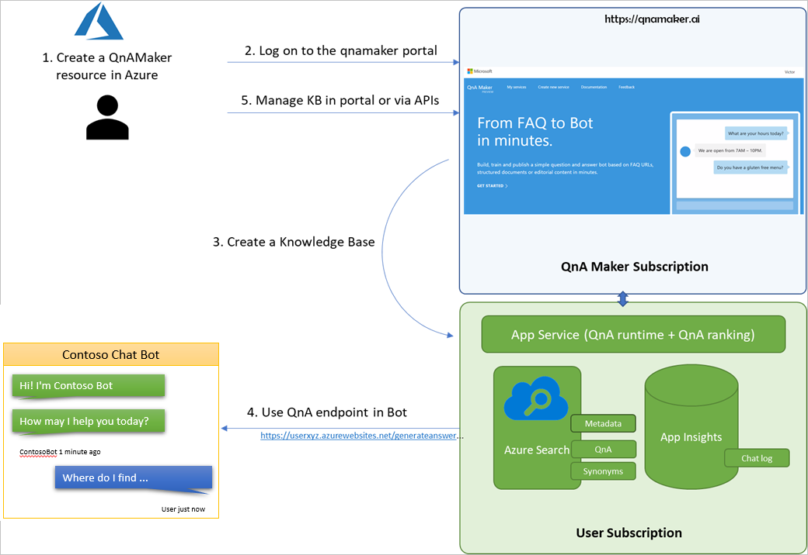

One way to improve customer satisfaction is to help customers quickly locate answers to their questions. The information they're looking for might be in a frequently asked questions (FAQ) list, support documentation, or product manuals. 

Search pages can help, but many organizations look for ways to interact more personally with customers while still using automation. The QnA Maker service answers your users' natural language questions by matching them with the best possible answers from your knowledge base (KB). To find the information they need, customers can have an interactive and natural conversation with the automated service.

You create a QnA Maker KB by using a web portal. In the portal, you can create, manage, train, and publish your service without any developer experience. After the service is published to an endpoint, a client application like a chatbot can use the service to process a conversation with a user to determine the question asked and respond with the best answer.

## Architecture

To understand the services that QnA Maker provides, we can look at the architecture behind it. As we pointed out earlier, you use a web-based portal to create your knowledge base. This portal is part of the QnA Maker management services. The management services also provide facilities for updating, training, and publishing your knowledge base for consumption. You can use REST-based APIs to manage your knowledge base as well.

After you create the knowledge base and publish it, the QnA Maker data and runtime will make your service available. It will be accessible from your Azure subscription in the region you chose during the creation process. The content that you add into your knowledge base is stored in Azure Search, and the access endpoint for client applications is deployed as an Azure app service. Azure also lets you integrate Application Insights into your service for analytics.

