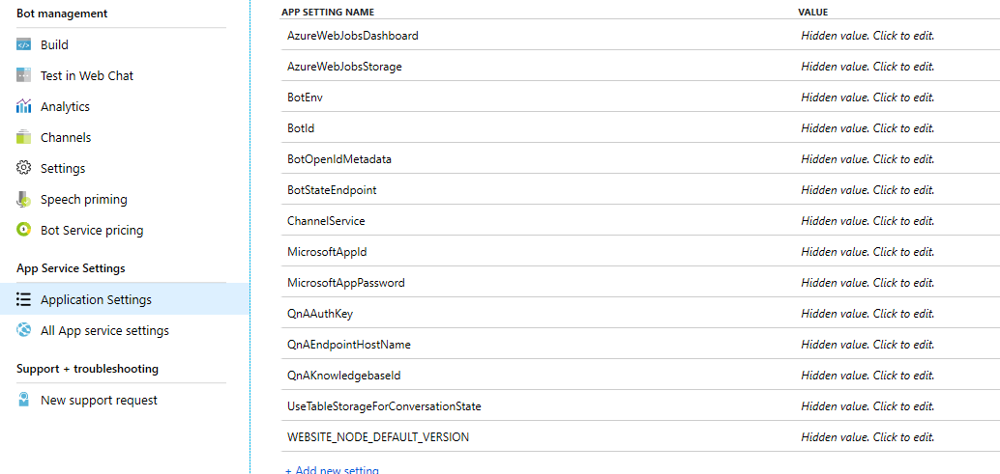
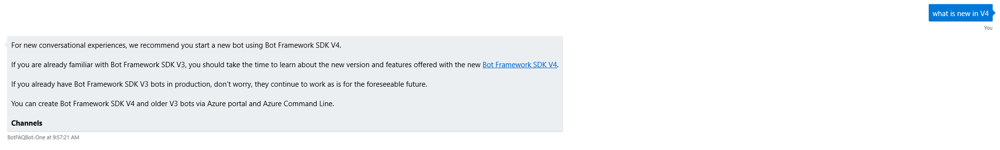

Now that you have a QnA Knowledge base created and published, it's time to learn how to integrate it with a Bot. In this exercise, you will create a web-based chat bot on the Azure portal, and integrate it with the QnA Maker Knowledge base you created earlier.

## Search for Web App Bot

1. Sign into the [Azure portal](https://portal.zure.com?azure-portal=true).
1. Click **Create a resource** in the sidebar.
1. Type "bot" into the Marketplace Search box and press Enter.
1. Select **Web App Bot**.

1. Click **Create**.
1. Fill in the details for the new Bot giving it a unique name.
1. Select a Subscription.
1. Place it in the Resource Group you are using for these exercises.
1. Select the **S1** pricing tier.
1. Click Bot Template and choose SDK v3, C# for the language.

7. Choose the Question and Answer template, then click Select.
1. Turn off Application Insights.
1. Leave the remaining options at their default.
1. Click **Create**.

The Web App Bot will be created and ready in a few minutes. Once the Bot app resource is published, open the Application Settings section.

## Connect the Bot with Your QnA Service

Next, let's connect your Bot to the QnA Maker service that you created in the previous exercises

1. Open a new browser tab and sign into your QnA Maker account, or open the tab where your QnA Maker service was published.
1. In the first line of the Postman sample, locate the GUID that represents the knowledge base ID and copy it.

3. Switch back to the Bot tab and in the Application Settings section locate the **QnAKnowledgebaseId** entry.
1. Click Hidden value and paste your ID that you copied from the Postman sample.
1. Do the same for the QnAEndpointHostName and QnAAuthKey values.
1. Click **Save**.
1. Under **Bot Management** in the left area, click **Test** in Web Chat.
1. The Bot should connect to your QnA Maker service.
1. Type "What is new in v4" and press Enter.
    1. The Bot integration with your QnA Maker service should return a valid response

You have now successfully created a QnA Maker service, published it on Azure, created a Web chat Bot, and integrated the Bot with the QnA Maker service to provide a chat-based experience for users to interact with the Microsoft Bot Framework FAQ.