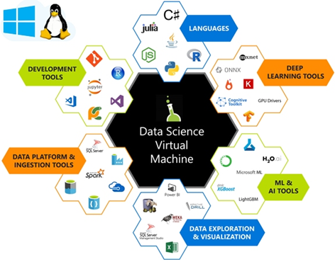

The Data Science Virtual Machine (DSVM) platform is designed to provide a virtual machine in which you can complete everything within the data science process. 

## What is Data Science Virtual Machine (DSVM)?

*Azure DSVM* is a customized virtual machine on Azure Cloud Services, with many popular data science tools preinstalled and preconfigured for building data science applications. These tools are designed to help business analysts, data engineers, data scientists, and developers.

If you are a data scientist looking to maximize your environment with numerous preinstalled data science tools, DSVM is a good option.

## How to use DSVM

 DSVM provides a jumpstart for machine learning model training. To use a Windows-based DSVM, you can use Microsoft Remote Desktop to access it using the administrator credentials defined when the DSVM was created. You can learn more about how to build a model in a DSVM by accessing the tutorials available on the virtual machine.

For Linux-based DSVMs, you connect to it using of the following methods:

1. SSH for terminal sessions
2. X2Go for graphical sessions
3. JupyterHub and JupyterLab for Jupyter notebooks

## Explore types of DSVMs

There are a various types of DSVMs that are available for different machine learning purposes.

### Supported operating systems

DSVM supports both Windows and Linux operating systems, with each offering various machine learning tools. The key difference between the two servers is that Windows operating systems offer scalability with Machine Learning in SQL Server, and Linux does not.

### Deep Learning Virtual Machine

A *Deep Learning Virtual Machine* (DLVM) is a version of DSVM that offers a variety of deep-learning tools for building artificial neural networks—an algorithmic process that simulates the decision process of the human neural network.

### Geo AI DSVM

This version of a DSVM includes tools specific to Machine Learning that relate to geospatial data. Geo AI DSVM comes with other standard machine learning software, but it also includes ArcGIS, which is a commercial platform for Geo AI.
