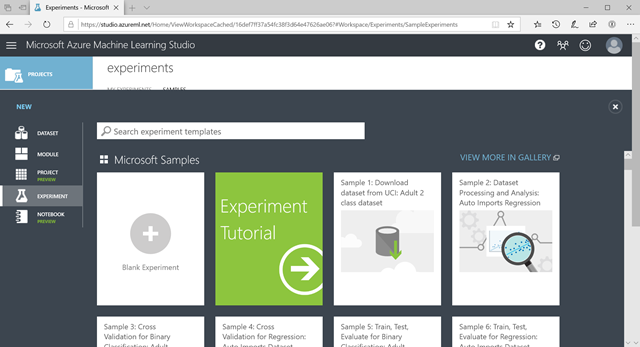
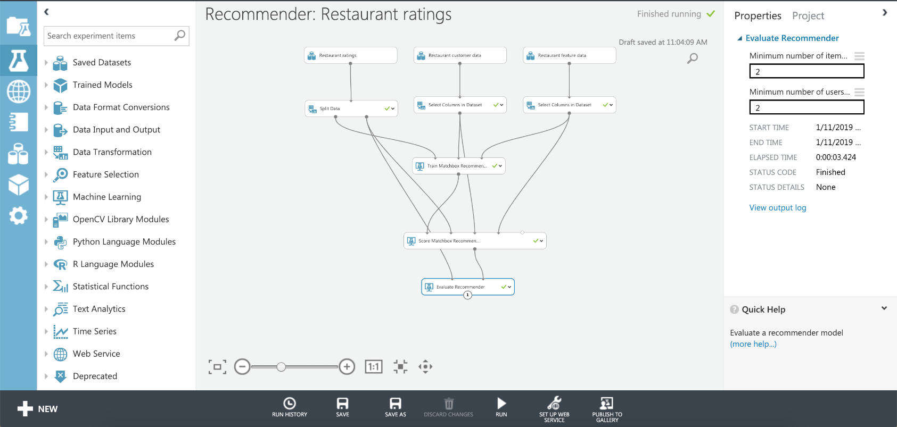
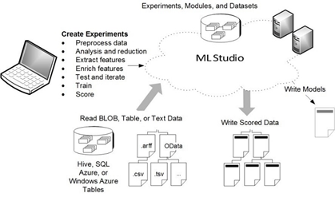

**Microsoft Azure Machine Learning Studio** is a web-based drag-and-drop learning platform you can use to build, test, and deploy machine learning models without writing any code. It provides a visual display of datasets and models with a drag-and-drop interface and includes many tools, such as Azure Notebooks to process data and visualize output. The interactive visual workspace allows data scientists of all skill levels to use the platform to easily create and iterate predictive analysis models.

Azure Machine Learning Studio allows you to bring in data, cleanse and transform the data, train and score a model with the option of deploying it on the web. If you are beginning your journey to learning data science, this platform is an intuitive way to help you understand the data science process.

## Use Azure Machine Learning Studio

Azure Machine Learning Studio provides several sample datasets and experiment models such as the **Prediction of studio performance** experiment which uses a regression model. These different samples demonstrate various ways to train models and process data. For example, here's a screenshot of an experiment showing how to implement a restaurant recommender system.

You can then import your own data and process it with the built-in machine learning models. There's no programming required - just connect your datasets visually to the prebuilt modules to construct your analysis models. As you modify the various functions and their parameters, your results converge until you have a trained, effective model. Then you can then publish the model as a web service so others can access it.

Here's a visual overview of the workflow used with Azure Machine Learning Studio showing how the data is turned into trained models.

While programming experience is not required, you can customize the logic using scripts written in Python or R - this allows you to write custom algorithms and intermix them with the standard modules provided by the platform.

You can learn more by signing into the [Azure Machine Learning Studio](https://studio.azureml.net) and going through tour.