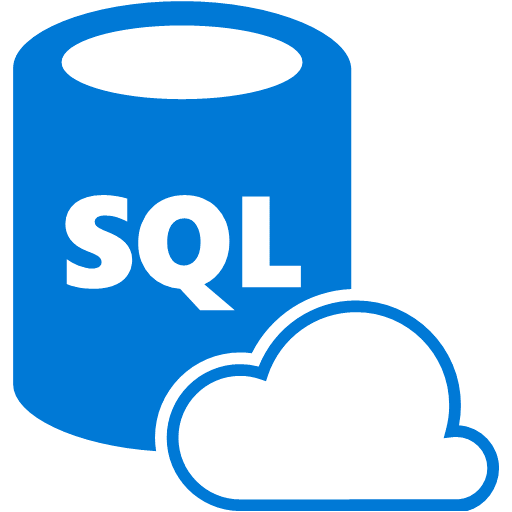

Machine Learning Server is a special service running on the SQL Server platform that supports high scale integration of Python and R code.

## Using ML Server in SQL Server

This platform allows you to integrate a data science process using Python or R within the local SQL server environment. This eliminates the need to switch between the database and machine learning environments. You get all the features of SQL Server with scalable machine learning.

Let's briefly walk through how to use ML Server in SQL Server.

1. Install Machine Learning Server on SQL Server.
2. Choose the tool (Python or R) that you would like to use for machine learning and run the tool you chose using the environment of your choice.
3. Write the code for machine learning within your IDE. At this point, you can merely call Python or R functions within the server. When the code is tested, it can be incorporated into a SQL Server stored procedure where it can be executed from SQL Agent. Performance can be enhanced by replacing inefficient data wrangling code with T_SQL.
4. Follow the data science procedure, as usual, meaning you can transform data, feature engineer, and train/test models.

## Summary

SQL Server / Machine Learning Server allows you to integrate your data science process using Python or R within the local SQL server environment. This eliminates the need to switch between the database and machine learning environments. You get all the features of SQL Server with scalable machine learning.

