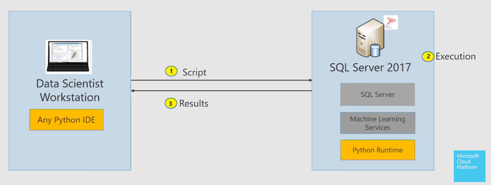

**SQL Server Machine Learning Services** is an add-on for SQL Server that allows you to execute Python and R code on SQL Server. This platform enables you to integrate data science processes using Python or R within the local SQL Server environment, which eliminates the need to switch between the database and machine learning environments. You get all the features of SQL Server with scalable machine learning.

> [!NOTE]
> Machine Learning Services (with R) is currently in public preview for Azure SQL Database.

There are several advantages to using the SQL Server Machine Learning Services to perform data science tasks.

- **Security**. Because the data processing occurs closer to the source of the data, it avoids the movement of the data which limits the exposure.
- **Performance**. Along with data locality, SQL Server is optimized for set-based operations and includes support for in-memory tables which provides better throughput for many data science operations.
- **Consistency**. SQL Server is often the hub for data management tasks and applications in an organization. By using data that resides in the database or reporting warehouse, you ensure that the data used by machine learning solutions is consistent and up-to-date.
- **Efficiency**. You can use other tightly integrated tools such as PowerBI and Azure Data Factory to report and analyze results.
