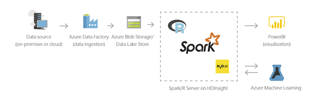

**Azure HDInsight** is an Azure platform as a service (PaaS) Apache Hadoop offering. It is based on the Hortonworks distribution of Hadoop. When you provision an HDInsight cluster, you specify which type of a Hadoop platform you want. 

HDInsight provides several benefits.

- You can quickly spin up big data clusters on demand, scale them up or down based on your usage needs, and pay only for what you use.
- Extract, transform, and load your big data clusters on demand with Hadoop MapReduce and Apache Spark.
- Meet industry and government compliance standards and protect your enterprise data assets using an Azure Virtual Network, encryption, and integration with Azure Active Directory.
- Integrate seamlessly with other Azure services, including Data Factory and Data Lake Storage, for building comprehensive analytics pipelines.
- Use your preferred productivity tools, including Visual Studio, Eclipse, IntelliJ, Jupyter, and Zeppelin. 
- Write code in familiar languages such as Scala, Python, R, JavaScript, and .NET.

For scalable machine learning, we are only concerned with the HDInsight Spark implementation.

## What is Spark?

Apache Spark is an open-source big-data platform that uses a *scale-out* approach. This is where multiple machines working together to process data. Unlike Hadoop, Spark works in-memory as much as possible. This results in much faster processing than Hadoop.

**HDInsight Spark** is an implementation of Apache Spark on Azure HDInsight. It supports massive scale for data querying, wrangling, and machine learning model training. A cluster has a master server that controls the other servers in the cluster. By splitting the work among multiple machines, performance is greatly enhanced. It shares the data source across all the servers by storing the data into Azure Blob Storage.

> [!TIP]
> Data scientists who are comfortable working with the native Spark interface and want complete custom control of the data science process should consider using HDInsight Spark. For the data science team looking for an all-inclusive, user friendly, secure, collaborative, Spark-based environment, Azure Databricks may be a better solution.

HDInsight Spark has a version that uses R Server as a processing front end. The R Server proprietary model training libraries scale out machine learning over the Spark cluster for big data model training. HDInsight integrates with other Azure Services as shown in the following diagram.

