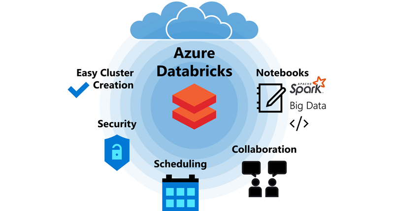
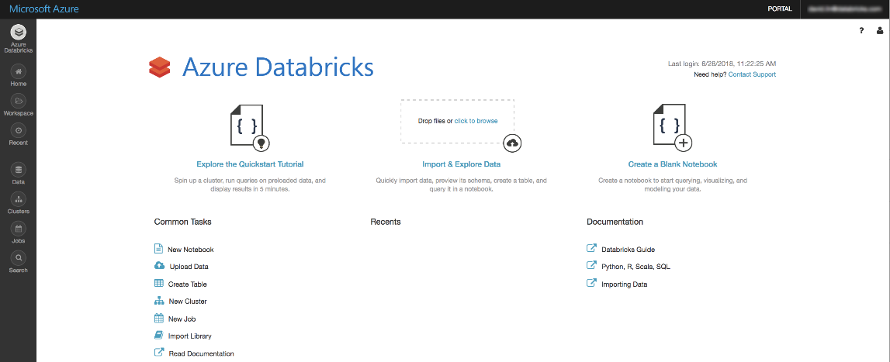

**Azure Databricks** is a secure, all-in-one collaboration platform for data science teams. It includes a powerful notebooks interface, job scheduling, Active Directory integration, granular security control, and seamless Azure integration. It instantly provides data science teams with everything they need to create end-to-end machine learning pipelines for big data.

## How Azure Databricks works

To use Azure Databricks, you provision an Azure Databricks Workspace using the Azure portal. The workspace provides all the assets you need. From there, you can add users that you want to have access to the workspace, and refine the level of access from with Azure Databricks. Here's a screenshot of the Azure Databricks landing page.

### Provided tools

The tools provided include a powerful notebook service that supports big data queries and visualizations. Notebooks can include all Spark-supported languages (including Scala, Java, SQL, Python, and R) in the same notebook. This enables you to use your language of preference, but switch to another language if you need to. 

An advanced job scheduler allows you to schedule notebooks to run whenever you want. If the cluster isn't running, the job scheduler will create it automatically and delete it at the end of the job. 

Assets such as notebooks can be shared and worked on collaboratively. Best of all, you don't need to worry about the complexities of configuring Spark clusters. The Azure Databricks GUI provides an easy-to-use interface to create and edit your cluster, and even set automatic turn-off for clusters after a period of disuse. You can delete clusters without losing any data or notebooks, so there's no need to keep clusters running if you don't need them.

In addition, Azure Databricks has several other features and tools including:
- Granular security configuration
- PySpark and SparkR
- Command-Line interface to perform tasks
