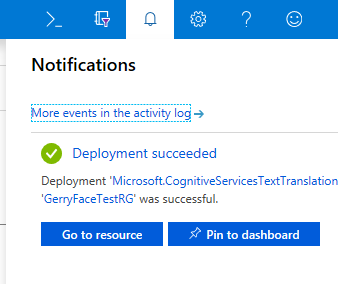

Let's create a speech-translation subscription by using the Azure portal.

1. Sign in to the [Azure portal](https://portal.azure.com?azure-portal=true).

1. Select **+ Create a resource**. In the **Search the Marketplace** box, type **translation** and press Enter.

1. In the **Results** list, select **Translator Text**. In the **Translator Text** pane, select **Create**.

    

1. Enter a name for your Speech Translation API subscription, such as **SpeechTranslation**.
1. For **Pricing tier**, select a tier.
1. Create a new resource group named **mslearn-speechapi** to hold your resources.
1. Select **Create** to create a subscription to the Speech Translation API.

After a short delay, your new Speech Translation API subscription will be available, and new API keys will be generated for programmatic use.  

> [!TIP]
> If you miss the notification that your resource is published, select the notification icon in the top bar of the portal, and then select **Go to resource**, as shown in the following figure:

   

With a Speech Translation API subscription created, you're now able to access your API endpoint and subscription keys.