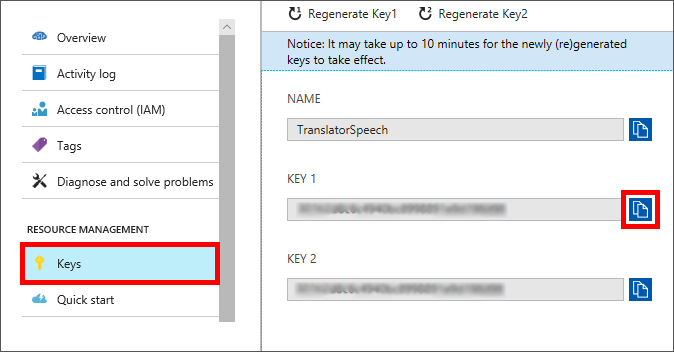
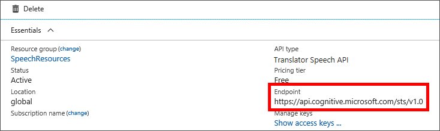

To access your Speech Translation API subscription, you'll need to get two pieces of information from the Azure portal:

- A *subscription key* that's passed with every request to authenticate the call.
- The *endpoint* that exposes your service on the network.

## View the subscription keys

1. In the left menu of the portal, select **Resource groups**, and then select the **mslearn-speechapi** resource group that you created for the Speech Translation API.

1. Select the Speech Translation subscription name (such as **SpeechTranslation**).
1. Under the **RESOURCE MANAGEMENT** group, select **Keys** to view your new API keys.
1. Copy the value of **KEY 1** or **KEY 2** to the clipboard for use in an application.

    

## View the endpoint

1. In the left menu of the portal, select **Overview**. 
1. Find **Endpoint**, and make note of the endpoint value. This URL will be used when temporary tokens are generated.

    