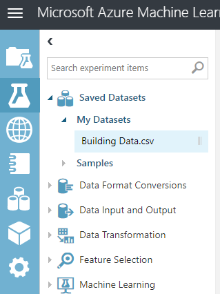

We'll start in Azure Machine Learning Studio by creating an experiment. The experiment uses a prebuilt dataset that relates to building energy considerations.

In this exercise, you'll import a dataset into Machine Learning Studio. There you'll experiment with it to publish a web service. This simple experiment shows how to create a machine learning model that you can publish and consume as a web service.

To import a dataset into Machine Learning Studio:

1. Download and extract the [Building Data.zip](https://github.com/MicrosoftDocs/mslearn-work-with-vision-cognitive-services/blob/master/Building%20Data.zip?raw=true) file. This is the dataset.
1. Go to the [Machine Learning Studio portal](https://studio.azureml.net?azure-portal=true). 
1. Sign in by using the Microsoft account that's associated with your Azure account.
1. On the left navigation bar of Machine Learning Studio, select the **Datasets** icon.  
1. In the lower-left corner, select the **New** button to upload the dataset.
1. Select **DataSet** > **From Local File**.
1. Select **Choose File** and then select the file you just downloaded.
1. In the lower-right corner, select the check mark to upload the dataset.
1. Verify that **Building Data.csv** is listed as a dataset.
1. In Machine Learning Studio, select the **Experiments** icon.
1. Select **New** > **Blank Experiment**.
1. Select **Saved Datasets** > **My Datasets** > **Building Data.csv**.  

    

1. Drag this dataset onto the designer surface.
