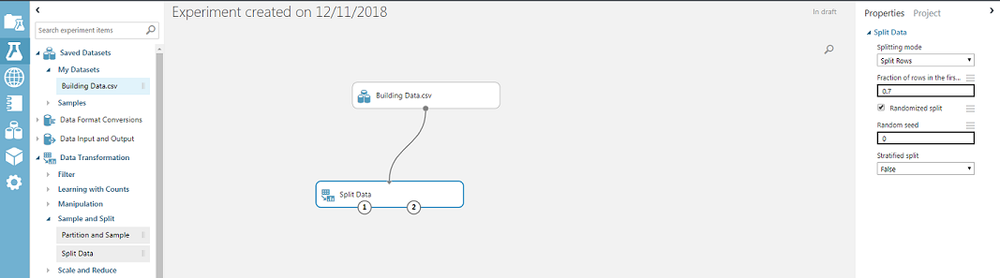
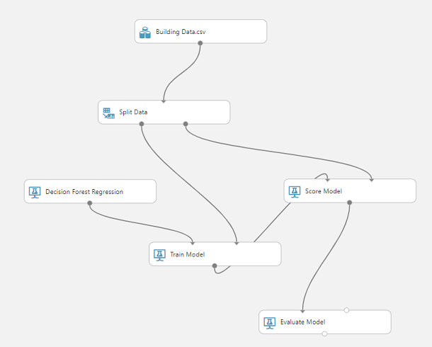

Now let's build and run the experiment.

1. Expand **Data Transformation** > **Sample and Split**.
1. Drag a **Split Data** operation onto the designer surface.
1. On the right, set the fraction of rows in the first output dataset to **0.7** to split the data at 70/30.
1. Connect the dataset to the Split Data operation by dragging the dataset handle to the Split Data operation.

    

1. On the left, expand **Machine Learning** > **Initialize Model** > **Regression**.
1. Drag the **Decision Forest Regression** entry onto the designer surface.
1. On the left, expand the **Score** subcategory and locate **Score Model**.
1. Drag the **Score Model** operation onto the designer.
1. On the left, expand **Train** and drag a **Train Model** operation onto the designer.
1. On the left, expand the **Evaluate** subcategory of Machine Learning and drag an **Evaluate Model** operation onto the designer.

    > [!TIP]
    > If you run out of space on the designer surface, you can scroll the designer surface area or use your mouse wheel to zoom in or out.
    
    Your experiment window should now look like this:

    

1. Connect output 1 of the **Split Data** operation to the **Train Model** operation.
1. Select the **Train Model** operation.
1. On the right, select **Launch Column Selector**.
1. Select the **With Rules** entry. Then click inside the empty column list and select the **Wall Area** column name.
1. Select the check mark to accept the selection.
1. Connect the **Decision Forest Regression** operation to the remaining input of the **Train Model** operation.
1. Connect the second output of the **Split Data** operation to the **Score Model** operation.
1. Connect the output of the **Score Model** operation to the left input of the **Evaluate Model** operation.
1. Connect the output of the **Train Model** operation to the remaining **Score Model** input.
    Your experiment should now look like this:

    

1. At the bottom of the designer window, run the experiment by selecting the **Run** button.
1. Make sure all of the operation boxes show green check marks and that the upper-right corner of the designer displays **Finished running** with a green check mark.
1. Save your experiment as **Energy Efficiency Regression**.

At this point, feel free to look at the data in the CSV file to figure out what your experiment is acting on.