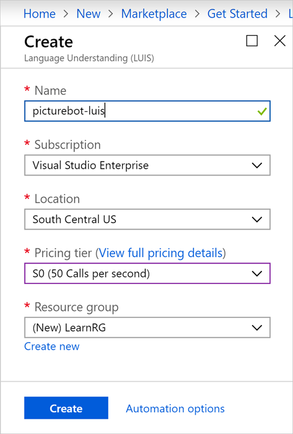

Let’s look at how we can use LUIS to add natural language capabilities to a picture-management bot. LUIS allows you to map natural language *utterances* to *intents*. In other words, LUIS maps the user's words, phrases, or sentences to tasks or actions the user wants to do.

Our application might have several intents: finding pictures, sharing pictures, and ordering prints of pictures. We'll give LUIS a few example utterances of ways users might ask for each of these things. LUIS will then map additional new utterances to each intent based on what it learns over time.

> [!NOTE]
> This is an optional exercise. To use a LUIS service that's tied to your Azure account, follow these steps to create the LUIS service. To use a test environment only, go to the "Create a LUIS app" exercise later on this page.

1. Sign in to the [Azure portal](https://portal.azure.com?azure-portal=true).
1. In the left pane, select **+ Create a resource**.
1. In the **Search the Marketplace** box, type **LUIS**, and then press Enter.
1. In the search results, select **Language Understanding**.
1. Select **Create**.

    

1. Enter a unique name for your LUIS service.
1. Choose a subscription.
1. For **Location**, choose the one nearest you.
1. For **Pricing tier**, select **S0**.
1. Create a new resource group named **LearnRG**.
1. Select **Create**.

    

After the deployment has finished, go the resource page for the service. You'll need one of the displayed subscription keys for later exercises. You can either use the "Grab your keys" option in the **Quick start** section, or switch to the **Keys** section to see the two created keys.

## Create a LUIS app

Azure requires you to create the LUIS app in the same geographic location where you created the service. If you didn't create the service in the previous optional exercise, use the location closest to you.

1. Select one of the following URLs, and open it in a new browser window.

   - **North America:** [https://www.luis.ai/](https://www.luis.ai/)
   - **Europe:** [https://eu.luis.ai/](https://eu.luis.ai/)
   - **Australia:** [https://au.luis.ai/](https://au.luis.ai/)

    > [!NOTE]
    > There are three LUIS websites, based on region. You must author and publish in the same region. Select the closest region to you.

1. Select the **Sign in** link in the upper-right corner.
1. Sign in with your Microsoft account.
1. On the **Welcome** page, select **Create a LUIS app now**.
1. Select **+ Create a new app**.
1. Give your LUIS app a name, for example, **PictureBotLUIS**.
1. For **Culture**, select the appropriate choice.
1. Give your LUIS app a description so it's clear what the app's purpose is.
1. Select **Done**. 

The newly created app will show the **Intents** page with a single intent named **None**.