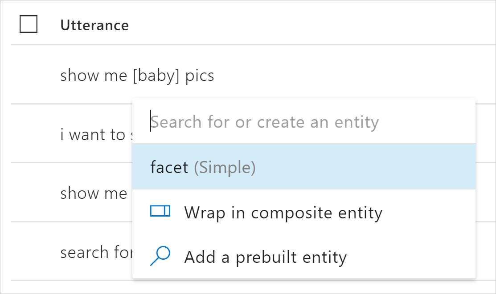

Our next step for the PictureBotLUIS app is creating intents that map to user requests. We want our picture-management bot to understand how to:

- Find pictures.
- Share pictures on social media.
- Order prints of pictures.
- Greet the user.

Let’s create intents for each of these items.

> [!NOTE]
> There is one intent already present named **None**. Random utterances that don’t map to any of your intents can be mapped to this intent.

1. Select **+ Create new intent**.
1. Name the first intent **Greeting**, and then select **Done**.

    Because our scenario for this application is to integrate with a bot, you'll provide examples of utterances that users might say when greeting the bot initially.

1. Enter a greeting utterance, such as **hello**, and press Enter.
1. Repeat the previous step to create values for each of the following utterances: **hi**, **hola**, **yo**, **hey**, **greetings**.

    > [!TIP]
    > You should always provide at least five example utterances for each intent.

1. Your utterances for the **Greeting** intent should look similar to the following image:

    

1. Create another intent named **SearchPics**.
1. Add the following values as utterances for the **SearchPics** intent:

    - **find outdoor pics**
    - **are there pictures of a train?**
    - **find pictures of food**
    - **search for photos of boys playing**
    - **give me colorful pictures**
    - **show me beach pics**
    - **I want to find dog photos**
    - **find pictures of german shepherds**
    - **search for pictures of men indoors**
    - **show me pictures of men wearing glasses**
    - **I want to see pics of smiling people**
    - **show me baby pics**

## Create entities

Next, let's create the entities we need to capture specific requests from users. For example, when users want to search the pictures, they might specify what they're looking for.

1. In the left column, select **Entities**, and then select **Create new entity**.

1. Name the entity **facet** (to represent one way to identify an image).

1. Select **Simple** for **Entity type**. Then select **Done**.

    

## Map search subjects to the facet entity

Next, we have to teach LUIS how to pick out the search subject as the **facet** entity. Whatever the **facet** entity picks up is what the app will search for.

1. Switch back to the Intents and select the **SearchPics** intent.

1. Hover over the utterance and click the keyword that specifies the _search subject_, and then select the **facet** entity. For example, if the utterance is "show me baby pics", the subject would be "baby".

    

   > [!TIP]
   > Using multiword keywords, such as "german shepherds", is a bit tricky.
   >
   > Click the first word in the keyword, move the cursor to the second word, and then click again. Then move the cursor into the entity selection pop-up list. Be sure not to move the cursor outside the borders, or you'll lose the selection.

1. Your progress should look similar to the following image:

    

1. Add two more intents with related utterances, as shown in the following table:

    | Intent name | Utterances |
    |---------|---------|
    | **SharePic** | **Share this pic**, **Can you tweet that?**, **Post to Twitter** |
    | **OrderPic** | **Print this picture**, **I would like to order prints**, **Can I get an 8x10 of that one?**, **Order wallets** |

1. To finish out the exercise, add some utterances to the existing **None** intent. Make sure these utterances don't match the context of this LUIS app. Some examples are:

    - **I'm hungry for pizza**
    - **Search videos**
    - **Show me how to drive a car**
