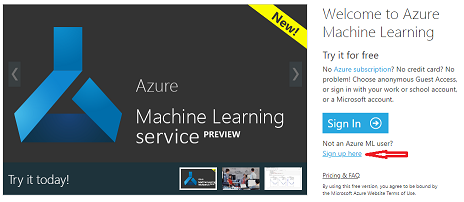
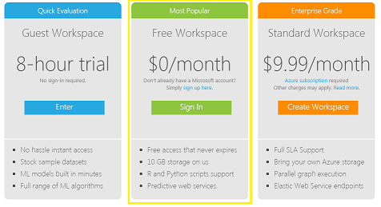

You'll need a Machine Learning Studio Workspace to access tools to create, publish, and manage experiments. Here are details on your free or paid options:

:::row:::
  :::column:::
**Guest workspace**
  :::column-end:::
  :::column span="3":::
- 8-hour trial
- No sign-in required
- Can build machine-learning models in minutes
- Full range of available machine-learning algorithms
  :::column-end:::
:::row-end:::
:::row:::
  :::column:::
**Free workspace**
  :::column-end:::
  :::column span="3":::
- Sign in with a Microsoft account
- Free access with no expiration
- 10 GB of free storage
- Support for both Python and R scripts
- Predictive web services
  :::column-end:::
:::row-end:::
:::row:::
  :::column:::
**Standard workspace**
  :::column-end:::
  :::column span="3":::
- Azure subscription required
- $9.99 per month
- Full SLA (service-level agreement) support
- Bring your own Azure storage
- Parallel graph execution
- Elastic web service endpoints
- Ideal for enterprise-grade usage
  :::column-end:::
:::row-end:::

## Create a Machine Learning Studio Workspace

1. In a web browser, go to [Machine Learning Studio](https://studio.azureml.net/?azure-portal=true).
1. Under the **Sign In** button, select the **Sign up here** link if you're not a current Machine Learning Studio user.

    

1. Select one of the free options. If you have a Microsoft account, we recommend using the **Free Workspace** option. You'll need this to complete the hands-on parts of the units that follow.

    

You now have a Machine Learning Studio Workspace and account.