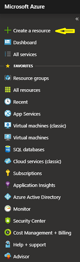
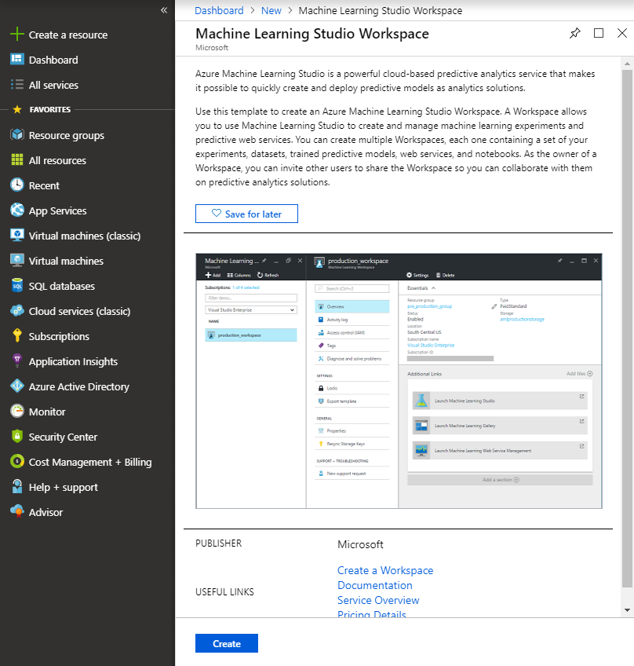
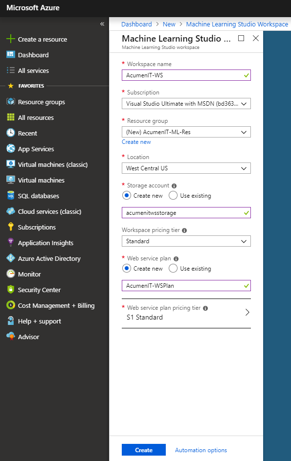

If you already have an Azure account, you can use it to create and manage a Machine Learning Studio Workspace. Here's how:

1. Sign in to the [Azure portal](https://portal.azure.com?azure-portal=true).
1. On the dashboard, select **Create a resource**.

    

1. In the search bar, enter *Machine Learning Studio Workspace*.

    > [!IMPORTANT]
    > Make sure you choose the Machine Learning Studio Workspace and not the Learning Service Workspace.

1. At the bottom of the window, select **Create**.

    

1. Enter your workspace information. Here's an example:

    

    If you'll deploy web services from this workspace, use your web service plan and the associated pricing tier.

1. Select **Create** and wait until the resource is created and deployed.

Now you can access your new Machine Learning Studio Workspace in one of two ways:
* Go to the resource in your Azure portal. On the Overview page, select **Launch Machine Learning Studio** to open the workspace in Machine Learning Studio.
* Sign in to the [Machine Learning Studio portal](https://studio.azureml.net/?azure-portal=true).
    - In the upper-right corner, select your workspace.
    - Select **my experiments**.