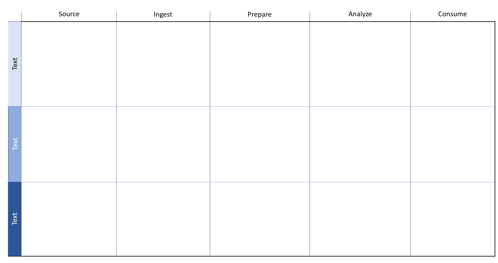

There are several common practices that a Data Engineer will perform to ensure the operational success of the data estate that they own. 

- Provision and configure data services with Azure.
- Ensure the platform and the data stored within it is secure by design. 
- Ensure business continuity using high availability and disaster recovery techniques.
- Use monitoring to ensure that the systems are running proactively. 
- Develop data storage and data processing solution for structured and non-structured systems and create streaming solutions when required. 

Data Engineers must work with a broader range of technologies than Database Administrators, and they focus on cloud implementations rather than on-premises servers.

## Moving data around

When it comes to the transfer and movement of data, there are several different approaches. Below is a detailed examination of a typical data movement processes Data Engineers will perform in various projects.

### Extract, Transform, Load (ETL) Process

Data Engineers may sometimes perform ETL process when processing data. The extract may come from many sources including databases, files, and streams. Each data source has unique data formats and can be structured, semi-structured, or unstructured.  In Microsoft Azure, data sources include Azure Cosmos DB, Azure Data Lake, files, and Azure Blob Storage. 

#### Extract

During the extraction process, Data Engineers will perform the following steps.

1. **Define Data Source**

To begin data extraction in Microsoft Azure, Data Engineers will need to identify source details such as the resource group, subscription, and identity information such as a key or secret.

2. **Define the Data**

After the connection information is established, the Data Engineer will need to define the data to be extracted which would be a query for databases, a filename for files, or an Azure Blob Storage name for blob storage.

#### Transform

3. **Define the Transformation**

After extracting the data, Data Engineers define any data transformation operations, which can include splitting, combining, deriving, adding, removing, or pivoting columns.  Data may also need to be aggregated or merged.  Data Engineers will need to identify field mapping between the data source and data destination.

#### Load

4. **Define the Destination**

When performing a load, many of the Microsoft Azure destinations can accept data in the JavaScript Object Notation (JSON), file, or blob formats.  Data Engineers may also need to write code to interact with application APIs.  Azure Data Factory contains built-in support for Azure Functions that supports many programming languages such as node.js, .NET, Python, and Java.  While Extensible Markup Language (XML) was common in the past, most systems have migrated to JSON due to its increased flexibility as a semi-structured data type.

5. **Execute the Job**

After the ETL operations have been defined, the Data Engineer will test the ETL job in a development or test environment and then migrate the job to a production environment to load the production system.

6. **Monitoring execution**

ETL operations can contain many complex processes and workflows. Setting up a proactive and reactive monitoring system can provide useful information when things go wrong. How logging is set up depends on the technology utilizing it.

## ETL Tools

Data Engineers will use several tools to perform ETL, the most common is Azure Data Factory, which provides a robust set of tools and nearly 100 enterprise connectors. Also, there are also a wide variety of languages that can be used within Azure Data Factory to perform the transformations.

If you also require a repository for maintaining information about the data sources and dictionaries within an organization. Azure Data Catalog can prove useful to store this information centrally.

## Extract, Load, and Transform Process (ELT)

The advent of Azure has meant that there are technologies that can handle unstructured data at unlimited scale. This has meant that the paradigm for loading and transforming data has shifted from ETL to ELT. The benefit of this approach is that data can be stored in its original source format, be it JSON, XML, PDFs or images. This has provided the opportunity to make use of this source data to multiple downstream systems as the structure of this data defined during the Transform phase.

As a result, data is extracted and loaded in its native format to reduce the time it takes to load into a destination system and to limit resource contention on the data sources it is extracted from. The steps are the same as ETL, just in a different order.

## Extract, Load, Transform, Load Process (ELTL)

This is the same process as ELT. There is just a final load into a destination system.

### Holistic Data Engineering

As the types of analysis in organizations are evolving to incorporate predictive and preemptive analytics, it is more important for Data Engineers to look at data projects holistically. In the past data, professionals would focus on ETL, but the latest developments to data platform technologies lend themselves to an ELT Approach. Therefore, the first steps of Data projects can be broken down into phases that reflect the ELT approach, including:

- Source – identify the source systems to extract from 
- Ingest – identify the technology and method for loading data
- Prepare – identify the technology and method for transforming/preparing the data

However, it is also important to consider the technologies that will be used to Analyze and Consume the data within the project. In traditional descriptive analytics projects this may have involved transforming data in the Analysis Services for the Analyze phase, and then using Power BI to consume the analyzed data. New technologies such as Machine Learning Services and Azure Notebooks means there is a wider range of technologies to consider. These are reflected in the following phases including

- Analyze – identify the technology and method for analyzing the data
- Consume - identify the technology and method for consuming and presenting the data

Furthermore, it cannot be necessarily assumed that there is a linear flow through each of the phases. For example, due to the iterative nature of Machine Learning experimentation, it is not uncommon for the result of the Analyze phase to have a path back to the Prepare, Ingest and even the source phase as the results of a Data Science experiment has revealed that this is either missing source data, or the wrong columns have been loaded, or the data needs further transformations to perform a new iteration of an experiment.

To fully appreciate this process, let's examine it using a high-level architecture example.