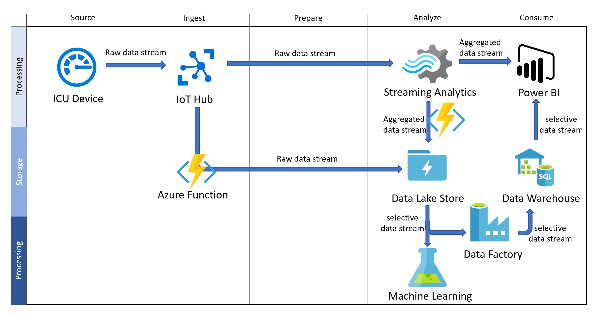

Here's an example of how to holistically design a data engineering project by following the five phases: source, ingest, prepare, analyze, and consume.

Contoso Health Network recently deployed IoT devices to its intensive care unit (ICU). Here are the goals of the project:

- Capture data on patient biometric monitoring in real time to help physicians treat their patients.  
- Store the biometric data so that Contoso's research center can further analyze it in the future.
- Use Azure Machine Learning to understand which treatments improve the quality of care and reduce the likelihood of a patient being readmitted to the hospital.
- Create a visualization of the data's history for Contoso's chief medical officer.

Contoso's technical architect reviewed the business case and proposes the following technologies:

- **Azure IoT Hub** to capture real-time data from the ICU's IoT devices.
- **Azure Stream Analytics** to stream and enrich the IoT data, to create windows and aggregations, and to integrate Azure Machine Learning.
- **Azure Data Lake Storage Gen2** to store the biometric data at high speed.
- **Azure Data Factory** to perform the extract, load, transform, and load (ELTL) process to move the data from the data lake store to Azure SQL Data Warehouse.
- **Azure Synapse Analytics** to provide data warehousing and big data engineering services to support the chief medical officer's needs.
- **Power BI** to create the patient dashboard. Part of the dashboard can show real-time telemetry about the patient's condition and the other part can show the patient's recent history.  
- **Azure Machine Learning** to process both raw and aggregated data. Researchers can use the processed data to perform predictive analytics on patient readmittance.

Contoso's data engineer creates a work plan to implement the ELTL operations. The plan includes a provisioning workflow and a holistic workflow.

The provisioning workflow:

1. Provision Azure Data Lake Storage Gen2.
2. Provision Azure Synapse Analytics.
3. Provision Azure IoT Hub.
4. Provision Azure Stream Analytics.
5. Provision Azure Machine Learning.
6. Provision Azure Data Factory.
7. Provision Power BI.

The holistic workflow:

1. Set up Azure IoT Hub to capture data from the ICU IoT devices.
2. Connect Azure IoT Hub to Azure Stream Analytics. Set up window-creation functions for the ICU data. The functions aggregate the data for each window. At the same time, set up the IoT Hub to move the streaming data to Azure Data Lake Storage by using Azure Functions.
3. Set up Azure Functions to store the Azure Stream Analytics aggregates in Azure Data Lake Storage Gen2.
4. Use Azure Data Factory to load data from the data lake into Azure Synapse Analytics to support the chief medical officer's needs. After the data is loaded, transformations can occur within Azure Synapse Analytics.
5. In parallel, connect the Azure Machine Learning service to Azure Data Lake Storage to perform predictive analytics.
6. Connect Power BI to Stream Analytics to pull the real-time aggregates for the patient data. Connect Azure Synapse Analytics to pull the historical data to create a combined dashboard.

The following diagram provides a high-level visualization of the solution:

